# LAPORAN PROJECT

**Aplikasi Perhitungan Hasil Lomba Tendangan Penalti**

| Nama        | Raka Arwaky      |
| Nim         | 22342030         |
| Mata Kuliah | Pengantar Coding |
| Sesi        | 863              |

---

## 1. Analisis Permasalahan

Berdasarkan kerangka epistemologis filsafat masalah, suatu kondisi hanya dapat disebut "masalah" apabila memenuhi prasyarat berikut:

- terdapat subjek yang memiliki tujuan;
- terdapat kesenjangan antara keadaan aktual dan keadaan yang dikehendaki;
- terdapat hambatan yang tidak dapat diatasi secara langsung.

### Tujuan

- Membangun program bahasa C untuk mengelola hasil lomba tendangan penalti.
- Jumlah peserta 5-7 orang; setiap peserta 7 tendangan; zona bernilai 0 sampai 5.
- Mengubah zona menjadi skor; total skor = jumlah seluruh skor tendangan.
- Menentukan juara dari total skor tertinggi, dengan aturan seri 5 -> 4 -> 3 -> 2 -> 1.
- Menyimpan data peserta, mencatat hasil tendangan, mencari peserta, menampilkan rekap, dan mengurutkan ranking.

### Keadaan Saat Ini dan Keadaan Diinginkan

Keadaan saat ini: belum tersedia program yang memenuhi seluruh ketentuan di atas. Keadaan diinginkan: program yang secara utuh memenuhi batas peserta (5-7), batas tendangan (7), rentang zona (0-5), aturan konversi dan akumulasi skor, aturan seri bertingkat, serta kelima kemampuan kelola data. Kesenjangan antara kedua keadaan inilah yang menjadikan tugas ini sebagai masalah.

### Hambatan

- Pembatasan input zona 0-5. Tanpa pembatasan, pengguna dapat memasukkan nilai di luar rentang yang merusak perhitungan.
- Batas jumlah peserta 5-7 (aturan lomba). Data peserta harus dialokasikan menampung maksimal 7 tanpa meluap, namun tetap menerima minimal 5.
- Konversi zona ke skor dan akumulasi. Setiap zona harus dipetakan ke poin, lalu dijumlahkan menjadi total skor tiap peserta.
- Penentuan juara dan aturan seri bertingkat. Pengurutan tidak cukup hanya by total skor; diperlukan pemecah seri 5 -> 4 -> 3 -> 2 -> 1, dan peringkat sama bila seluruh komponen identik.
- Kelola data antar-fitur (simpan, catat, cari, rekap, ranking). Seluruh fitur harus beroperasi pada satu kesatuan data peserta yang konsisten.

---

## 2. Skenario Program

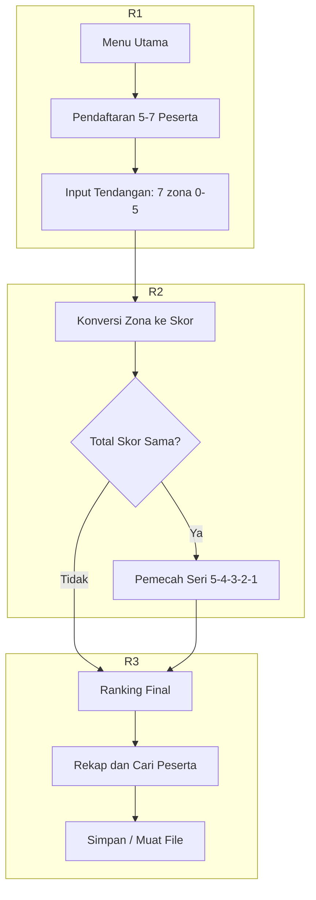

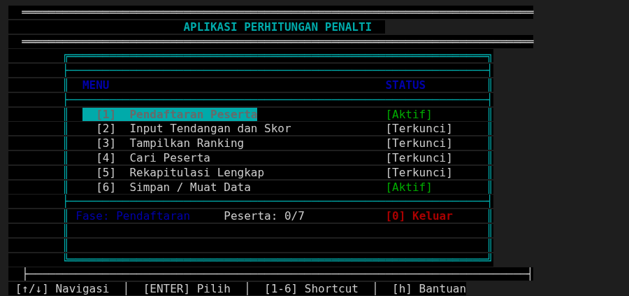

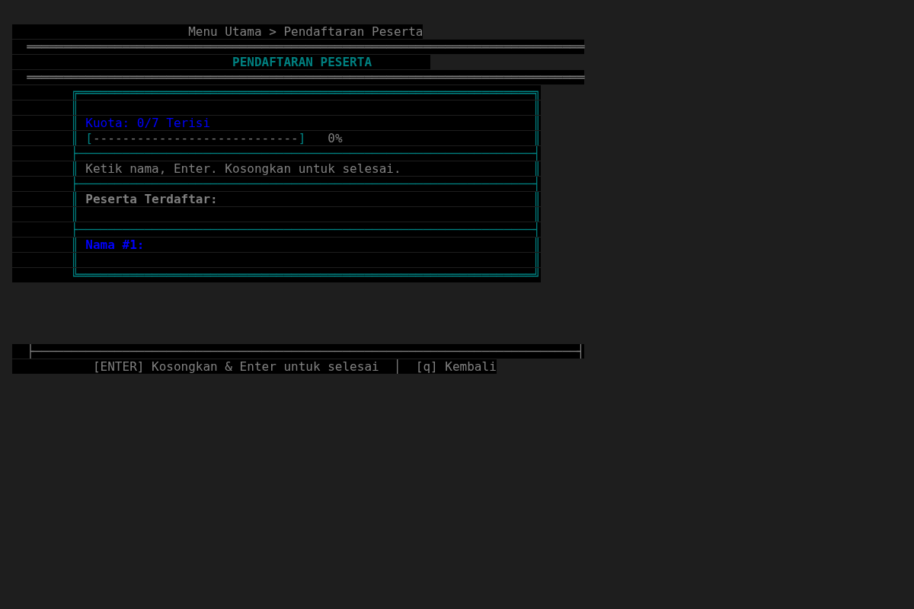

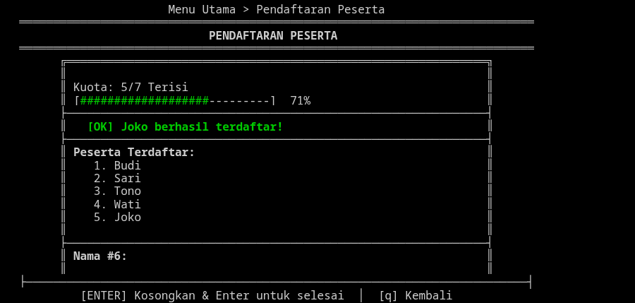

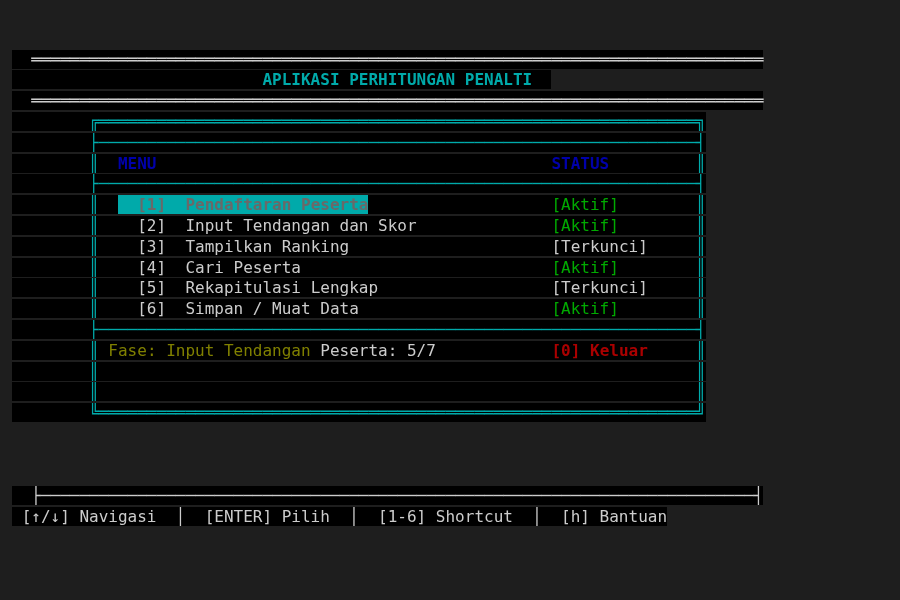

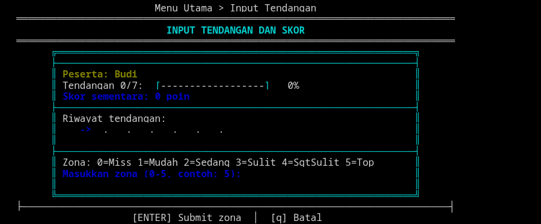

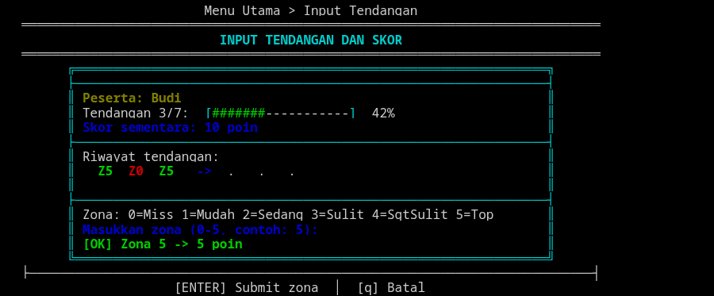

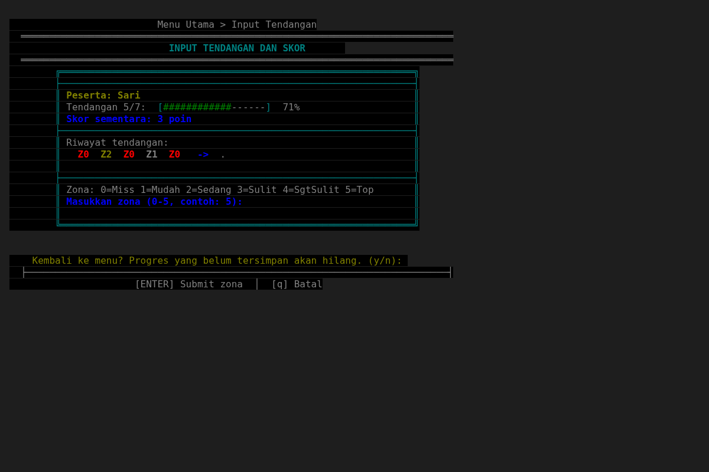

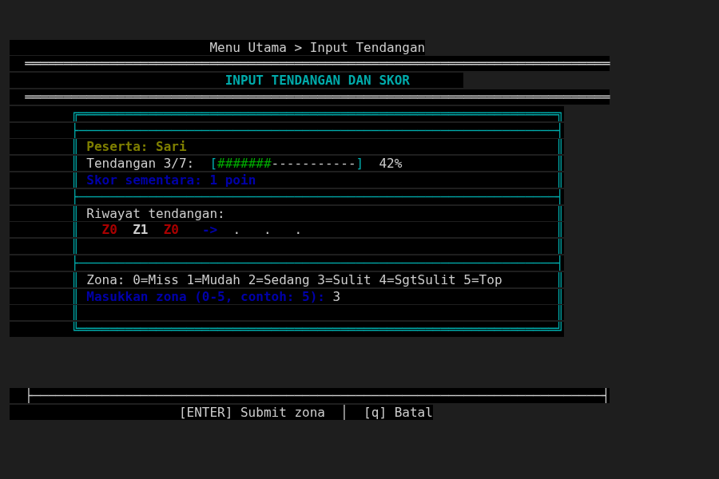

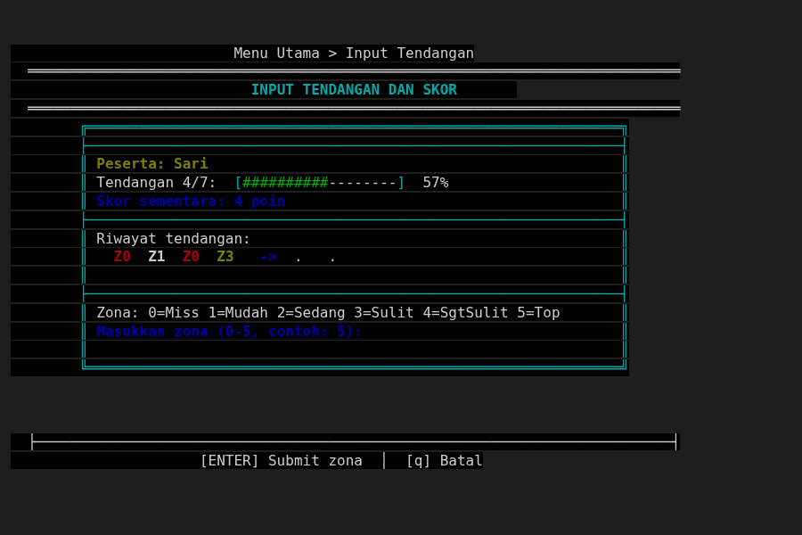

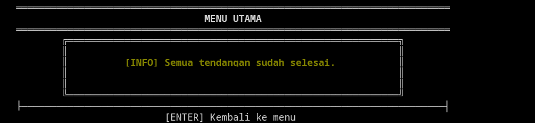

![Tahap 3 — Rekapitulasi Lengkap: ringkasan semua peserta + juara; tombol [E] export ke file.](screenshots/11_recap.png)

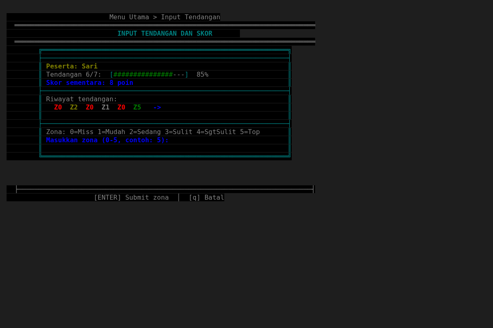

![Layar Bantuan: keterangan navigasi tombol ([↑/↓], [ENTER], [1-6], [h]).](screenshots/13_help.png)

---

## 3. Konstruksi Program

Arsitektur yang digunakan adalah **AES (Agentic Engineering System)** — pola berlapis ketat (strict layered) dengan dependency inversion dilakukan lewat struct of function pointers sebagai pengganti interface. Arah dependensi downward-only: `taxonomy -> contract -> capabilities/infrastructure -> agent -> surfaces -> root (wiring only)`. Capabilities dan Infrastructure adalah layer setara (peer) yang sama-sama bergantung ke bawah pada Contract, dan tidak saling mengimpor.

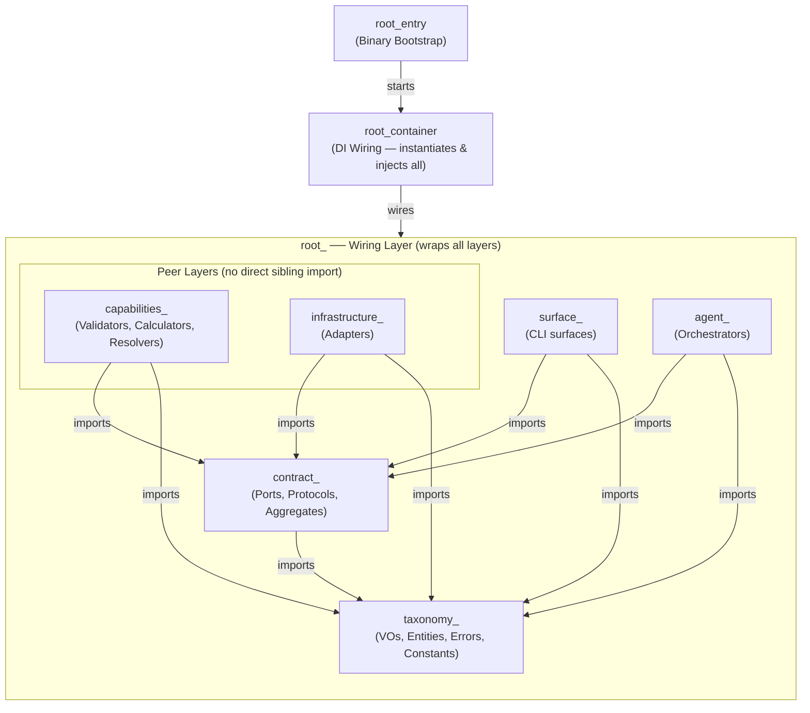

---

## 4. Struktur (struct & enum)

| Struct | Keterangan |
|---|---|
| `CompetitionState` | Wadah status lomba utama; menampung array peserta, jumlah peserta, dan tahap lomba. |
| `CompetitionStateKind` | Enum tahap lomba: `STATE_INIT`, `STATE_REGISTERED`, `STATE_COMPLETED`. |
| `ParticipantEntity` | Satu peserta lengkap: id, nama, 7 hasil tendangan (`kicks`), total skor, frekuensi zona, jumlah tendangan. |
| `ParticipantIdVO` | Pembungkus nomor urut peserta (indeks array data). |
| `ParticipantNameVO` | Pembungkus nama peserta (`char[MAX_NAME_LENGTH+1]`). |
| `KickVO` | Satu tendangan: `zone` (0–5) dan `points` (sama dengan zone). |
| `ZoneVO` | Pembungkus nilai zona (0..5, 0 = miss). |
| `TotalScoreVO` | Pembungkus total skor peserta (0..35 = 7 × 5). |
| `ZoneFreqVO` | Frekuensi tiap zona (0..5), pemecah seri peringkat. |
| `KickCountVO` | Pembungkus jumlah tendangan dilakukan (0..TOTAL_KICKS). |
| `RankingEntryVO` | Satu baris hasil peringkat: `participant_id`, `total_score`, `zone_freq[MAX_ZONE+1]`, `rank`. |
| `SearchResultVO` | Balikan pencarian: status, id, nama, skor, riwayat tendangan, frekuensi zona. |
| `RegistrationAggregate` | Contract aggregate pendaftaran (`contract_registration_aggregate.h`). |
| `ScoringAggregate` | Contract aggregate scoring (`contract_scoring_aggregate.h`). |
| `RankingAggregate` | Contract aggregate ranking (`contract_ranking_aggregate.h`). |
| `SearchAggregate` | Contract aggregate pencarian (`contract_search_aggregate`/surfaces). |
| `RecapAggregate` | Contract aggregate rekap (`contract_recap_aggregate.h`). |
| `SanitizeAggregate` | Contract aggregate validasi input (`contract_sanitize_aggregate.h`). |
| `StorageAggregate` | Contract aggregate penyimpanan (`module.storage.h`). |
| `ExportAggregate` | Contract aggregate ekspor (`module.export.h`). |
| `DisplayPort` | Antarmuka render struct function-pointer (`contract_display_port.h`). |
| `RegistrationProtocol` | Contract port pendaftaran (`contract_registration_protocol.h`). |
| `ScoringProtocol` | Contract port scoring (`contract_scoring_protocol.h`). |
| `RankingProtocol` | Contract port ranking (`contract_ranking_protocol.h`). |
| `SearchProtocol` | Contract port pencarian (`contract_search_protocol.h`). |
| `SanitizeProtocol` | Contract port validasi (`contract_sanitize_protocol.h`). |
| `ExportProtocol` | Contract port ekspor (`contract_export_protocol.h`). |

| Enum | Nilai |
|---|---|
| `RegistrationError` | `REG_OK=0`, `REG_NAME_EMPTY`, `REG_NAME_TOO_LONG`, `REG_NAME_INVALID_CHAR`, `REG_NAME_DUPLICATE`, `REG_FULL`, `REG_TOO_FEW` |
| `ScoringError` | `SC_OK=0`, `SC_INVALID_ZONE`, `SC_NOT_REGISTERED`, `SC_ALREADY_DONE`, `SC_PARTICIPANT_NOT_FOUND` |
| `RankingError` | `RK_OK=0`, `RK_NOT_READY`, `RK_NO_PARTICIPANT` |
| `SearchError` | `SR_OK=0`, `SR_NOT_FOUND`, `SR_EMPTY_QUERY` |
| `RecapError` | `RC_OK=0`, `RC_NOT_READY` |
| `ExportError` | `EX_OK=0`, `EX_OPEN_FAIL`, `EX_WRITE_FAIL`, `EX_READ_FAIL`, `EX_EMPTY`, `EX_CORRUPT`, `EX_CLOSE_FAIL` |
| `SanitizeError` | `SZ_OK=0`, `SZ_EMPTY`, `SZ_TOO_LONG`, `SZ_INVALID_CHAR`, `SZ_INVALID_INT`, `SZ_OUT_OF_RANGE`, `SZ_UNKNOWN` |
| `LogLevel` | `LOG_DEBUG`, `LOG_INFO`, `LOG_WARN`, `LOG_ERROR` |

---

## 5. Konstanta

| Konstanta | Nilai | Keterangan |
|---|---|---|
| `MIN_PARTICIPANTS` | 5 | Jumlah peserta minimal yang harus didaftarkan. |
| `MAX_PARTICIPANTS` | 7 | Batas maksimal peserta (ukuran array data lomba). |
| `TOTAL_KICKS` | 7 | Jumlah tendangan per peserta. |
| `MIN_ZONE` | 0 | Zona terendah (tendangan meleset / miss). |
| `MAX_ZONE` | 5 | Zona tertinggi (poin maksimal per tendangan). |
| `MAX_NAME_LENGTH` | 30 | Panjang maksimal nama peserta (karakter, tanpa null-terminator). |
| `DEFAULT_STORAGE_FILENAME` | `"data_lomba.bin"` | Nama file penyimpanan lomba default. |
| `MENU_EXIT` | 0 | Kode pilihan menu: keluar dari program. |
| `MENU_REGISTRATION` | 1 | Kode pilihan menu: layar pendaftaran peserta. |
| `MENU_SCORING` | 2 | Kode pilihan menu: layar input tendangan & skor. |
| `MENU_RANKING` | 3 | Kode pilihan menu: layar tampilkan peringkat. |
| `MENU_SEARCH` | 4 | Kode pilihan menu: layar cari peserta. |
| `MENU_RECAP` | 5 | Kode pilihan menu: layar rekapitulasi lengkap. |

---

## 6. Variabel (field di dalam struct)

| Variabel | Keterangan |
|---|---|
| `participants` | Array semua peserta (tipe `ParticipantEntity[MAX_PARTICIPANTS]`). |
| `participant_count` | Jumlah peserta yang benar-benar terdaftar. |
| `state` | Tahap lomba: `STATE_INIT`, `STATE_REGISTERED`, `STATE_COMPLETED`. |
| `id` | Nomor urut peserta (`ParticipantIdVO`). |
| `name` | Nama peserta (`ParticipantNameVO`). |
| `kicks` | Hasil 7 tendangan peserta (`KickVO[TOTAL_KICKS]`). |
| `total_score` | Akumulasi poin seluruh tendangan (`TotalScoreVO`). |
| `zone_freq` | Frekuensi tiap zona, dipakai pemecah seri (`ZoneFreqVO`). |
| `kick_count` | Jumlah tendangan yang sudah dilakukan (`KickCountVO`). |
| `value` | Isi id peserta / zona / skor / count, tipe `int`. |
| `value` | Isi nama peserta, tipe `char[MAX_NAME_LENGTH + 1]`. |
| `zone` | Zona tendangan (0–5) dalam satu `KickVO`. |
| `points` | Poin tendangan (sama dengan zona) dalam satu `KickVO`. |
| `freq` | Hitungan tendangan per zona (indeks 0..5) dalam `ZoneFreqVO`. |
| `participant_id` | Nomor peserta pada `RankingEntryVO` / `SearchResultVO`. |
| `rank` | Posisi peringkat peserta (`RankingEntryVO`). |
| `found` | Status ketemu (1/0) pada `SearchResultVO`. |

---

## 7. Fungsi (capabilities, infrastructure, agent)

### 7.1 Capabilities

| Fungsi | Keterangan |
|---|---|
| `capabilities_registration_validate_name` | Validasi nama peserta (kosong / panjang / karakter / duplikat). |
| `capabilities_registration_append` | Menambah peserta ke `CompetitionState`. |
| `capabilities_scoring_validate_zone` | Validasi zona (0–5) sebelum dicatat. |
| `capabilities_scoring_record_kick` | Mencatat satu tendangan & akumulasi skor ke peserta. |
| `capabilities_ranking_compute` | Mengurutkan peserta + aturan seri zona 5→4→3→2→1. |
| `capabilities_search_resolver` | Mencari peserta berdasarkan nama (cocok persis). |
| `capabilities_recap_prepare_details` | Menyiapkan detail rekapitulasi dari `CompetitionState`. |
| `capabilities_recap_formatter` | Memformat data rekap menjadi tampilan. |

### 7.2 Infrastructure

| Fungsi | Keterangan |
|---|---|
| `storage_adapter_create` | Membuat `StorageProtocol` (adapter simpan/muat/hapus file). |
| `storage_save_impl` | Implementasi simpan lomba ke file. |
| `storage_load_impl` | Implementasi muat lomba dari file. |
| `storage_delete_impl` | Implementasi hapus file penyimpanan. |
| `export_adapter_create` | Membuat `ExportProtocol` (adapter ekspor). |
| `tui_init` | Inisialisasi antarmuka ncurses. |
| `tui_end` | Menutup antarmuka ncurses. |
| `tui_clear` | Membersihkan layar. |
| `tui_print` | Cetak teks di posisi (row, col). |
| `tui_print_centered` | Cetak teks terpusat di satu baris. |
| `tui_box` | Gambar kotak sederhana. |
| `tui_box_double` | Gambar kotak garis ganda. |
| `tui_highlight_row` | Tampilkan baris ter-highlight. |
| `tui_normal_row` | Tampilkan baris biasa. |
| `tui_separator` | Gambar pemisah horizontal. |
| `tui_separator_thick` | Gambar pemisah horizontal tebal. |
| `tui_progress_bar` | Gambar bilah progres. |
| `tui_getch` | Baca input keyboard. |

### 7.3 Agent

| Fungsi | Keterangan |
|---|---|
| `agent_registration_add` | Orkestrasi tambah peserta lewat `RegistrationAggregate`. |
| `agent_scoring_record` | Orkestrasi catat tendangan lewat `ScoringAggregate`. |
| `agent_ranking_compute` | Orkestrasi peringkat lewat `RankingAggregate`. |
| `agent_search_find` | Orkestrasi cari peserta lewat `SearchAggregate`. |
| `agent_recap_prepare` | Orkestrasi siapkan rekap lewat `RecapAggregate`. |
| `agent_sanitize_validate_string` | Orkestrasi validasi teks lewat `SanitizeAggregate`. |
| `agent_sanitize_validate_int` | Orkestrasi validasi bilangan lewat `SanitizeAggregate`. |
| `agent_storage_save` | Orkestrasi simpan lomba lewat `StorageAggregate`. |
| `agent_storage_load` | Orkestrasi muat lomba lewat `StorageAggregate`. |
| `agent_storage_delete` | Orkestrasi hapus file lewat `StorageAggregate`. |
| `agent_export_ranking` | Orkestrasi ekspor peringkat lewat `ExportAggregate`. |
| `agent_export_recap` | Orkestrasi ekspor rekap lewat `ExportAggregate`. |
| `agent_export_participant` | Orkestrasi ekspor peserta lewat `ExportAggregate`. |

---

## 8. Kode Sumber (Script Program)
Kode sumber lengkap seluruh isi folder `src/` (semua file `.c` dan `.h`), dikelompokkan per folder dan diurutkan.
Struktur:
- `src/shared/`- `src/registration/`- `src/scoring/`- `src/ranking/`- `src/search/`- `src/recap/`- `src/storage/`- `src/sanitizer/`- `src/cli/`- `src/tui/`- `src/export/`- `src/` (root, termasuk `root_cli_main_entry.c`)

### src/ (root)

**src/root_cli_main_entry.c**
```c/**
 * @file root_cli_main_entry.c
 * @brief Titik mulai program: siapkan data, jalankan menu, bersihkan layar.
 */

#include "cli/module.cli.h"
#include "sanitizer/module.sanitizer.h"
#include "storage/module.storage.h"
#include "shared/taxonomy_game_constant.h"
#include "tui/infrastructure_tui_adapter.h"

#include <locale.h>
#include <signal.h>
#include <stdlib.h>

/* Bila program dihentikan mendadak, matikan moda ncurses dulu. */
static void cleanup_handler(int sig) {
    (void)sig;
    tui_end();
    exit(0);
}

int main(void) {
    /* Aktifkan UTF-8 locale agar karakter Unicode Box Drawing bisa dirender. */
    setlocale(LC_ALL, "");

    /* Tangani tombol interupsi agar terminal kembali normal. */
    signal(SIGINT, cleanup_handler);
    signal(SIGTERM, cleanup_handler);

    /* Satu-satunya data lomba (disimpan di sini, bukan global). */
    CompetitionState state;
    state.participant_count = 0;
    state.state = STATE_INIT;

    /* Siapkan seluruh fitur (pendaftaran, scoring, ranking, dll). */
    RegistrationAggregate reg = root_registration_build();
    ScoringAggregate      sc  = root_scoring_build();
    RankingAggregate      rk  = root_ranking_build();
    SearchAggregate       sr  = root_search_build();
    RecapAggregate        rc  = root_recap_build(rk.protocol);
    SanitizeAggregate     sn  = root_sanitize_build();
    StorageAggregate      st  = root_storage_build();
    ExportAggregate       ex  = root_export_build();

    /* Hidupkan layar ncurses, rakit DisplayPort, lalu langsung ke menu utama. */
    tui_init();

    /* Rakit DisplayPort — surfaces hanya pegang pointer ke ini. */
    DisplayPort dp = root_display_build();

    /* Muat data tersimpan bila ada (silent: kalau file belum ada, biarkan kosong). */
    {
        agent_storage_load(&st, DEFAULT_STORAGE_FILENAME, &state);
    }

    cli_surfaces_menu_run(&reg, &sc, &rk, &sr, &rc, &st, &ex, &state, &dp, &sn);

    /* D2: Ringkasan juara sebelum keluar — tampilkan di ncurses, tunggu Enter. */
    if (state.state == STATE_COMPLETED && state.participant_count > 0) {
        RankingEntryVO entries[MAX_PARTICIPANTS];
        if (agent_ranking_compute(&rk, &state, entries, MAX_PARTICIPANTS) == RK_OK) {
            dp.cls();
            dp.print_centered_colored(2, "\xe2\x95\x90\xe2\x95\x90\xe2\x95\x90\xe2\x95\x90\xe2\x95\x90\xe2\x95\x90\xe2\x95\x90\xe2\x95\x90\xe2\x95\x90\xe2\x95\x90\xe2\x95\x90\xe2\x95\x90\xe2\x95\x90\xe2\x95\x90\xe2\x95\x90\xe2\x95\x90\xe2\x95\x90\xe2\x95\x90\xe2\x95\x90\xe2\x95\x90\xe2\x95\x90\xe2\x95\x90\xe2\x95\x90\xe2\x95\x90\xe2\x95\x90\xe2\x95\x90\xe2\x95\x90\xe2\x95\x90\xe2\x95\x90\xe2\x95\x90", COLOR_DIM, 0);
            dp.print_centered_colored(3, "TERIMA KASIH TELAH BERLOMBA", COLOR_TITLE, 1);
            dp.print_centered_colored(4, "\xe2\x95\x90\xe2\x95\x90\xe2\x95\x90\xe2\x95\x90\xe2\x95\x90\xe2\x95\x90\xe2\x95\x90\xe2\x95\x90\xe2\x95\x90\xe2\x95\x90\xe2\x95\x90\xe2\x95\x90\xe2\x95\x90\xe2\x95\x90\xe2\x95\x90\xe2\x95\x90\xe2\x95\x90\xe2\x95\x90\xe2\x95\x90\xe2\x95\x90\xe2\x95\x90\xe2\x95\x90\xe2\x95\x90\xe2\x95\x90\xe2\x95\x90\xe2\x95\x90\xe2\x95\x90\xe2\x95\x90\xe2\x95\x90\xe2\x95\x90", COLOR_DIM, 0);

            const char *winner = state.participants[entries[0].participant_id].name.value;
            dp.print_centered_colored(7, "JUARA UMUM", COLOR_GOLD, 1);

            char line[64];
            snprintf(line, sizeof line, "%s  -  %d poin", winner, entries[0].total_score);
            dp.print_centered_colored(8, line, COLOR_MENU, 1);

            if (state.participant_count >= 2) {
                const char *second = state.participants[entries[1].participant_id].name.value;
                snprintf(line, sizeof line, "Juara 2: %s (%d poin)", second, entries[1].total_score);
                dp.print_centered_colored(10, line, COLOR_MENU, 0);
            }
            if (state.participant_count >= 3) {
                const char *third = state.participants[entries[2].participant_id].name.value;
                snprintf(line, sizeof line, "Juara 3: %s (%d poin)", third, entries[2].total_score);
                dp.print_centered_colored(11, line, COLOR_MENU, 0);
            }

            dp.footer("Tekan ENTER untuk keluar");
            dp.screen_refresh();
            dp.readkey();
        }
    }

    tui_end();

    /* Pesan penutup di terminal biasa. */
    printf("\nTekan Enter untuk keluar...");
    fflush(stdout);
    getchar();

    return 0;
}```

Kompilasi & pengujian: `make` (build) dan `make test` (semua test lolos).
