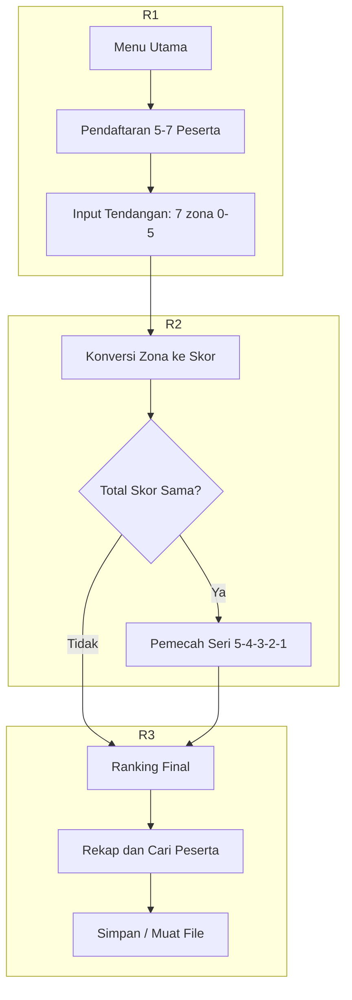
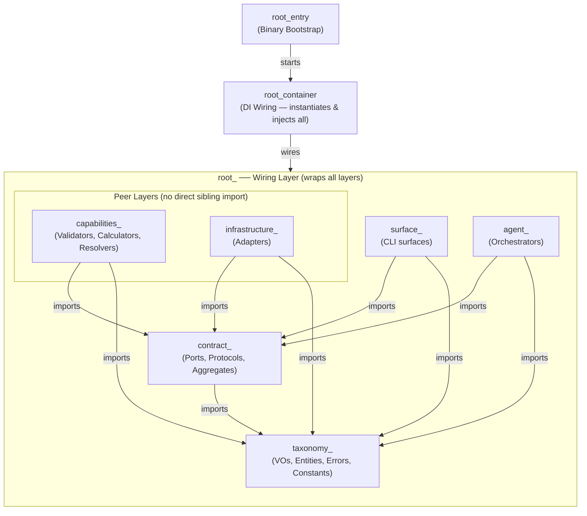

# LAPORAN PROJECT

**Aplikasi Perhitungan Hasil Lomba Tendangan Penalti**

| Nama        | Raka Arwaky      |
| Nim         | 22342030         |
| Mata Kuliah | Pengantar Coding |
| Sesi        | 863              |

---

## 1. Analisis Permasalahan

Berdasarkan kerangka epistemologis filsafat masalah, suatu kondisi hanya dapat disebut "masalah" apabila memenuhi prasyarat berikut:

- terdapat subjek yang memiliki tujuan;
- terdapat kesenjangan antara keadaan aktual dan keadaan yang dikehendaki;
- terdapat hambatan yang tidak dapat diatasi secara langsung.

### Tujuan

- Membangun program bahasa C untuk mengelola hasil lomba tendangan penalti.
- Jumlah peserta 5-7 orang; setiap peserta 7 tendangan; zona bernilai 0 sampai 5.
- Mengubah zona menjadi skor; total skor = jumlah seluruh skor tendangan.
- Menentukan juara dari total skor tertinggi, dengan aturan seri 5 -> 4 -> 3 -> 2 -> 1.
- Menyimpan data peserta, mencatat hasil tendangan, mencari peserta, menampilkan rekap, dan mengurutkan ranking.

### Keadaan Saat Ini dan Keadaan Diinginkan

Keadaan saat ini: belum tersedia program yang memenuhi seluruh ketentuan di atas. Keadaan diinginkan: program yang secara utuh memenuhi batas peserta (5-7), batas tendangan (7), rentang zona (0-5), aturan konversi dan akumulasi skor, aturan seri bertingkat, serta kelima kemampuan kelola data. Kesenjangan antara kedua keadaan inilah yang menjadikan tugas ini sebagai masalah.

### Hambatan

- Pembatasan input zona 0-5. Tanpa pembatasan, pengguna dapat memasukkan nilai di luar rentang yang merusak perhitungan.
- Batas jumlah peserta 5-7 (aturan lomba). Data peserta harus dialokasikan menampung maksimal 7 tanpa meluap, namun tetap menerima minimal 5.
- Konversi zona ke skor dan akumulasi. Setiap zona harus dipetakan ke poin, lalu dijumlahkan menjadi total skor tiap peserta.
- Penentuan juara dan aturan seri bertingkat. Pengurutan tidak cukup hanya by total skor; diperlukan pemecah seri 5 -> 4 -> 3 -> 2 -> 1, dan peringkat sama bila seluruh komponen identik.
- Kelola data antar-fitur (simpan, catat, cari, rekap, ranking). Seluruh fitur harus beroperasi pada satu kesatuan data peserta yang konsisten.

---

## 2. Skenario Program




![Tahap 3 — Rekapitulasi Lengkap: ringkasan semua peserta + juara; tombol [E] export ke file.](screenshots/11_recap.png)


![Layar Bantuan: keterangan navigasi tombol ([↑/↓], [ENTER], [1-6], [h]).](screenshots/13_help.png)

---

## 3. Konstruksi Program

Arsitektur yang digunakan adalah **AES (Agentic Engineering System)** — pola berlapis ketat (strict layered) dengan dependency inversion dilakukan lewat struct of function pointers sebagai pengganti interface. Arah dependensi downward-only: `taxonomy -> contract -> capabilities/infrastructure -> agent -> surfaces -> root (wiring only)`. Capabilities dan Infrastructure adalah layer setara (peer) yang sama-sama bergantung ke bawah pada Contract, dan tidak saling mengimpor.



---

## 4. Struktur (struct & enum)

| Struct | Keterangan |
|---|---|
| `CompetitionState` | Wadah status lomba utama; menampung array peserta, jumlah peserta, dan tahap lomba. |
| `CompetitionStateKind` | Enum tahap lomba: `STATE_INIT`, `STATE_REGISTERED`, `STATE_COMPLETED`. |
| `ParticipantEntity` | Satu peserta lengkap: id, nama, 7 hasil tendangan (`kicks`), total skor, frekuensi zona, jumlah tendangan. |
| `ParticipantIdVO` | Pembungkus nomor urut peserta (indeks array data). |
| `ParticipantNameVO` | Pembungkus nama peserta (`char[MAX_NAME_LENGTH+1]`). |
| `KickVO` | Satu tendangan: `zone` (0–5) dan `points` (sama dengan zone). |
| `ZoneVO` | Pembungkus nilai zona (0..5, 0 = miss). |
| `TotalScoreVO` | Pembungkus total skor peserta (0..35 = 7 × 5). |
| `ZoneFreqVO` | Frekuensi tiap zona (0..5), pemecah seri peringkat. |
| `KickCountVO` | Pembungkus jumlah tendangan dilakukan (0..TOTAL_KICKS). |
| `RankingEntryVO` | Satu baris hasil peringkat: `participant_id`, `total_score`, `zone_freq[MAX_ZONE+1]`, `rank`. |
| `SearchResultVO` | Balikan pencarian: status, id, nama, skor, riwayat tendangan, frekuensi zona. |
| `RegistrationAggregate` | Contract aggregate pendaftaran (`contract_registration_aggregate.h`). |
| `ScoringAggregate` | Contract aggregate scoring (`contract_scoring_aggregate.h`). |
| `RankingAggregate` | Contract aggregate ranking (`contract_ranking_aggregate.h`). |
| `SearchAggregate` | Contract aggregate pencarian (`contract_search_aggregate`/surfaces). |
| `RecapAggregate` | Contract aggregate rekap (`contract_recap_aggregate.h`). |
| `SanitizeAggregate` | Contract aggregate validasi input (`contract_sanitize_aggregate.h`). |
| `StorageAggregate` | Contract aggregate penyimpanan (`module.storage.h`). |
| `ExportAggregate` | Contract aggregate ekspor (`module.export.h`). |
| `DisplayPort` | Antarmuka render struct function-pointer (`contract_display_port.h`). |
| `RegistrationProtocol` | Contract port pendaftaran (`contract_registration_protocol.h`). |
| `ScoringProtocol` | Contract port scoring (`contract_scoring_protocol.h`). |
| `RankingProtocol` | Contract port ranking (`contract_ranking_protocol.h`). |
| `SearchProtocol` | Contract port pencarian (`contract_search_protocol.h`). |
| `SanitizeProtocol` | Contract port validasi (`contract_sanitize_protocol.h`). |
| `ExportProtocol` | Contract port ekspor (`contract_export_protocol.h`). |

| Enum | Nilai |
|---|---|
| `RegistrationError` | `REG_OK=0`, `REG_NAME_EMPTY`, `REG_NAME_TOO_LONG`, `REG_NAME_INVALID_CHAR`, `REG_NAME_DUPLICATE`, `REG_FULL`, `REG_TOO_FEW` |
| `ScoringError` | `SC_OK=0`, `SC_INVALID_ZONE`, `SC_NOT_REGISTERED`, `SC_ALREADY_DONE`, `SC_PARTICIPANT_NOT_FOUND` |
| `RankingError` | `RK_OK=0`, `RK_NOT_READY`, `RK_NO_PARTICIPANT` |
| `SearchError` | `SR_OK=0`, `SR_NOT_FOUND`, `SR_EMPTY_QUERY` |
| `RecapError` | `RC_OK=0`, `RC_NOT_READY` |
| `ExportError` | `EX_OK=0`, `EX_OPEN_FAIL`, `EX_WRITE_FAIL`, `EX_READ_FAIL`, `EX_EMPTY`, `EX_CORRUPT`, `EX_CLOSE_FAIL` |
| `SanitizeError` | `SZ_OK=0`, `SZ_EMPTY`, `SZ_TOO_LONG`, `SZ_INVALID_CHAR`, `SZ_INVALID_INT`, `SZ_OUT_OF_RANGE`, `SZ_UNKNOWN` |
| `LogLevel` | `LOG_DEBUG`, `LOG_INFO`, `LOG_WARN`, `LOG_ERROR` |

---

## 5. Konstanta

| Konstanta | Nilai | Keterangan |
|---|---|---|
| `MIN_PARTICIPANTS` | 5 | Jumlah peserta minimal yang harus didaftarkan. |
| `MAX_PARTICIPANTS` | 7 | Batas maksimal peserta (ukuran array data lomba). |
| `TOTAL_KICKS` | 7 | Jumlah tendangan per peserta. |
| `MIN_ZONE` | 0 | Zona terendah (tendangan meleset / miss). |
| `MAX_ZONE` | 5 | Zona tertinggi (poin maksimal per tendangan). |
| `MAX_NAME_LENGTH` | 30 | Panjang maksimal nama peserta (karakter, tanpa null-terminator). |
| `DEFAULT_STORAGE_FILENAME` | `"data_lomba.bin"` | Nama file penyimpanan lomba default. |
| `MENU_EXIT` | 0 | Kode pilihan menu: keluar dari program. |
| `MENU_REGISTRATION` | 1 | Kode pilihan menu: layar pendaftaran peserta. |
| `MENU_SCORING` | 2 | Kode pilihan menu: layar input tendangan & skor. |
| `MENU_RANKING` | 3 | Kode pilihan menu: layar tampilkan peringkat. |
| `MENU_SEARCH` | 4 | Kode pilihan menu: layar cari peserta. |
| `MENU_RECAP` | 5 | Kode pilihan menu: layar rekapitulasi lengkap. |

---

## 6. Variabel (field di dalam struct)

| Variabel | Keterangan |
|---|---|
| `participants` | Array semua peserta (tipe `ParticipantEntity[MAX_PARTICIPANTS]`). |
| `participant_count` | Jumlah peserta yang benar-benar terdaftar. |
| `state` | Tahap lomba: `STATE_INIT`, `STATE_REGISTERED`, `STATE_COMPLETED`. |
| `id` | Nomor urut peserta (`ParticipantIdVO`). |
| `name` | Nama peserta (`ParticipantNameVO`). |
| `kicks` | Hasil 7 tendangan peserta (`KickVO[TOTAL_KICKS]`). |
| `total_score` | Akumulasi poin seluruh tendangan (`TotalScoreVO`). |
| `zone_freq` | Frekuensi tiap zona, dipakai pemecah seri (`ZoneFreqVO`). |
| `kick_count` | Jumlah tendangan yang sudah dilakukan (`KickCountVO`). |
| `value` | Isi id peserta / zona / skor / count, tipe `int`. |
| `value` | Isi nama peserta, tipe `char[MAX_NAME_LENGTH + 1]`. |
| `zone` | Zona tendangan (0–5) dalam satu `KickVO`. |
| `points` | Poin tendangan (sama dengan zona) dalam satu `KickVO`. |
| `freq` | Hitungan tendangan per zona (indeks 0..5) dalam `ZoneFreqVO`. |
| `participant_id` | Nomor peserta pada `RankingEntryVO` / `SearchResultVO`. |
| `rank` | Posisi peringkat peserta (`RankingEntryVO`). |
| `found` | Status ketemu (1/0) pada `SearchResultVO`. |

---

## 7. Fungsi (capabilities, infrastructure, agent)

### 7.1 Capabilities

| Fungsi | Keterangan |
|---|---|
| `capabilities_registration_validate_name` | Validasi nama peserta (kosong / panjang / karakter / duplikat). |
| `capabilities_registration_append` | Menambah peserta ke `CompetitionState`. |
| `capabilities_scoring_validate_zone` | Validasi zona (0–5) sebelum dicatat. |
| `capabilities_scoring_record_kick` | Mencatat satu tendangan & akumulasi skor ke peserta. |
| `capabilities_ranking_compute` | Mengurutkan peserta + aturan seri zona 5→4→3→2→1. |
| `capabilities_search_resolver` | Mencari peserta berdasarkan nama (cocok persis). |
| `capabilities_recap_prepare_details` | Menyiapkan detail rekapitulasi dari `CompetitionState`. |
| `capabilities_recap_formatter` | Memformat data rekap menjadi tampilan. |

### 7.2 Infrastructure

| Fungsi | Keterangan |
|---|---|
| `storage_adapter_create` | Membuat `StorageProtocol` (adapter simpan/muat/hapus file). |
| `storage_save_impl` | Implementasi simpan lomba ke file. |
| `storage_load_impl` | Implementasi muat lomba dari file. |
| `storage_delete_impl` | Implementasi hapus file penyimpanan. |
| `export_adapter_create` | Membuat `ExportProtocol` (adapter ekspor). |
| `tui_init` | Inisialisasi antarmuka ncurses. |
| `tui_end` | Menutup antarmuka ncurses. |
| `tui_clear` | Membersihkan layar. |
| `tui_print` | Cetak teks di posisi (row, col). |
| `tui_print_centered` | Cetak teks terpusat di satu baris. |
| `tui_box` | Gambar kotak sederhana. |
| `tui_box_double` | Gambar kotak garis ganda. |
| `tui_highlight_row` | Tampilkan baris ter-highlight. |
| `tui_normal_row` | Tampilkan baris biasa. |
| `tui_separator` | Gambar pemisah horizontal. |
| `tui_separator_thick` | Gambar pemisah horizontal tebal. |
| `tui_progress_bar` | Gambar bilah progres. |
| `tui_getch` | Baca input keyboard. |

### 7.3 Agent

| Fungsi | Keterangan |
|---|---|
| `agent_registration_add` | Orkestrasi tambah peserta lewat `RegistrationAggregate`. |
| `agent_scoring_record` | Orkestrasi catat tendangan lewat `ScoringAggregate`. |
| `agent_ranking_compute` | Orkestrasi peringkat lewat `RankingAggregate`. |
| `agent_search_find` | Orkestrasi cari peserta lewat `SearchAggregate`. |
| `agent_recap_prepare` | Orkestrasi siapkan rekap lewat `RecapAggregate`. |
| `agent_sanitize_validate_string` | Orkestrasi validasi teks lewat `SanitizeAggregate`. |
| `agent_sanitize_validate_int` | Orkestrasi validasi bilangan lewat `SanitizeAggregate`. |
| `agent_storage_save` | Orkestrasi simpan lomba lewat `StorageAggregate`. |
| `agent_storage_load` | Orkestrasi muat lomba lewat `StorageAggregate`. |
| `agent_storage_delete` | Orkestrasi hapus file lewat `StorageAggregate`. |
| `agent_export_ranking` | Orkestrasi ekspor peringkat lewat `ExportAggregate`. |
| `agent_export_recap` | Orkestrasi ekspor rekap lewat `ExportAggregate`. |
| `agent_export_participant` | Orkestrasi ekspor peserta lewat `ExportAggregate`. |

---

## 8. Kode Sumber (Script Program)

Kode sumber lengkap seluruh isi folder `src/` (semua file `.c` dan `.h`), dikelompokkan per folder dan diurutkan.

Struktur:
- `src/shared/`- `src/registration/`- `src/scoring/`- `src/ranking/`- `src/search/`- `src/recap/`- `src/storage/`- `src/sanitizer/`- `src/cli/`- `src/tui/`- `src/export/`- `src/` (root, termasuk `root_cli_main_entry.c`)

### src/shared/

**src/shared/contract_display_port.h**

```c
/**
 * @file contract_display_port.h
 * @brief Interface display: function pointers untuk rendering UI.
 */

#ifndef SHARED_CONTRACT_DISPLAY_PORT_H
#define SHARED_CONTRACT_DISPLAY_PORT_H

#include "shared/taxonomy_display_constant.h"

/**
 * DisplayPort — interface untuk semua operasi rendering.
 * Surfaces memanggil melalui struct ini, bukan langsung ke ncurses.
 */
typedef struct {
    /* Drawing primitives */
    void (*cls)(void);
    void (*screen_refresh)(void);
    void (*draw_at)(int row, int col, const char *text);
    void (*draw_colored)(int row, int col, int color, int bold, const char *text);
    void (*draw_append)(const char *text);
    void (*draw_append_colored)(int color, int bold, const char *text);

    /* Higher-level drawing */
    void (*print_centered_colored)(int row, const char *text, int color, int bold);
    void (*print_colored)(int row, int col, const char *text, int color);
    void (*box)(int row, int col, int width, int height);
    void (*box_double)(int row, int col, int width, int height);
    void (*separator)(int row, int col, int width);
    void (*separator_thick)(int row, int col, int width);
    void (*highlight_row)(int row, int col, int width, const char *text);
    void (*normal_row)(int row, int col, int width, const char *text);
    void (*footer)(const char *help);
    void (*progress_bar)(int row, int col, int width, int percent, int color);
    const char *(*medal)(int rank);

    /* Input */
    int  (*readkey)(void);
    int  (*confirm)(const char *prompt);
    void (*input_string)(int row, int col, char *buf, int maxlen);

    /* Terminal info */
    int  (*get_lines)(void);
    int  (*get_cols)(void);

} DisplayPort;

#endif /* SHARED_CONTRACT_DISPLAY_PORT_H */
```

**src/shared/contract_export_protocol.h**

```c
/**
 * @file contract_export_protocol.h
 * @brief Daftar fungsi yang harus ada untuk ekspor hasil ke file.
 */

#ifndef SHARED_CONTRACT_EXPORT_PROTOCOL_H
#define SHARED_CONTRACT_EXPORT_PROTOCOL_H

#include "shared/taxonomy_export_error.h"
#include "shared/taxonomy_competition_state_vo.h"
#include "shared/taxonomy_rank_vo.h"
#include "shared/taxonomy_search_result_vo.h"
#include <stddef.h>

/* Tipe fungsi: tulis hasil peringkat peserta ke file. */
typedef ExportError (*export_ranking_fn)(const char *filename,
                                         const CompetitionState *state,
                                         const RankingEntryVO *entries,
                                         int count);

/* Tipe fungsi: tulis rekapitulasi lengkap ke file. */
typedef ExportError (*export_recap_fn)(const char *filename,
                                       const CompetitionState *state,
                                       const RankingEntryVO *ranking,
                                       const SearchResultVO *details,
                                       int count,
                                       int total_score,
                                       int avg_score,
                                       int highest_score);

/* Tipe fungsi: tulis data satu peserta ke file. */
typedef ExportError (*export_participant_fn)(const char *filename,
                                             const SearchResultVO *participant);

/** Kumpulan fungsi ekspor — diisi oleh root container. */
typedef struct {
    export_ranking_fn export_ranking;        /**< Tulis peringkat ke file. */
    export_recap_fn export_recap;            /**< Tulis rekapitulasi ke file. */
    export_participant_fn export_participant; /**< Tulis data peserta ke file. */
} ExportProtocol;

#endif /* SHARED_CONTRACT_EXPORT_PROTOCOL_H */
```

**src/shared/contract_ranking_aggregate.h**

```c
/**
 * @file contract_ranking_aggregate.h
 * @brief Wadah protocol ranking yang dipakai seluruh program.
 */

#ifndef SHARED_CONTRACT_RANKING_AGGREGATE_H
#define SHARED_CONTRACT_RANKING_AGGREGATE_H

#include "shared/contract_ranking_protocol.h"
#include "shared/taxonomy_rank_vo.h"

/** Penghubung ke fungsi ranking (disimpan alamatnya saja). */
typedef struct {
    RankingProtocol *protocol; /**< Pointer ke fungsi-fungsi ranking. */
} RankingAggregate;

#endif /* SHARED_CONTRACT_RANKING_AGGREGATE_H */
```

**src/shared/contract_ranking_protocol.h**

```c
/**
 * @file contract_ranking_protocol.h
 * @brief Daftar fungsi yang harus ada untuk hitung peringkat.
 */

#ifndef SHARED_CONTRACT_RANKING_PROTOCOL_H
#define SHARED_CONTRACT_RANKING_PROTOCOL_H

#include "shared/taxonomy_competition_state_vo.h"
#include "shared/taxonomy_rank_vo.h"
#include "shared/taxonomy_competition_error.h"

/* Tipe fungsi: susun peringkat seluruh peserta dari data lomba. */
typedef RankingError (*compute_ranking_fn)(const CompetitionState *state,
                                           RankingEntryVO *out, int capacity);

/** Kumpulan fungsi ranking — diisi oleh root container. */
typedef struct {
    compute_ranking_fn compute_ranking;  /**< Hitung peringkat. */
} RankingProtocol;

#endif /* SHARED_CONTRACT_RANKING_PROTOCOL_H */
```

**src/shared/contract_recap_aggregate.h**

```c
/**
 * @file contract_recap_aggregate.h
 * @brief Wadah recap: gabungkan fungsi detail & peringkat.
 *
 * Struct ini memuat dua penghubung: fungsi detail milik recap
 * sendiri, dan fungsi peringkat milik fitur ranking (dipinjam
 * agar recap tak perlu menghitung peringkat sendiri).
 */

#ifndef SHARED_CONTRACT_RECAP_AGGREGATE_H
#define SHARED_CONTRACT_RECAP_AGGREGATE_H

#include "shared/contract_recap_protocol.h"
#include "shared/taxonomy_rank_vo.h"
#include "shared/contract_ranking_protocol.h"

/** Penghubung recap: detail peserta + peringkat (dipinjam). */
typedef struct {
    RecapProtocol *protocol;    /**< Fungsi detail recap. */
    RankingProtocol *ranking;   /**< Fungsi peringkat dari fitur ranking. */
} RecapAggregate;

#endif /* SHARED_CONTRACT_RECAP_AGGREGATE_H */
```

**src/shared/contract_recap_protocol.h**

```c
/**
 * @file contract_recap_protocol.h
 * @brief Daftar fungsi yang harus ada untuk rekapitulasi.
 */

#ifndef SHARED_CONTRACT_RECAP_PROTOCOL_H
#define SHARED_CONTRACT_RECAP_PROTOCOL_H

#include "shared/taxonomy_competition_state_vo.h"
#include "shared/taxonomy_search_result_vo.h"
#include "shared/taxonomy_competition_error.h"

/* Tipe fungsi: kumpulkan data tiap peserta untuk ditampilkan. */
typedef RecapError (*prepare_details_fn)(const CompetitionState *state,
                                         SearchResultVO *details, int capacity);

/** Kumpulan fungsi recap — diisi oleh root container. */
typedef struct {
    prepare_details_fn prepare_details;  /**< Susun detail peserta. */
} RecapProtocol;

#endif /* SHARED_CONTRACT_RECAP_PROTOCOL_H */
```

**src/shared/contract_registration_aggregate.h**

```c
/**
 * @file contract_registration_aggregate.h
 * @brief Wadah protocol pendaftaran yang dipakai seluruh program.
 */

#ifndef SHARED_CONTRACT_REGISTRATION_AGGREGATE_H
#define SHARED_CONTRACT_REGISTRATION_AGGREGATE_H

#include "shared/contract_registration_protocol.h"
#include "shared/taxonomy_participant_vo.h"

/** Penghubung ke fungsi pendaftaran (disimpan alamatnya saja). */
typedef struct {
    RegistrationProtocol *protocol; /**< Pointer ke fungsi-fungsi pendaftaran. */
} RegistrationAggregate;

#endif /* SHARED_CONTRACT_REGISTRATION_AGGREGATE_H */
```

**src/shared/contract_registration_protocol.h**

```c
/**
 * @file contract_registration_protocol.h
 * @brief Daftar fungsi yang harus ada untuk fitur pendaftaran.
 */

#ifndef SHARED_CONTRACT_REGISTRATION_PROTOCOL_H
#define SHARED_CONTRACT_REGISTRATION_PROTOCOL_H

#include "shared/taxonomy_competition_state_vo.h"
#include "shared/taxonomy_participant_vo.h"
#include "shared/taxonomy_competition_error.h"

/* Tipe fungsi: periksa sah/tidaknya nama sebelum didaftarkan. */
typedef RegistrationError (*validate_name_fn)(const CompetitionState *state,
                                              const ParticipantNameVO *name);

/* Tipe fungsi: tambah peserta baru ke data lomba. */
typedef RegistrationError (*append_participant_fn)(CompetitionState *state,
                                                   const ParticipantNameVO *name);

/** Kumpulan fungsi pendaftaran — diisi oleh root container. */
typedef struct {
    validate_name_fn validate_name;          /**< Cek nama. */
    append_participant_fn append_participant; /**< Tambah peserta. */
} RegistrationProtocol;

#endif /* SHARED_CONTRACT_REGISTRATION_PROTOCOL_H */
```

**src/shared/contract_sanitize_aggregate.h**

```c
/**
 * @file contract_sanitize_aggregate.h
 * @brief Wadah SanitizeProtocol yang dipakai seluruh program.
 */

#ifndef SHARED_CONTRACT_SANITIZE_AGGREGATE_H
#define SHARED_CONTRACT_SANITIZE_AGGREGATE_H

#include "shared/contract_sanitize_protocol.h"
#include "shared/taxonomy_sanitize_error.h"

/** Penghubung ke fungsi sanitasi (disimpan alamatnya saja). */
typedef struct {
    SanitizeProtocol *protocol; /**< Pointer ke fungsi-fungsi sanitasi. */
} SanitizeAggregate;

#endif /* SHARED_CONTRACT_SANITIZE_AGGREGATE_H */
```

**src/shared/contract_sanitize_protocol.h**

```c
/**
 * @file contract_sanitize_protocol.h
 * @brief Daftar fungsi yang harus ada untuk periksa input pengguna.
 */

#ifndef CONTRACT_SANITIZE_PROTOCOL_H
#define CONTRACT_SANITIZE_PROTOCOL_H

#include "shared/taxonomy_sanitize_error.h"
#include <stddef.h>

/* Tipe fungsi: periksa string input (panjang & karakter). */
typedef SanitizeError (*validate_string_fn)(const char *input, size_t max_length);

/* Tipe fungsi: periksa string bisa dijadikan angka dalam rentang. */
typedef SanitizeError (*validate_int_fn)(const char *input, int min_val, int max_val);

/** Kumpulan fungsi sanitasi — diisi oleh root container. */
typedef struct {
    validate_string_fn validate_string;  /**< Cek string. */
    validate_int_fn validate_int;        /**< Cek angka. */
} SanitizeProtocol;

#endif /* CONTRACT_SANITIZE_PROTOCOL_H */
```

**src/shared/contract_scoring_aggregate.h**

```c
/**
 * @file contract_scoring_aggregate.h
 * @brief Wadah protocol scoring yang dipakai seluruh program.
 */

#ifndef SHARED_CONTRACT_SCORING_AGGREGATE_H
#define SHARED_CONTRACT_SCORING_AGGREGATE_H

#include "shared/contract_scoring_protocol.h"
#include "shared/taxonomy_total_score_vo.h"

/** Penghubung ke fungsi scoring (disimpan alamatnya saja). */
typedef struct {
    ScoringProtocol *protocol; /**< Pointer ke fungsi-fungsi scoring. */
} ScoringAggregate;

#endif /* SHARED_CONTRACT_SCORING_AGGREGATE_H */
```

**src/shared/contract_scoring_protocol.h**

```c
/**
 * @file contract_scoring_protocol.h
 * @brief Daftar fungsi yang harus ada untuk input tendangan & skor.
 */

#ifndef SHARED_CONTRACT_SCORING_PROTOCOL_H
#define SHARED_CONTRACT_SCORING_PROTOCOL_H

#include "shared/taxonomy_competition_state_vo.h"
#include "shared/taxonomy_zone_vo.h"
#include "shared/taxonomy_competition_error.h"

/* Tipe fungsi: periksa apakah zona dalam rentang 0..5. */
typedef ScoringError (*validate_zone_fn)(ZoneVO zone);

/* Tipe fungsi: catat satu tendangan ke data peserta. */
typedef ScoringError (*record_kick_fn)(CompetitionState *state, int id, ZoneVO zone);

/** Kumpulan fungsi scoring — diisi oleh root container. */
typedef struct {
    validate_zone_fn validate_zone;  /**< Cek zona. */
    record_kick_fn record_kick;      /**< Catat tendangan. */
} ScoringProtocol;

#endif /* SHARED_CONTRACT_SCORING_PROTOCOL_H */
```

**src/shared/contract_search_aggregate.h**

```c
/**
 * @file contract_search_aggregate.h
 * @brief Wadah protocol search yang dipakai seluruh program.
 */

#ifndef SHARED_CONTRACT_SEARCH_AGGREGATE_H
#define SHARED_CONTRACT_SEARCH_AGGREGATE_H

#include "shared/contract_search_protocol.h"
#include "shared/taxonomy_search_result_vo.h"

/** Penghubung ke fungsi pencarian (disimpan alamatnya saja). */
typedef struct {
    SearchProtocol *protocol; /**< Pointer ke fungsi-fungsi cari. */
} SearchAggregate;

#endif /* SHARED_CONTRACT_SEARCH_AGGREGATE_H */
```

**src/shared/contract_search_protocol.h**

```c
/**
 * @file contract_search_protocol.h
 * @brief Daftar fungsi yang harus ada untuk cari peserta.
 */

#ifndef SHARED_CONTRACT_SEARCH_PROTOCOL_H
#define SHARED_CONTRACT_SEARCH_PROTOCOL_H

#include "shared/taxonomy_competition_state_vo.h"
#include "shared/taxonomy_participant_vo.h"
#include "shared/taxonomy_search_result_vo.h"
#include "shared/taxonomy_competition_error.h"

/* Tipe fungsi: cari peserta dari namanya. */
typedef SearchError (*find_participant_fn)(const CompetitionState *state,
                                           const ParticipantNameVO *name,
                                           SearchResultVO *out);

/** Kumpulan fungsi pencarian — diisi oleh root container. */
typedef struct {
    find_participant_fn find_participant;  /**< Cari peserta. */
} SearchProtocol;

#endif /* SHARED_CONTRACT_SEARCH_PROTOCOL_H */
```

**src/shared/contract_storage_protocol.h**

```c
/**
 * @file contract_storage_protocol.h
 * @brief Daftar fungsi yang harus ada untuk simpan/muat data ke file.
 */

#ifndef SHARED_CONTRACT_STORAGE_PROTOCOL_H
#define SHARED_CONTRACT_STORAGE_PROTOCOL_H

#include "shared/taxonomy_storage_error.h"
#include "shared/taxonomy_competition_state_vo.h"

/* Tipe fungsi: tulis data lomba ke file. */
typedef StorageError (*save_fn)(const char *filename, const CompetitionState *state);

/* Tipe fungsi: baca data lomba dari file. */
typedef StorageError (*load_fn)(const char *filename, CompetitionState *state);

/* Tipe fungsi: hapus file data tersimpan di disk. */
typedef StorageError (*delete_fn)(const char *filename);

/** Kumpulan fungsi penyimpanan — diisi oleh root container. */
typedef struct {
    save_fn save;     /**< Simpan ke file. */
    load_fn load;     /**< Muat dari file. */
    delete_fn delete_file; /**< Hapus file tersimpan. */
} StorageProtocol;

#endif /* SHARED_CONTRACT_STORAGE_PROTOCOL_H */
```

**src/shared/taxonomy_competition_error.h**

```c
/**
 * @file taxonomy_competition_error.h
 * @brief Kode error tiap fitur (dipakai agar pesan gagal bisa ditampilkan).
 */

#ifndef SHARED_TAXONOMY_COMPETITION_ERROR_H
#define SHARED_TAXONOMY_COMPETITION_ERROR_H

/* Error pendaftaran peserta. */
typedef enum {
    REG_OK = 0,                /**< Berhasil. */
    REG_NAME_EMPTY,            /**< Nama kosong. */
    REG_NAME_TOO_LONG,         /**< Nama kepanjangan. */
    REG_NAME_INVALID_CHAR,     /**< Ada karakter tak sah (bukan huruf/spasi). */
    REG_NAME_DUPLICATE,        /**< Nama sudah dipakai. */
    REG_FULL,                  /**< Kuota peserta penuh. */
    REG_TOO_FEW                /**< Belum cukup peserta untuk selesai. */
} RegistrationError;

/* Error pencatatan tendangan. */
typedef enum {
    SC_OK = 0,                 /**< Berhasil. */
    SC_INVALID_ZONE,           /**< Zona di luar 0..5. */
    SC_NOT_REGISTERED,         /**< Data belum siap (belum terdaftar). */
    SC_ALREADY_DONE,           /**< Peserta sudah 7 tendangan. */
    SC_PARTICIPANT_NOT_FOUND   /**< Nomor peserta tak ada. */
} ScoringError;

/* Error perhitungan peringkat. */
typedef enum {
    RK_OK = 0,                 /**< Berhasil. */
    RK_NOT_READY,              /**< Lomba belum selesai (belum STATE_COMPLETED). */
    RK_NO_PARTICIPANT          /**< Tidak ada peserta / ruang kurang. */
} RankingError;

/* Error pencarian peserta. */
typedef enum {
    SR_OK = 0,                 /**< Berhasil. */
    SR_NOT_FOUND,              /**< Peserta tak ditemukan. */
    SR_EMPTY_QUERY             /**< Nama dicari kosong. */
} SearchError;

/* Error rekapitulasi. */
typedef enum {
    RC_OK = 0,                 /**< Berhasil. */
    RC_NOT_READY               /**< Lomba belum selesai. */
} RecapError;

#endif /* SHARED_TAXONOMY_COMPETITION_ERROR_H */
```

**src/shared/taxonomy_competition_state_vo.h**

```c
/**
 * @file taxonomy_competition_state_vo.h
 * @brief Satu-satunya wadah status lomba yang dikirim ke tiap fungsi.
 */

#ifndef SHARED_TAXONOMY_COMPETITION_STATE_VO_H
#define SHARED_TAXONOMY_COMPETITION_STATE_VO_H

#include <stddef.h> /* NULL, size_t */

#include "shared/taxonomy_participant_entity.h"
#include "shared/taxonomy_game_constant.h"

/** Tahap lomba — mengatur menu & fitur mana yang boleh dibuka. */
typedef enum {
    STATE_INIT = 0,       /**< Awal: belum ada peserta. Hanya pendaftaran yang boleh. */
    STATE_REGISTERED = 1, /**< Peserta cukup & terdaftar. Boleh input tendangan & cari. */
    STATE_COMPLETED = 2   /**< Semua peserta sudah 7 tendangan. Boleh ranking & recap. */
} CompetitionStateKind;

/** Status keseluruhan lomba. Disimpan di main() lalu di-pass via pointer (tanpa global). */
typedef struct {
    ParticipantEntity participants[MAX_PARTICIPANTS]; /**< Semua peserta (ukuran tetap MAX_PARTICIPANTS). */
    int participant_count;                             /**< Jumlah peserta yang benar-benar terdaftar. */
    CompetitionStateKind state;                        /**< Tahap lomba saat ini. */
} CompetitionState;

#endif /* SHARED_TAXONOMY_COMPETITION_STATE_VO_H */
```

**src/shared/taxonomy_display_constant.h**

```c
/**
 * @file taxonomy_display_constant.h
 * @brief Konstanta display: warna, tombol, dan batas UI.
 */

#ifndef SHARED_TAXONOMY_DISPLAY_CONSTANT_H
#define SHARED_TAXONOMY_DISPLAY_CONSTANT_H

/* ── Warna (nomor pasangan ncurses; 0 = default) ── */
#define COLOR_DEFAULT   0
#define COLOR_TITLE     1
#define COLOR_MENU      2
#define COLOR_HIGHLIGHT 3
#define COLOR_SUCCESS   4
#define COLOR_ERROR     5
#define COLOR_BORDER    6
#define COLOR_WARN      7
#define COLOR_DIM       8
#define COLOR_GOLD      9
#define COLOR_SILVER    10
#define COLOR_BRONZE    11
#define COLOR_WARNING   12
#define COLOR_INFO      13
#define COLOR_HEADER    14

/* ── Kode tombol (nilai literal, tanpa dependensi ncurses) ── */
#define TUI_KEY_UP      259
#define TUI_KEY_DOWN    258
#define TUI_KEY_ENTER   10
#define TUI_KEY_ESC     27
#define TUI_KEY_RESIZE  410

/* ── Batas UI ── */
#define TUI_BAR_WIDTH   26
#define BOX_ROW         4
#define BOX_WIDTH_MIN   40
#define BOX_WIDTH_MAX   64
#define BOX_WIDTH_RANKING 70
#define BOX_WIDTH_RECAP   72

/* ── Box Drawing Characters (UTF-8 escape sequences) ── */
/* ═══════════════════════════════ (32 chars) */
#define UTF_DOUBLE_H_32 \
    "\xe2\x95\x90\xe2\x95\x90\xe2\x95\x90\xe2\x95\x90" \
    "\xe2\x95\x90\xe2\x95\x90\xe2\x95\x90\xe2\x95\x90" \
    "\xe2\x95\x90\xe2\x95\x90\xe2\x95\x90\xe2\x95\x90" \
    "\xe2\x95\x90\xe2\x95\x90\xe2\x95\x90\xe2\x95\x90" \
    "\xe2\x95\x90\xe2\x95\x90\xe2\x95\x90\xe2\x95\x90" \
    "\xe2\x95\x90\xe2\x95\x90\xe2\x95\x90\xe2\x95\x90" \
    "\xe2\x95\x90\xe2\x95\x90\xe2\x95\x90\xe2\x95\x90" \
    "\xe2\x95\x90\xe2\x95\x90\xe2\x95\x90\xe2\x95\x90"

/* ═══════════════════════════════════════════ (40 chars) */
#define UTF_DOUBLE_H_40 \
    "\xe2\x95\x90\xe2\x95\x90\xe2\x95\x90\xe2\x95\x90" \
    "\xe2\x95\x90\xe2\x95\x90\xe2\x95\x90\xe2\x95\x90" \
    "\xe2\x95\x90\xe2\x95\x90\xe2\x95\x90\xe2\x95\x90" \
    "\xe2\x95\x90\xe2\x95\x90\xe2\x95\x90\xe2\x95\x90" \
    "\xe2\x95\x90\xe2\x95\x90\xe2\x95\x90\xe2\x95\x90" \
    "\xe2\x95\x90\xe2\x95\x90\xe2\x95\x90\xe2\x95\x90" \
    "\xe2\x95\x90\xe2\x95\x90\xe2\x95\x90\xe2\x95\x90" \
    "\xe2\x95\x90\xe2\x95\x90\xe2\x95\x90\xe2\x95\x90" \
    "\xe2\x95\x90\xe2\x95\x90\xe2\x95\x90\xe2\x95\x90" \
    "\xe2\x95\x90\xe2\x95\x90\xe2\x95\x90\xe2\x95\x90"

/* ═══════════════════ (16 chars — completion banner) */
#define UTF_DOUBLE_H_16 \
    "\xe2\x95\x90\xe2\x95\x90\xe2\x95\x90\xe2\x95\x90" \
    "\xe2\x95\x90\xe2\x95\x90\xe2\x95\x90\xe2\x95\x90" \
    "\xe2\x95\x90\xe2\x95\x90\xe2\x95\x90\xe2\x95\x90" \
    "\xe2\x95\x90\xe2\x95\x90\xe2\x95\x90\xe2\x95\x90"

/* │ (box drawings light vertical) */
#define UTF_LIGHT_VLINE "\xe2\x94\x82"

#endif /* SHARED_TAXONOMY_DISPLAY_CONSTANT_H */
```

**src/shared/taxonomy_export_error.h**

```c
/**
 * @file taxonomy_export_error.h
 * @brief Kode error penulisan file ekspor hasil peringkat.
 */

#ifndef SHARED_TAXONOMY_EXPORT_ERROR_H
#define SHARED_TAXONOMY_EXPORT_ERROR_H

/** Hasil operasi ekspor ke file. */
typedef enum {
    EXP_OK = 0,                /**< Berhasil. */
    EXP_ERROR_FILE_NOT_FOUND,  /**< Nama file kosong / data null. */
    EXP_ERROR_PERMISSION,      /**< Tidak boleh tulis file. */
    EXP_ERROR_FORMAT,          /**< Format output tak valid. */
    EXP_ERROR_EMPTY_DATA       /**< Tidak ada data untuk diekspor. */
} ExportError;

#endif /* SHARED_TAXONOMY_EXPORT_ERROR_H */
```

**src/shared/taxonomy_game_constant.h**

```c
/**
 * @file taxonomy_game_constant.h
 * @brief Batas & kode tetap permainan penalti (1 sumber ubah untuk seluruh aturan).
 */

#ifndef SHARED_TAXONOMY_GAME_CONSTANT_H
#define SHARED_TAXONOMY_GAME_CONSTANT_H

/* ── Batas jumlah peserta ── */

/** Minimal 5 peserta supaya ada peringkat yang bermakna. */
#define MIN_PARTICIPANTS 5

/** Maksimal 7 peserta — batas array data lomba. */
#define MAX_PARTICIPANTS 7

/* ── Batas tendangan ── */

/** Tiap peserta menendang persis 7 kali. Dipakai untuk ukuran array kicks[]. */
#define TOTAL_KICKS 7

/* ── Zona tendangan (0 = miss, 1..5 = sasaran) ── */

/** Zona terrendah: tembakan meleset sama sekali. */
#define MIN_ZONE 0

/** Zona tertinggi: pojok atas, nilai poin maksimum. */
#define MAX_ZONE 5

/* ── Batas nama ── */

/** Panjang nama terpanjang yang diterima (belum termasu null). Dipakai ukuran buffer nama. */
#define MAX_NAME_LENGTH 30

/** Nama file penyimpanan lomba (default, pakai di auto-load & menu simpan). */
#define DEFAULT_STORAGE_FILENAME "data_lomba.bin"

/* ── Kode pilihan menu utama (cocok dengan nomor di layar menu) ── */

#define MENU_EXIT 0        /**< Pilihan 0: keluar dari program. */
#define MENU_REGISTRATION 1 /**< Pilihan 1: layar pendaftaran peserta. */
#define MENU_SCORING 2     /**< Pilihan 2: layar input tendangan & skor. */
#define MENU_RANKING 3     /**< Pilihan 3: layar tampilkan peringkat. */
#define MENU_SEARCH 4       /**< Pilihan 4: layar cari peserta. */
#define MENU_RECAP 5        /**< Pilihan 5: layar rekapitulasi lengkap. */

#endif /* SHARED_TAXONOMY_GAME_CONSTANT_H */
```

**src/shared/taxonomy_kick_count_vo.h**

```c
/**
 * @file taxonomy_kick_count_vo.h
 * @brief Pembungkus jumlah tendangan yang sudah dilakukan peserta.
 */

#ifndef SHARED_TAXONOMY_KICK_COUNT_VO_H
#define SHARED_TAXONOMY_KICK_COUNT_VO_H

/** Berapa tendangan yang sudah dilakukan (0..TOTAL_KICKS). */
typedef struct {
    int value;  /**< Jumlah tendangan tercatat (0 sampai TOTAL_KICKS). */
} KickCountVO;

#endif /* SHARED_TAXONOMY_KICK_COUNT_VO_H */
```

**src/shared/taxonomy_kick_vo.h**

```c
/**
 * @file taxonomy_kick_vo.h
 * @brief Satu tendangan: zona & poin (sama nilainya menurut aturan lomba).
 */

#ifndef SHARED_TAXONOMY_KICK_VO_H
#define SHARED_TAXONOMY_KICK_VO_H

/** Hasil satu tendangan. Zona 0 = 0 poin, zona 5 = 5 poin (PRD 2.2). */
typedef struct {
    int zone;    /**< Zona tendangan (0-5). */
    int points;  /**< Poin yang diperoleh (sama dengan zone). */
} KickVO;

#endif /* SHARED_TAXONOMY_KICK_VO_H */
```

**src/shared/taxonomy_log_level.h**

```c
/* Level log untuk seluruh modul aplikasi. */
#ifndef SHARED_TAXONOMY_LOG_LEVEL_H
#define SHARED_TAXONOMY_LOG_LEVEL_H

typedef enum {
    LOG_DEBUG = 0,
    LOG_INFO = 1,
    LOG_WARN = 2,
    LOG_ERROR = 3,
    LOG_FATAL = 4
} LogLevel;

#endif /* SHARED_TAXONOMY_LOG_LEVEL_H */
```

**src/shared/taxonomy_logger.c**

```c
/* Implementasi logger — pengaturan level dan pencatatan pesan log. */
#include "shared/taxonomy_logger.h"
#include <stdio.h>
#include <stdlib.h>
#include <string.h>
#include <stdarg.h>

/*
 * Default level = LOG_FATAL.
 *
 * Aplikasi ini berjalan di mode TUI (ncurses). Logger menulis ke stderr,
 * dan tulisan bebas ke terminal akan merusak layar ncurses — makanya pesan
 * DEBUG/INFO/WARN/ERROR disembunyikan secara default. Hanya FATAL yang tampil.
 *
 * Tujuannya: saat `make run` jalan normal, tidak ada sampah log yang merusak
 * layar TUI. Pesan ERROR (mis. input user tak valid) sudah ditampilkan sendiri
 * di layar TUI, jadi logger tidak perlu meng-echo-nya ke stderr.
 *
 * Untuk debug, set env PENALTI_LOG=DEBUG (atau INFO/WARN/ERROR/FATAL).
 */
static LogLevel current_level = LOG_FATAL;

static const char *level_names[] = {
    "DEBUG", "INFO", "WARN", "ERROR", "FATAL"
};

/* Inisialisasi level dari env PENALTI_LOG (dipanggil sekali). */
static LogLevel resolve_initial_level(void) {
    const char *env = getenv("PENALTI_LOG");
    if (env == NULL) return LOG_FATAL;
    if (strcmp(env, "DEBUG") == 0) return LOG_DEBUG;
    if (strcmp(env, "INFO")  == 0) return LOG_INFO;
    if (strcmp(env, "WARN")  == 0) return LOG_WARN;
    if (strcmp(env, "ERROR") == 0) return LOG_ERROR;
    if (strcmp(env, "FATAL") == 0) return LOG_FATAL;
    return LOG_FATAL; /* nilai env tak dikenal → fallback ke FATAL (senyap) */
}

void log_set_level(LogLevel level) {
    current_level = level;
}

LogLevel log_get_level(void) {
    return current_level;
}

void log_message(LogLevel level, const char *module, const char *message) {
    /* Lazy-init sekali saat pemanggilan pertama (setelah env tersedia). */
    static int initialized = 0;
    if (!initialized) {
        current_level = resolve_initial_level();
        initialized = 1;
    }

    if (level < current_level) return;
    fprintf(stderr, "[%s] %s: %s\n", level_names[level], module, message);
}
```

**src/shared/taxonomy_logger.h**

```c
/* Utilitas logger — pengaturan level dan pemancaran pesan log. */
#ifndef SHARED_TAXONOMY_LOGGER_H
#define SHARED_TAXONOMY_LOGGER_H

#include "shared/taxonomy_log_level.h"

void log_set_level(LogLevel level);
LogLevel log_get_level(void);
void log_message(LogLevel level, const char *module, const char *message);

/* Makro pendukung untuk pemanggilan log yang lebih ringkas. */
#define LOG_DEBUG(msg) log_message(LOG_DEBUG, __func__, msg)
#define LOG_INFO(msg)  log_message(LOG_INFO, __func__, msg)
#define LOG_WARN(msg)  log_message(LOG_WARN, __func__, msg)
#define LOG_ERROR(msg) log_message(LOG_ERROR, __func__, msg)
#define LOG_FATAL(msg) log_message(LOG_FATAL, __func__, msg)

#endif /* SHARED_TAXONOMY_LOGGER_H */
```

**src/shared/taxonomy_participant_entity.h**

```c
/**
 * @file taxonomy_participant_entity.h
 * @brief Satu peserta lengkap: identitas, riwayat tendangan, skor, & frekuensi zona.
 */

#ifndef SHARED_TAXONOMY_PARTICIPANT_ENTITY_H
#define SHARED_TAXONOMY_PARTICIPANT_ENTITY_H

#include "shared/taxonomy_participant_vo.h"
#include "shared/taxonomy_participant_id_vo.h"
#include "shared/taxonomy_kick_vo.h"
#include "shared/taxonomy_total_score_vo.h"
#include "shared/taxonomy_zone_freq_vo.h"
#include "shared/taxonomy_kick_count_vo.h"
#include "shared/taxonomy_game_constant.h"

/** Data utuh satu peserta — dipakai di seluruh fitur sebagai unit peserta. */
typedef struct {
    ParticipantIdVO id;                       /**< Nomor urut peserta (indeks dalam array data). */
    ParticipantNameVO name;                   /**< Nama, dibungkus VO agar batas panjang terjaga. */
    KickVO kicks[TOTAL_KICKS];               /**< Hasil 7 tendangan; zone = -1 berarti belum dilakukan. */
    TotalScoreVO total_score;                 /**< Akumulasi poin dari seluruh tendangan. */
    ZoneFreqVO zone_freq;                     /**< Hitungan tiap zona — dipakai pemecah seri peringkat. */
    KickCountVO kick_count;                   /**< Berapa tendangan yang sudah dilakukan (0..7). */
} ParticipantEntity;

#endif /* SHARED_TAXONOMY_PARTICIPANT_ENTITY_H */
```

**src/shared/taxonomy_participant_id_vo.h**

```c
/**
 * @file taxonomy_participant_id_vo.h
 * @brief Pembungkus nomor urut peserta (indeks dalam array data).
 */

#ifndef SHARED_TAXONOMY_PARTICIPANT_ID_VO_H
#define SHARED_TAXONOMY_PARTICIPANT_ID_VO_H

/** Nomor urut peserta sebagai tipe sendiri agar tidak tertukar dengan skor/zona. */
typedef struct {
    int value;  /**< Indeks peserta dalam array CompetitionState. */
} ParticipantIdVO;

#endif /* SHARED_TAXONOMY_PARTICIPANT_ID_VO_H */
```

**src/shared/taxonomy_participant_vo.h**

```c
/**
 * @file taxonomy_participant_vo.h
 * @brief Pembungkus nama peserta agar lewat sebagai tipe domain, bukan char mentah.
 */

#ifndef SHARED_TAXONOMY_PARTICIPANT_VO_H
#define SHARED_TAXONOMY_PARTICIPANT_VO_H

#include "shared/taxonomy_game_constant.h"

/** Nama peserta sebagai tipe sendiri (bukan char* telanjang) supaya ukuran maksimum jelas. */
typedef struct {
    char value[MAX_NAME_LENGTH + 1]; /**< Isi nama + null-terminator. */
} ParticipantNameVO;

#endif /* SHARED_TAXONOMY_PARTICIPANT_VO_H */
```

**src/shared/taxonomy_rank_vo.h**

```c
/**
 * @file taxonomy_rank_vo.h
 * @brief Satu baris hasil peringkat peserta (untuk ranking & recap).
 */

#ifndef SHARED_TAXONOMY_RANK_VO_H
#define SHARED_TAXONOMY_RANK_VO_H

#include "shared/taxonomy_game_constant.h"

/** Hasil peringkat satu peserta — dipakai ranking & recap. */
typedef struct {
    int participant_id;              /**< Nomor peserta yang diranking (indeks data). */
    int total_score;                 /**< Skor total peserta ini. */
    int zone_freq[MAX_ZONE + 1];    /**< Frekuensi zona 0..5 — dipakai pemecah seri. */
    int rank;                        /**< Posisi (1 = terbaik, seri berbagi nomor). */
} RankingEntryVO;

#endif /* SHARED_TAXONOMY_RANK_VO_H */
```

**src/shared/taxonomy_sanitize_error.h**

```c
/**
 * @file taxonomy_sanitize_error.h
 * @brief Kode error pemeriksaan input teks/angka dari pengguna.
 */

#ifndef TAXONOMY_SANITIZE_ERROR_H
#define TAXONOMY_SANITIZE_ERROR_H

/** Hasil validasi input pengguna. */
typedef enum {
    SANITIZE_OK,                   /**< Input sah. */
    SANITIZE_ERROR_NULL_INPUT,     /**< Input kosong/null. */
    SANITIZE_ERROR_TOO_LONG,       /**< Melebihi panjang maksimum string. */
    SANITIZE_ERROR_INVALID_CHARS,  /**< Ada karakter tak sah. */
    SANITIZE_ERROR_OUT_OF_RANGE    /**< Angka di luar rentang [min,max]. */
} SanitizeError;

#endif /* TAXONOMY_SANITIZE_ERROR_H */
```

**src/shared/taxonomy_search_result_vo.h**

```c
/**
 * @file taxonomy_search_result_vo.h
 * @brief Hasil pencarian peserta (dipakai layar cari).
 */

#ifndef SHARED_TAXONOMY_SEARCH_RESULT_VO_H
#define SHARED_TAXONOMY_SEARCH_RESULT_VO_H

#include "shared/taxonomy_game_constant.h"

/** Isi balikan cari peserta: apa ketemu & data lengkapnya bila ya. */
typedef struct {
    int found;                            /**< 1 = ketemu, 0 = tidak. */
    int participant_id;                   /**< Nomor peserta (bila found == 1). */
    char name[MAX_NAME_LENGTH + 1];       /**< Salinan nama peserta. */
    int total_score;                      /**< Skor total peserta. */
    int kicks[TOTAL_KICKS];              /**< Riwayat 7 tendangannya. */
    int zone_freq[MAX_ZONE + 1];         /**< Frekuensi zona 0..5. */
} SearchResultVO;

#endif /* SHARED_TAXONOMY_SEARCH_RESULT_VO_H */
```

**src/shared/taxonomy_storage_error.h**

```c
/**
 * @file taxonomy_storage_error.h
 * @brief Kode error baca/tulis file penyimpanan data.
 */

#ifndef SHARED_TAXONOMY_STORAGE_ERROR_H
#define SHARED_TAXONOMY_STORAGE_ERROR_H

/** Hasil operasi simpan/muat file lomba. */
typedef enum {
    ST_OK = 0,                /**< Berhasil. */
    ST_ERROR_FILE_NOT_FOUND,  /**< File tak ada / nama kosong. */
    ST_ERROR_PERMISSION,      /**< Tidak boleh akses file. */
    ST_ERROR_CORRUPT,         /**< File rusak / tak utuh saat baca/tulis. */
    ST_ERROR_FULL             /**< Tempat simpanan penuh. */
} StorageError;

#endif /* SHARED_TAXONOMY_STORAGE_ERROR_H */
```

**src/shared/taxonomy_total_score_vo.h**

```c
/**
 * @file taxonomy_total_score_vo.h
 * @brief Pembungkus total skor peserta agar lewat sebagai tipe domain.
 */

#ifndef SHARED_TAXONOMY_TOTAL_SCORE_VO_H
#define SHARED_TAXONOMY_TOTAL_SCORE_VO_H

/** Total akumulasi poin dari seluruh tendangan peserta. */
typedef struct {
    int value;  /**< Nilai total skor (0..35 = 7 tendangan x max 5 poin). */
} TotalScoreVO;

#endif /* SHARED_TAXONOMY_TOTAL_SCORE_VO_H */
```

**src/shared/taxonomy_zone_freq_vo.h**

```c
/**
 * @file taxonomy_zone_freq_vo.h
 * @brief Pembungkus frekuensi zona tendangan peserta.
 */

#ifndef SHARED_TAXONOMY_ZONE_FREQ_VO_H
#define SHARED_TAXONOMY_ZONE_FREQ_VO_H

#include "shared/taxonomy_game_constant.h"

/** Frekuensi tiap zona (0..5) — dipakai pemecah seri peringkat. */
typedef struct {
    int freq[MAX_ZONE + 1];  /**< Hitungan tendangan per zona (indeks 0..5). */
} ZoneFreqVO;

#endif /* SHARED_TAXONOMY_ZONE_FREQ_VO_H */
```

**src/shared/taxonomy_zone_vo.h**

```c
/**
 * @file taxonomy_zone_vo.h
 * @brief Pembungkus angka zona supaya tidak tertukar dengan id/poin.
 */

#ifndef SHARED_TAXONOMY_ZONE_VO_H
#define SHARED_TAXONOMY_ZONE_VO_H

/** Zona tendangan sebagai tipe sendiri agar salah kirim parameter ketahuan saat kompilasi. */
typedef struct {
    int value;  /**< Nilai zona 0..5 (0 = miss). */
} ZoneVO;

#endif /* SHARED_TAXONOMY_ZONE_VO_H */
```

### src/registration/

**src/registration/agent_registration_orchestrator.c**

```c
/**
 * @file agent_registration_orchestrator.c
 * @brief Urutkan proses pendaftaran: validasi dulu, lalu simpan.
 */

#include "registration/module.registration.h"

/**
 * Daftarkan peserta: pastikan nama sah, lalu simpan ke data lomba.
 *
 * @param agg   Penghubung ke fungsi cek & simpan peserta.
 * @param state Data lomba yang akan diubah.
 * @param name  Nama peserta.
 * @return      Hasil validasi/simpan, atau REG_NAME_EMPTY bila parameter kosong.
 */
RegistrationError agent_registration_add(RegistrationAggregate *agg,
                                         CompetitionState *state,
                                         const ParticipantNameVO *name) {
    /* Parameter wajib tidak boleh kosong. */
    if (agg == NULL || state == NULL || name == NULL) return REG_NAME_EMPTY;

    /* Langkah 1: periksa dulu apakah nama sah. */
    RegistrationError ve = agg->protocol->validate_name(state, name);
    if (ve != REG_OK) return ve; /* gagal validasi -> hentikan */

    /* Langkah 2: nama sah -> simpan peserta. */
    return agg->protocol->append_participant(state, name);
}
```

**src/registration/capabilities_registration_appender.c**

```c
/**
 * @file capabilities_registration_appender.c
 * @brief Tambah peserta baru ke data lomba dan isi nilai awalnya.
 */

#include "registration/module.registration.h"

#include <string.h>

/**
 * Daftarkan peserta baru ke dalam data lomba.
 *
 * @param state  Data lomba yang akan diubah (tambah peserta baru).
 * @param name   Nama peserta yang sudah tervalidasi.
 * @return       REG_OK bila berhasil, REG_FULL bila kuota penuh,
 *               REG_NAME_EMPTY bila parameter tidak sah.
 */
RegistrationError capabilities_registration_append(CompetitionState *state,
                                                   const ParticipantNameVO *name) {
    /* Parameter wajib tidak boleh kosong. */
    if (state == NULL || name == NULL) return REG_NAME_EMPTY;

    /* Kuota peserta sudah penuh. */
    if (state->participant_count >= MAX_PARTICIPANTS) return REG_FULL;

    /* Ambil slot berikutnya (indeks = jumlah peserta saat ini). */
    int slot = state->participant_count;

    /* Isi data awal peserta baru. */
    state->participants[slot].id.value = slot;
    memcpy(state->participants[slot].name.value,
           name->value, MAX_NAME_LENGTH);
    state->participants[slot].name.value[MAX_NAME_LENGTH] = '\0'; /* jamin string berakhir null */
    state->participants[slot].total_score.value = 0;
    state->participants[slot].kick_count.value = 0;
    for (int z = 0; z <= MAX_ZONE; z++) state->participants[slot].zone_freq.freq[z] = 0; /* reset frekuensi zona */
    for (int k = 0; k < TOTAL_KICKS; k++) {
        state->participants[slot].kicks[k].zone = -1;   /* -1 = tendangan belum dilakukan */
        state->participants[slot].kicks[k].points = 0;
    }

    /* Catat jumlah peserta yang bertambah. */
    state->participant_count++;

    /* Bila sudah cukup peserta, tandai pendaftaran selesai. */
    if (state->state == STATE_INIT && state->participant_count >= MIN_PARTICIPANTS)
        state->state = STATE_REGISTERED;

    return REG_OK;
}
```

**src/registration/capabilities_registration_validator.c**

```c
/**
 * @file capabilities_registration_validator.c
 * @brief Cek validitas nama peserta sebelum didaftarkan.
 */

#include "registration/module.registration.h"

#include <string.h>
#include <ctype.h>

/* Bandingkan dua string tanpa peduli huruf besar/kecil. */
static int ci_equal(const char *a, const char *b) {
    while (*a && *b) {
        if (tolower((unsigned char)*a) != tolower((unsigned char)*b)) return 0;
        a++; b++;
    }
    return *a == *b;
}

/**
 * Periksa apakah nama peserta sah untuk didaftarkan.
 *
 * Urutan cek: kosong -> terlalu panjang -> ada karakter tak sah ->
 * tidak ada huruf sama sekali -> nama sudah dipakai peserta lain.
 *
 * @param state  Data lomba (hanya dibaca, untuk cek duplikat nama).
 * @param name   Nama yang akan diperiksa.
 * @return       REG_OK bila sah, atau kode error yang menjelaskan penyebabnya.
 */
RegistrationError capabilities_registration_validate_name(const CompetitionState *state,
                                                          const ParticipantNameVO *name) {
    /* Nama belum diisi sama sekali. */
    if (name == NULL || name->value[0] == '\0') return REG_NAME_EMPTY;

    /* Melebihi batas panjang maksimum nama (safe: tanpa strlen). */
    size_t len = 0;
    while (len <= (size_t)MAX_NAME_LENGTH && name->value[len] != '\0') {
        len++;
    }
    if (len > (size_t)MAX_NAME_LENGTH) return REG_NAME_TOO_LONG;

    /* Tiap huruf harus alfabet atau spasi; butuh minimal satu huruf. */
    int has_letter = 0;
    for (size_t i = 0; i < len; i++) {
        char c = name->value[i];
        if (isalpha((unsigned char)c)) has_letter = 1;
        else if (c != ' ') return REG_NAME_INVALID_CHAR;
    }
    if (!has_letter) return REG_NAME_EMPTY;

    /* Cek apakah nama sudah dipakai peserta yang terdaftar. */
    if (state != NULL) {
        for (int i = 0; i < state->participant_count; i++) {
            if (ci_equal(state->participants[i].name.value, name->value))
                return REG_NAME_DUPLICATE;
        }
    }
    return REG_OK;
}
```

**src/registration/module.registration.h**

```c
/**
 * @file module.registration.h
 * @brief Kumpulan fungsi fitur pendaftaran (cari lewat satu file ini).
 */

#ifndef MODULE_REGISTRATION_H
#define MODULE_REGISTRATION_H

#include "shared/contract_registration_aggregate.h"

/* Cek & simpan peserta (diisi alamatnya saat rakit). */
RegistrationError capabilities_registration_validate_name(const CompetitionState *state,
                                                          const ParticipantNameVO *name);
RegistrationError capabilities_registration_append(CompetitionState *state,
                                                   const ParticipantNameVO *name);

/* Urutkan pendaftaran: validasi lalu simpan. */
RegistrationError agent_registration_add(RegistrationAggregate *agg,
                                         CompetitionState *state,
                                         const ParticipantNameVO *name);

/* Siapkan struct pendaftaran. */
RegistrationAggregate root_registration_build(void);

#endif /* MODULE_REGISTRATION_H */
```

**src/registration/root_registration_container.c**

```c
/**
 * @file root_registration_container.c
 * @brief Siapkan struct pendaftaran dan sambungkan ke fungsi cek & simpan.
 */

#include "registration/module.registration.h"

/**
 * Bangun struct pendaftaran: isi dengan alamat fungsi cek nama
 * dan fungsi simpan peserta agar siap dipakai seluruh program.
 *
 * @return RegistrationAggregate yang sudah terisi.
 */
RegistrationAggregate root_registration_build(void) {
    static RegistrationProtocol protocol;
    protocol.validate_name = capabilities_registration_validate_name;
    protocol.append_participant = capabilities_registration_append;

    RegistrationAggregate a;
    a.protocol = &protocol;
    return a;
}
```

### src/scoring/

**src/scoring/agent_scoring_orchestrator.c**

```c
/**
 * @file agent_scoring_orchestrator.c
 * @brief Urutkan pencatatan tendangan: validasi zona dulu, lalu catat.
 */

#include "scoring/module.scoring.h"

/**
 * Catat tendangan peserta: pastikan zona sah, lalu simpan.
 *
 * @param agg   Penghubung ke fungsi cek & catat tendangan.
 * @param state Data lomba yang akan diubah.
 * @param id    Nomor peserta.
 * @param zone  Zona tendangan.
 * @return      Hasil validasi/pencatatan, atau SC_NOT_REGISTERED bila kosong.
 */
ScoringError agent_scoring_record(ScoringAggregate *agg,
                                  CompetitionState *state,
                                  int id, ZoneVO zone) {
    /* Parameter wajib tidak boleh kosong. */
    if (agg == NULL || state == NULL) return SC_NOT_REGISTERED;

    /* Langkah 1: periksa dulu apakah zona sah. */
    ScoringError ve = agg->protocol->validate_zone(zone);
    if (ve != SC_OK) return ve; /* zona tak sah -> hentikan */

    /* Langkah 2: zona sah -> catat tendangan. */
    return agg->protocol->record_kick(state, id, zone);
}
```

**src/scoring/capabilities_scoring_score_calculator.c**

```c
/**
 * @file capabilities_scoring_score_calculator.c
 * @brief Catat satu tendangan peserta dan akumulasikan skornya.
 */

#include "scoring/module.scoring.h"

/**
 * Rekam tendangan ke-`kick_count` milik peserta, lalu perbarui skor.
 *
 * Yang diubah: simpan zona ke riwayat, tambah skor, hitung frekuensi
 * zona, dan tandai bila seluruh peserta sudah menyelesaikan tendangan.
 *
 * @param state  Data lomba yang akan diubah.
 * @param id     Nomor peserta (indeks dalam data).
 * @param zone   Zona tendangan yang dicatat.
 * @return       SC_OK bila berhasil, atau error bila id/peserta tak sah.
 */
ScoringError capabilities_scoring_record_kick(CompetitionState *state, int id, ZoneVO zone) {
    /* Nomor peserta harus valid. */
    if (state == NULL || id < 0 || id >= state->participant_count)
        return SC_PARTICIPANT_NOT_FOUND;
    ParticipantEntity *p = &state->participants[id];

    /* Peserta sudah melakukan semua tendangannya. */
    if (p->kick_count.value >= TOTAL_KICKS) return SC_ALREADY_DONE;

    /* Simpan hasil tendangan ke slot berikutnya. */
    int k = p->kick_count.value;
    p->kicks[k].zone = zone.value;
    p->kicks[k].points = zone.value;
    p->total_score.value += zone.value;       /* skor = jumlah semua zona */
    p->zone_freq.freq[zone.value]++;          /* hitung frekuensi zona ini */
    p->kick_count.value++;

    /* Bila semua peserta sudah selesai, tandai lomba selesai. */
    if (state->state == STATE_REGISTERED) {
        int all = 1;
        for (int i = 0; i < state->participant_count; i++)
            if (state->participants[i].kick_count.value < TOTAL_KICKS) { all = 0; break; }
        if (all) state->state = STATE_COMPLETED;
    }
    return SC_OK;
}
```

**src/scoring/capabilities_scoring_zone_validator.c**

```c
/**
 * @file capabilities_scoring_zone_validator.c
 * @brief Cek apakah angka zona tendangan berada dalam rentang sah.
 */

#include "scoring/module.scoring.h"

/**
 * Periksa angka zona tendangan.
 *
 * @param zone  Zona yang dimasukkan pengguna.
 * @return      SC_OK bila 0-5, SC_INVALID_ZONE bila di luar rentang.
 */
ScoringError capabilities_scoring_validate_zone(ZoneVO zone) {
    /* Zona harus antara 0 (miss) dan 5 (terendah poin tertinggi). */
    if (zone.value < MIN_ZONE || zone.value > MAX_ZONE) return SC_INVALID_ZONE;
    return SC_OK;
}
```

**src/scoring/module.scoring.h**

```c
/**
 * @file module.scoring.h
 * @brief Kumpulan fungsi fitur input tendangan & skor (cari lewat satu file ini).
 */

#ifndef MODULE_SCORING_H
#define MODULE_SCORING_H

#include "shared/contract_scoring_aggregate.h"

/* Cek zona & catat tendangan (diisi alamatnya saat rakit). */
ScoringError capabilities_scoring_validate_zone(ZoneVO zone);
ScoringError capabilities_scoring_record_kick(CompetitionState *state, int id, ZoneVO zone);

/* Urutkan pencatatan: validasi lalu catat. */
ScoringError agent_scoring_record(ScoringAggregate *agg,
                                  CompetitionState *state,
                                  int id, ZoneVO zone);

/* Siapkan struct scoring. */
ScoringAggregate root_scoring_build(void);

#endif /* MODULE_SCORING_H */
```

**src/scoring/root_scoring_container.c**

```c
/**
 * @file root_scoring_container.c
 * @brief Siapkan struct scoring dan sambungkan ke fungsi cek & catat.
 */

#include "scoring/module.scoring.h"

/**
 * Bangun struct scoring: isi dengan alamat fungsi cek zona dan
 * fungsi catat tendangan agar siap dipakai seluruh program.
 *
 * @return ScoringAggregate yang sudah terisi.
 */
ScoringAggregate root_scoring_build(void) {
    static ScoringProtocol protocol;
    protocol.validate_zone = capabilities_scoring_validate_zone;
    protocol.record_kick = capabilities_scoring_record_kick;

    ScoringAggregate a;
    a.protocol = &protocol;
    return a;
}
```

### src/ranking/

**src/ranking/agent_ranking_orchestrator.c**

```c
/**
 * @file agent_ranking_orchestrator.c
 * @brief Hitung peringkat melalui fungsi yang sudah disiapkan.
 */

#include "ranking/module.ranking.h"

/**
 * Hitung peringkat peserta.
 *
 * @param agg      Penghubung ke fungsi hitung peringkat.
 * @param state    Data lomba (hanya dibaca).
 * @param out      Tempat menulis hasil peringkat.
 * @param capacity Cukupnya ruang pada array out.
 * @return         Hasil perhitungan, atau RK_NO_PARTICIPANT bila kosong.
 */
RankingError agent_ranking_compute(RankingAggregate *agg,
                                   const CompetitionState *state,
                                   RankingEntryVO *out, int capacity) {
    /* Parameter wajib tidak boleh kosong. */
    if (agg == NULL || state == NULL || out == NULL) return RK_NO_PARTICIPANT;
    /* Hitung peringkat. */
    return agg->protocol->compute_ranking(state, out, capacity);
}
```

**src/ranking/capabilities_ranking_calculator.c**

```c
/**
 * @file capabilities_ranking_calculator.c
 * @brief Hitung urutan peringkat peserta beserta aturan seri.
 */

#include "ranking/module.ranking.h"

#include <stdlib.h>

/* Urutkan dua peserta: skor tinggi di atas; bila skor sama,
   zona tinggi (5..1) lebih diutamakan sebagai pemecah seri. */
static int compare_entries(const void *a, const void *b) {
    const RankingEntryVO *x = (const RankingEntryVO *)a;
    const RankingEntryVO *y = (const RankingEntryVO *)b;
    if (x->total_score != y->total_score) return y->total_score - x->total_score;
    for (int z = MAX_ZONE; z >= 1; z--)
        if (x->zone_freq[z] != y->zone_freq[z])
            return y->zone_freq[z] - x->zone_freq[z];
    return 0;
}

/**
 * Susun peringkat seluruh peserta dari data lomba.
 *
 * Hasil: urutkan berdasar skor lalu frekuensi zona, lalu tetapkan
 * nomor peringkat (peserta seri mendapat nomor yang sama).
 *
 * @param state    Data lomba (hanya dibaca).
 * @param out      Tempat menulis hasil peringkat.
 * @param capacity Cukupnya ruang pada array out.
 * @return         RK_OK bila berhasil, atau error bila belum siap/ruang kurang.
 */
RankingError capabilities_ranking_compute(const CompetitionState *state,
                                          RankingEntryVO *out, int capacity) {
    /* Data atau ruang tidak sah. */
    if (state == NULL || out == NULL) return RK_NO_PARTICIPANT;
    if (state->state != STATE_COMPLETED) return RK_NOT_READY;
    if (capacity < state->participant_count) return RK_NO_PARTICIPANT;

    /* Salin data peserta ke hasil. */
    for (int i = 0; i < state->participant_count; i++) {
        out[i].participant_id = i;
        out[i].total_score = state->participants[i].total_score.value;
        for (int z = 0; z <= MAX_ZONE; z++)
            out[i].zone_freq[z] = state->participants[i].zone_freq.freq[z];
        out[i].rank = 0;
    }

    /* Urutkan berdasar skor dan frekuensi zona. */
    qsort(out, state->participant_count, sizeof(RankingEntryVO), compare_entries);

    /* Tetapkan nomor peringkat, jaga aturan seri (1,1,3,...). */
    if (state->participant_count > 0) {
        out[0].rank = 1;
        for (int i = 1; i < state->participant_count; i++) {
            if (compare_entries(&out[i - 1], &out[i]) == 0)
                out[i].rank = out[i - 1].rank;
            else
                out[i].rank = i + 1;
        }
    }
    return RK_OK;
}
```

**src/ranking/module.ranking.h**

```c
/**
 * @file module.ranking.h
 * @brief Kumpulan fungsi fitur peringkat (cari lewat satu file ini).
 */

#ifndef MODULE_RANKING_H
#define MODULE_RANKING_H

#include "shared/contract_ranking_aggregate.h"

/* Hitung peringkat peserta (diisi alamatnya saat rakit). */
RankingError capabilities_ranking_compute(const CompetitionState *state,
                                          RankingEntryVO *out, int capacity);

/* Hitung peringkat. */
RankingError agent_ranking_compute(RankingAggregate *agg,
                                   const CompetitionState *state,
                                   RankingEntryVO *out, int capacity);

/* Siapkan struct ranking. */
RankingAggregate root_ranking_build(void);

#endif /* MODULE_RANKING_H */
```

**src/ranking/root_ranking_container.c**

```c
/**
 * @file root_ranking_container.c
 * @brief Siapkan struct ranking dan sambungkan ke fungsi hitung peringkat.
 */

#include "ranking/module.ranking.h"

/**
 * Bangun struct ranking: isi dengan alamat fungsi hitung peringkat
 * agar siap dipakai seluruh program.
 *
 * @return RankingAggregate yang sudah terisi.
 */
RankingAggregate root_ranking_build(void) {
    static RankingProtocol protocol;
    protocol.compute_ranking = capabilities_ranking_compute;

    RankingAggregate a;
    a.protocol = &protocol;
    return a;
}
```

### src/search/

**src/search/agent_search_orchestrator.c**

```c
/**
 * @file agent_search_orchestrator.c
 * @brief Cari peserta melalui fungsi yang sudah disiapkan.
 */

#include "search/module.search.h"

/**
 * Cari peserta berdasar nama.
 *
 * @param agg   Penghubung ke fungsi pencarian.
 * @param state Data lomba (hanya dibaca).
 * @param name  Nama yang dicari.
 * @param out   Tempat menulis hasil.
 * @return      Hasil pencarian, atau SR_NOT_FOUND bila kosong.
 */
SearchError agent_search_find(SearchAggregate *agg,
                              const CompetitionState *state,
                              const ParticipantNameVO *name,
                              SearchResultVO *out) {
    /* Parameter wajib tidak boleh kosong. */
    if (agg == NULL || state == NULL || name == NULL || out == NULL) return SR_NOT_FOUND;
    /* Lakukan pencarian. */
    return agg->protocol->find_participant(state, name, out);
}
```

**src/search/capabilities_search_resolver.c**

```c
/**
 * @file capabilities_search_resolver.c
 * @brief Cari peserta berdasar namanya.
 */

#include "search/module.search.h"

#include <string.h>
#include <ctype.h>

/* Bandingkan dua string tanpa peduli huruf besar/kecil. */
static int ci_equal(const char *a, const char *b) {
    while (*a && *b) {
        if (tolower((unsigned char)*a) != tolower((unsigned char)*b)) return 0;
        a++; b++;
    }
    return *a == *b;
}

/**
 * Cari peserta dari namanya (cocok persis, tak peduli kapital).
 *
 * Bila ketemu, isi SearchResultVO dengan data peserta tersebut.
 *
 * @param state  Data lomba (hanya dibaca).
 * @param name   Nama yang dicari.
 * @param out    Tempat menulis hasil pencarian.
 * @return       SR_OK bila ketemu, SR_NOT_FOUND bila tak ada,
 *               SR_EMPTY_QUERY bila nama kosong.
 */
SearchError capabilities_search_find(const CompetitionState *state,
                                     const ParticipantNameVO *name,
                                     SearchResultVO *out) {
    /* Data atau nama tidak sah. */
    if (state == NULL || name == NULL || out == NULL) return SR_NOT_FOUND;
    /* Nama pencarian kosong. */
    if (name->value[0] == '\0') return SR_EMPTY_QUERY;

    /* Cari satu-per-satu peserta yang namanya cocok. */
    for (int i = 0; i < state->participant_count; i++) {
        if (ci_equal(state->participants[i].name.value, name->value)) {
            out->found = 1;
            out->participant_id = i;
            strncpy(out->name, state->participants[i].name.value, MAX_NAME_LENGTH);
            out->name[MAX_NAME_LENGTH] = '\0';
            out->total_score = state->participants[i].total_score.value;
            for (int k = 0; k < TOTAL_KICKS; k++) out->kicks[k] = state->participants[i].kicks[k].zone;
            for (int z = 0; z <= MAX_ZONE; z++) out->zone_freq[z] = state->participants[i].zone_freq.freq[z];
            return SR_OK;
        }
    }
    /* Tidak ditemukan. */
    out->found = 0;
    return SR_NOT_FOUND;
}
```

**src/search/module.search.h**

```c
/**
 * @file module.search.h
 * @brief Kumpulan fungsi fitur cari peserta (cari lewat satu file ini).
 */

#ifndef MODULE_SEARCH_H
#define MODULE_SEARCH_H

#include "shared/contract_search_aggregate.h"

/* Cari peserta dari nama (diisi alamatnya saat rakit). */
SearchError capabilities_search_find(const CompetitionState *state,
                                     const ParticipantNameVO *name,
                                     SearchResultVO *out);

/* Cari peserta. */
SearchError agent_search_find(SearchAggregate *agg,
                              const CompetitionState *state,
                              const ParticipantNameVO *name,
                              SearchResultVO *out);

/* Siapkan struct pencarian. */
SearchAggregate root_search_build(void);

#endif /* MODULE_SEARCH_H */
```

**src/search/root_search_container.c**

```c
/**
 * @file root_search_container.c
 * @brief Siapkan struct pencarian dan sambungkan ke fungsi cari.
 */

#include "search/module.search.h"

/**
 * Bangun struct pencarian: isi dengan alamat fungsi cari peserta
 * agar siap dipakai seluruh program.
 *
 * @return SearchAggregate yang sudah terisi.
 */
SearchAggregate root_search_build(void) {
    static SearchProtocol protocol;
    protocol.find_participant = capabilities_search_find;

    SearchAggregate a;
    a.protocol = &protocol;
    return a;
}
```

### src/recap/

**src/recap/agent_recap_orchestrator.c**

```c
/**
 * @file agent_recap_orchestrator.c
 * @brief Susun data rekap: hitung peringkat lalu kumpulkan detail.
 */

#include "recap/module.recap.h"

/**
 * Siapkan data rekapitulasi: dapatkan urutan peringkat, lalu
 * kumpulkan detail tiap peserta.
 *
 * @param agg      Struct recap (berisi fungsi detail & peringkat).
 * @param state    Data lomba (hanya dibaca).
 * @param ranking  Tempat menulis hasil peringkat.
 * @param details  Tempat menulis detail peserta.
 * @param capacity Cukupnya ruang pada kedua array.
 * @return         RC_OK bila berhasil, atau RC_NOT_READY bila gagal.
 */
RecapError agent_recap_prepare(RecapAggregate *agg,
                               const CompetitionState *state,
                               RankingEntryVO *ranking,
                               SearchResultVO *details,
                               int capacity) {
    /* Parameter wajib tidak boleh kosong. */
    if (agg == NULL || state == NULL || ranking == NULL || details == NULL) return RC_NOT_READY;

    /* Langkah 1: hitung peringkat peserta. */
    if (agg->ranking->compute_ranking(state, ranking, capacity) != RK_OK)
        return RC_NOT_READY;

    /* Langkah 2: kumpulkan detail tiap peserta. */
    return agg->protocol->prepare_details(state, details, capacity);
}
```

**src/recap/capabilities_recap_formatter.c**

```c
/**
 * @file capabilities_recap_formatter.c
 * @brief Kumpulkan data tiap peserta untuk ditampilkan di rekapitulasi.
 */

#include "recap/module.recap.h"

/**
 * Salin data seluruh peserta ke array hasil rekap.
 *
 * @param state    Data lomba (hanya dibaca).
 * @param details Tempat menulis data tiap peserta.
 * @param capacity Cukupnya ruang pada array details.
 * @return         RC_OK bila berhasil, atau error bila belum siap/ruang kurang.
 */
RecapError capabilities_recap_prepare_details(const CompetitionState *state,
                                              SearchResultVO *details, int capacity) {
    /* Data atau ruang tidak sah. */
    if (state == NULL || details == NULL) return RC_NOT_READY;
    if (state->state != STATE_COMPLETED) return RC_NOT_READY;
    if (capacity < state->participant_count) return RC_NOT_READY;

    /* Salin data tiap peserta ke hasil. */
    for (int i = 0; i < state->participant_count; i++) {
        const ParticipantEntity *p = &state->participants[i];
        details[i].found = 1;
        details[i].participant_id = i;
        for (int c = 0; c < MAX_NAME_LENGTH + 1; c++) details[i].name[c] = p->name.value[c];
        details[i].total_score = p->total_score.value;
        for (int k = 0; k < TOTAL_KICKS; k++) details[i].kicks[k] = p->kicks[k].zone;
        for (int z = 0; z <= MAX_ZONE; z++) details[i].zone_freq[z] = p->zone_freq.freq[z];
    }
    return RC_OK;
}
```

**src/recap/module.recap.h**

```c
/**
 * @file module.recap.h
 * @brief Kumpulan fungsi fitur rekapitulasi (cari lewat satu file ini).
 */

#ifndef MODULE_RECAP_H
#define MODULE_RECAP_H

#include "shared/contract_recap_aggregate.h"

/* Kumpulkan detail peserta (diisi alamatnya saat rakit). */
RecapError capabilities_recap_prepare_details(const CompetitionState *state,
                                              SearchResultVO *details, int capacity);

/* Susun data recap: peringkat lalu detail. */
RecapError agent_recap_prepare(RecapAggregate *agg,
                               const CompetitionState *state,
                               RankingEntryVO *ranking,
                               SearchResultVO *details,
                               int capacity);

/* Siapkan struct recap (terima peringkat dari fitur ranking). */
RecapAggregate root_recap_build(RankingProtocol *ranking_protocol);

#endif /* MODULE_RECAP_H */
```

**src/recap/root_recap_container.c**

```c
/**
 * @file root_recap_container.c
 * @brief Siapkan struct recap dan sambungkan ke fungsi detail & peringkat.
 */

#include "recap/module.recap.h"

/**
 * Bangun struct recap: isi fungsi detail peserta, lalu simpan
 * penghubung peringkat yang sudah dibuat di tempat lain.
 *
 * @param ranking_protocol Penghubung peringkat yang sudah siap.
 * @return RecapAggregate yang sudah terisi.
 */
RecapAggregate root_recap_build(RankingProtocol *ranking_protocol) {
    static RecapProtocol protocol;
    protocol.prepare_details = capabilities_recap_prepare_details;

    RecapAggregate a;
    a.protocol = &protocol;
    a.ranking = ranking_protocol;
    return a;
}
```

### src/storage/

**src/storage/agent_storage_orchestrator.c**

```c
/**
 * @file agent_storage_orchestrator.c
 * @brief Simpan/muat data lomba ke/dari file melalui fungsi penyimpan.
 */

/* STORAGE — Agent Orkestrator */
#include "module.storage.h"
#include "shared/taxonomy_logger.h"

/**
 * Simpan data lomba ke file.
 */
StorageError agent_storage_save(const StorageAggregate *agg,
                                const char *filename,
                                const CompetitionState *state) {
    LOG_INFO("storage_save: memulai penyimpanan");
    /* Jangan jalankan bila penghubung belum siap. */
    if (agg == NULL || agg->protocol == NULL) {
        LOG_ERROR("storage_save: aggregate/protocol NULL");
        return ST_ERROR_FILE_NOT_FOUND;
    }
    if (agg->protocol->save == NULL) {
        LOG_ERROR("storage_save: fungsi save NULL");
        return ST_ERROR_FILE_NOT_FOUND;
    }
    StorageError result = agg->protocol->save(filename, state);
    if (result == ST_OK)
        LOG_INFO("storage_save: berhasil");
    else
        LOG_ERROR("storage_save: gagal");
    return result;
}

/**
 * Muat data lomba dari file.
 */
StorageError agent_storage_load(const StorageAggregate *agg,
                                const char *filename,
                                CompetitionState *state) {
    LOG_INFO("storage_load: memulai pemuatan");
    /* Jangan jalankan bila penghubung belum siap. */
    if (agg == NULL || agg->protocol == NULL) {
        LOG_ERROR("storage_load: aggregate/protocol NULL");
        return ST_ERROR_FILE_NOT_FOUND;
    }
    if (agg->protocol->load == NULL) {
        LOG_ERROR("storage_load: fungsi load NULL");
        return ST_ERROR_FILE_NOT_FOUND;
    }
    StorageError result = agg->protocol->load(filename, state);
    if (result == ST_OK)
        LOG_INFO("storage_load: berhasil");
    else
        LOG_ERROR("storage_load: gagal");
    return result;
}

StorageError agent_storage_delete(const StorageAggregate *agg,
                                  const char *filename) {
    LOG_INFO("storage_delete: memulai penghapusan");
    if (agg == NULL || agg->protocol == NULL) {
        LOG_ERROR("storage_delete: aggregate/protocol NULL");
        return ST_ERROR_FILE_NOT_FOUND;
    }
    if (agg->protocol->delete_file == NULL) {
        LOG_ERROR("storage_delete: fungsi delete_file NULL");
        return ST_ERROR_FILE_NOT_FOUND;
    }
    StorageError result = agg->protocol->delete_file(filename);
    if (result == ST_OK)
        LOG_INFO("storage_delete: berhasil");
    else
        LOG_ERROR("storage_delete: gagal");
    return result;
}
```

**src/storage/infrastructure_storage_adapter.c**

```c
/*
 * infrastructure_storage_adapter.c
 * Baca/tulis data lomba dari/ke file biner.
 */

#include "module.storage.h"
#include <stdio.h>
#include <string.h>

static StorageError storage_save_impl(const char *filename, const CompetitionState *state) {
    if (filename == NULL || state == NULL) {
        return ST_ERROR_FILE_NOT_FOUND;
    }

    FILE *file = fopen(filename, "wb");
    if (file == NULL) {
        return ST_ERROR_PERMISSION;
    }

    size_t written = fwrite(state, sizeof(CompetitionState), 1, file);
    if (written != 1 || fclose(file) != 0) {
        return ST_ERROR_CORRUPT;
    }

    return ST_OK;
}

static StorageError storage_load_impl(const char *filename, CompetitionState *state) {
    if (filename == NULL || state == NULL) {
        return ST_ERROR_FILE_NOT_FOUND;
    }

    FILE *file = fopen(filename, "rb");
    if (file == NULL) {
        return ST_ERROR_FILE_NOT_FOUND;
    }

    size_t read_count = fread(state, sizeof(CompetitionState), 1, file);
    int io_err = ferror(file);
    fclose(file);

    if (read_count != 1 || io_err != 0) {
        return ST_ERROR_CORRUPT;
    }

    return ST_OK;
}

static StorageError storage_delete_impl(const char *filename) {
    if (filename == NULL) return ST_ERROR_FILE_NOT_FOUND;

    FILE *check = fopen(filename, "rb");
    if (check == NULL) return ST_ERROR_FILE_NOT_FOUND;
    fclose(check);

    if (remove(filename) != 0) return ST_ERROR_PERMISSION;
    return ST_OK;
}

StorageProtocol storage_adapter_create(void) {
    StorageProtocol protocol;
    protocol.save = storage_save_impl;
    protocol.load = storage_load_impl;
    protocol.delete_file = storage_delete_impl;
    return protocol;
}
```

**src/storage/module.storage.h**

```c
/**
 * @file module.storage.h
 * @brief Kumpulan fungsi simpan/muat data lomba ke file (cari lewat satu file ini).
 */

#ifndef MODULE_STORAGE_H
#define MODULE_STORAGE_H

#include "shared/contract_storage_protocol.h"
#include "shared/taxonomy_storage_error.h"
#include "shared/taxonomy_competition_state_vo.h"

/* Nama file penyimpanan bawaan (lomba tersimpan di direktori kerja). */
#define STORAGE_DEFAULT_FILE "data_lomba.bin"

/* Fungsi baca/tulis file (diisi alamatnya saat rakit). */
StorageProtocol storage_adapter_create(void);

/* Penghubung ke fungsi penyimpanan. */
typedef struct {
    const StorageProtocol *protocol;
} StorageAggregate;

StorageError agent_storage_save(const StorageAggregate *agg,
                                const char *filename,
                                const CompetitionState *state);

StorageError agent_storage_load(const StorageAggregate *agg,
                                const char *filename,
                                CompetitionState *state);

/* Hapus file data tersimpan di disk. */
StorageError agent_storage_delete(const StorageAggregate *agg,
                                  const char *filename);

/* Siapkan struct penyimpanan. */
StorageAggregate root_storage_build(void);

#endif /* MODULE_STORAGE_H */
```

**src/storage/root_storage_container.c**

```c
/**
 * @file root_storage_container.c
 * @brief Siapkan struct penyimpanan dan sambungkan ke fungsi file.
 */

/* STORAGE — Root Container (wiring) */
#include "storage/module.storage.h"

/**
 * Bangun struct penyimpanan: isi dengan fungsi baca/tulis file
 * agar siap dipakai seluruh program.
 *
 * @return StorageAggregate yang sudah terisi.
 */
StorageAggregate root_storage_build(void) {
    StorageAggregate agg;
    static StorageProtocol proto;
    proto = storage_adapter_create();
    agg.protocol = &proto;
    return agg;
}
```

### src/sanitizer/

**src/sanitizer/agent_sanitize_orchestrator.c**

```c
/**
 * @file agent_sanitize_orchestrator.c
 * @brief Orkestrasi validasi input: pastikan input valid sebelum diproses.
 */

/* SANITIZER — Agent Orkestrator */
#include "module.sanitizer.h"
#include "shared/taxonomy_logger.h"

/**
 * Validasi string input melalui protocol.
 *
 * @param agg   Penghubung ke fungsi sanitasi.
 * @param input String yang akan divalidasi.
 * @param max_length Panjang maksimum yang diizinkan.
 * @return      SANITIZE_OK bila sah, atau error bila tidak.
 */
SanitizeError agent_sanitize_validate_string(const SanitizeAggregate *agg,
                                             const char *input,
                                             size_t max_length) {
    LOG_INFO("sanitize_string: memulai validasi");
    if (agg == NULL || agg->protocol == NULL) {
        LOG_ERROR("sanitize_string: aggregate/protocol NULL");
        return SANITIZE_ERROR_NULL_INPUT;
    }
    if (agg->protocol->validate_string == NULL) {
        LOG_ERROR("sanitize_string: fungsi validate_string NULL");
        return SANITIZE_ERROR_NULL_INPUT;
    }
    SanitizeError result = agg->protocol->validate_string(input, max_length);
    if (result == SANITIZE_OK)
        LOG_INFO("sanitize_string: valid");
    else
        LOG_ERROR("sanitize_string: tidak valid");
    return result;
}

/**
 * Validasi angka input melalui protocol.
 *
 * @param agg   Penghubung ke fungsi sanitasi.
 * @param input String angka yang akan divalidasi.
 * @param min_val Nilai minimum yang diizinkan.
 * @param max_val Nilai maksimum yang diizinkan.
 * @return      SANITIZE_OK bila sah, atau error bila tidak.
 */
SanitizeError agent_sanitize_validate_int(const SanitizeAggregate *agg,
                                          const char *input,
                                          int min_val, int max_val) {
    LOG_INFO("sanitize_int: memulai validasi");
    if (agg == NULL || agg->protocol == NULL) {
        LOG_ERROR("sanitize_int: aggregate/protocol NULL");
        return SANITIZE_ERROR_NULL_INPUT;
    }
    if (agg->protocol->validate_int == NULL) {
        LOG_ERROR("sanitize_int: fungsi validate_int NULL");
        return SANITIZE_ERROR_NULL_INPUT;
    }
    SanitizeError result = agg->protocol->validate_int(input, min_val, max_val);
    if (result == SANITIZE_OK)
        LOG_INFO("sanitize_int: valid");
    else
        LOG_ERROR("sanitize_int: tidak valid");
    return result;
}
```

**src/sanitizer/capabilities_sanitizer_validator.c**

```c
/**
 * @file capabilities_sanitizer_validator.c
 * @brief Periksa keabsahan input teks & angka dari pengguna.
 */

/* SANITIZER — Capabilities (Logika Validasi) */
#include "module.sanitizer.h"
#include <ctype.h>
#include <string.h>
#include <stdlib.h>

/* Cek string: tidak kosong, tidak terlalu panjang, hanya karakter tercetak. */
static SanitizeError validate_string_impl(const char *input, size_t max_length) {
    if (input == NULL) {
        return SANITIZE_ERROR_NULL_INPUT;
    }
    size_t len = strlen(input);
    if (len > max_length) {
        return SANITIZE_ERROR_TOO_LONG;
    }
    for (size_t i = 0; i < len; i++) {
        if (!isprint((unsigned char)input[i])) {
            return SANITIZE_ERROR_INVALID_CHARS;
        }
    }
    return SANITIZE_OK;
}

/* Cek angka: string harus angka murni dan dalam rentang [min,max]. */
static SanitizeError validate_int_impl(const char *input, int min_val, int max_val) {
    if (input == NULL) {
        return SANITIZE_ERROR_NULL_INPUT;
    }
    char *endptr;
    long val = strtol(input, &endptr, 10);
    if (*endptr != '\0' || endptr == input) {
        return SANITIZE_ERROR_INVALID_CHARS; /* bukan angka */
    }
    if (val < min_val || val > max_val) {
        return SANITIZE_ERROR_OUT_OF_RANGE; /* di luar rentang */
    }
    return SANITIZE_OK;
}

/**
 * Siapkan struct sanitasi: sambungkan fungsi cek string & angka.
 */
SanitizeProtocol sanitizer_create(void) {
    SanitizeProtocol p;
    p.validate_string = validate_string_impl;
    p.validate_int = validate_int_impl;
    return p;
}

/* Cek string secara langsung (tanpa merakit struct). */
SanitizeError sanitizer_validate_string(const char *input, size_t max_length) {
    return validate_string_impl(input, max_length);
}

/* Cek angka secara langsung (tanpa merakit struct). */
SanitizeError sanitizer_validate_int(const char *input, int min_val, int max_val) {
    return validate_int_impl(input, min_val, max_val);
}
```

**src/sanitizer/module.sanitizer.h**

```c
/**
 * @file module.sanitizer.h
 * @brief Kumpulan fungsi periksa input pengguna (cari lewat satu file ini).
 */

#ifndef MODULE_SANITIZER_H
#define MODULE_SANITIZER_H

#include "shared/taxonomy_sanitize_error.h"
#include "shared/contract_sanitize_protocol.h"
#include "shared/contract_sanitize_aggregate.h"

/* Fungsi cek string & angka (diisi alamatnya saat rakit). */
SanitizeProtocol sanitizer_create(void);

/* Pemanggilan langsung tanpa merakit struct. */
SanitizeError sanitizer_validate_string(const char *input, size_t max_length);
SanitizeError sanitizer_validate_int(const char *input, int min_val, int max_val);

/* Agent layer: orkestrasi validasi melalui protocol. */
SanitizeError agent_sanitize_validate_string(const SanitizeAggregate *agg,
                                             const char *input,
                                             size_t max_length);
SanitizeError agent_sanitize_validate_int(const SanitizeAggregate *agg,
                                          const char *input,
                                          int min_val, int max_val);

/* Siapkan struct sanitasi. */
SanitizeAggregate root_sanitize_build(void);

#endif /* MODULE_SANITIZER_H */
```

**src/sanitizer/root_sanitize_container.c**

```c
/**
 * @file root_sanitize_container.c
 * @brief Siapkan struct sanitasi dan sambungkan ke fungsi validasi.
 */

/* SANITIZER — Root Container (wiring) */
#include "module.sanitizer.h"
#include "shared/contract_sanitize_aggregate.h"

/**
 * Bangun struct sanitasi: isi dengan fungsi validasi string & angka
 * agar siap dipakai seluruh program.
 *
 * @return SanitizeAggregate yang sudah terisi.
 */
SanitizeAggregate root_sanitize_build(void) {
    SanitizeAggregate agg;
    static SanitizeProtocol proto;
    proto = sanitizer_create();
    agg.protocol = &proto;
    return agg;
}
```

### src/cli/

**src/cli/module.cli.h**

```c
/**
 * @file module.cli.h
 * @brief Kumpulan fungsi layar menu & tiap fitur (cari lewat satu file ini).
 */

#ifndef MODULE_CLI_H
#define MODULE_CLI_H

#include "shared/contract_display_port.h"
#include "shared/contract_sanitize_aggregate.h"
#include "shared/taxonomy_display_constant.h"

#include "registration/module.registration.h"
#include "scoring/module.scoring.h"
#include "ranking/module.ranking.h"
#include "search/module.search.h"
#include "recap/module.recap.h"
#include "storage/module.storage.h"
#include "export/module.export.h"

DisplayPort root_display_build(void);

/* ── Smart Surfaces (command) ── */
int cli_surfaces_menu_run(RegistrationAggregate *reg,
                          ScoringAggregate *sc, RankingAggregate *rk,
                          SearchAggregate *sr, RecapAggregate *rc,
                          StorageAggregate *st, ExportAggregate *ex,
                          CompetitionState *state,
                          DisplayPort *dp, SanitizeAggregate *sn);

void cli_surfaces_registration_execute(RegistrationAggregate *agg,
                                       CompetitionState *state, DisplayPort *dp,
                                       SanitizeAggregate *sn);
void cli_surfaces_scoring_execute(ScoringAggregate *agg,
                                  CompetitionState *state, DisplayPort *dp,
                                  SanitizeAggregate *sn);
void cli_surfaces_ranking_execute(RankingAggregate *agg,
                                  ExportAggregate *ex,
                                  CompetitionState *state, DisplayPort *dp);
void cli_surfaces_search_execute(SearchAggregate *agg,
                                 ExportAggregate *ex,
                                 CompetitionState *state, DisplayPort *dp);
void cli_surfaces_recap_execute(RecapAggregate *agg,
                                ExportAggregate *ex,
                                CompetitionState *state, DisplayPort *dp);
void cli_surfaces_storage_execute(StorageAggregate *agg,
                                  CompetitionState *state, DisplayPort *dp);

/* ── Dumb Surfaces (page) ── */
void registration_page_draw(DisplayPort *dp, CompetitionState *state);
int  registration_page_input_row(int participant_count);
int  registration_page_error_row(void);

void scoring_page_draw(DisplayPort *dp, ParticipantEntity *part,
                       const char *msg, int msg_is_error);

void ranking_page_draw(DisplayPort *dp, RankingEntryVO *entries,
                       CompetitionState *state, int max_score,
                       ExportAggregate *ex);

void search_page_draw_input(DisplayPort *dp);
void search_page_draw_found(DisplayPort *dp, SearchResultVO *r,
                            ExportAggregate *ex);
void search_page_draw_not_found(DisplayPort *dp, const char *query,
                                CompetitionState *state);

void recap_page_draw(DisplayPort *dp, RankingEntryVO *ranking,
                     SearchResultVO *details, CompetitionState *state,
                     int total_score, int avg_score, int highest_score,
                     ExportAggregate *ex);

void storage_page_draw(DisplayPort *dp, int selected, int file_exists,
                       const char *msg, int msg_is_error);

#endif /* MODULE_CLI_H */
```

**src/cli/surfaces_menu_command.c**

```c
/**
 * @file surfaces_menu_command.c
 * @brief Smart surface: navigasi menu utama & dispatch ke fitur.
 */

#include "cli/module.cli.h"

#include <stdio.h>

#define MENU_ITEMS 7
#define MIN_LINES  18
#define MIN_COLS   40

static const char *menu_labels[MENU_ITEMS] = {
    "Keluar",
    "Pendaftaran Peserta",
    "Input Tendangan dan Skor",
    "Tampilkan Ranking",
    "Cari Peserta",
    "Rekapitulasi Lengkap",
    "Simpan / Muat Data"
};


static void resolve_status(int item, CompetitionStateKind state,
                           const char **out_status, int *out_color) {
    const char *aktif   = "[Aktif]";
    const char *kunci   = "[Terkunci]";
    const char *selesai = "[Selesai]";
    switch (item) {
        case 1:
            if (state == STATE_COMPLETED) { *out_status = kunci; *out_color = COLOR_DIM; }
            else { *out_status = aktif; *out_color = COLOR_SUCCESS; }
            break;
        case 2:
            if (state == STATE_INIT) { *out_status = kunci; *out_color = COLOR_DIM; }
            else if (state == STATE_COMPLETED) { *out_status = selesai; *out_color = COLOR_WARNING; }
            else { *out_status = aktif; *out_color = COLOR_SUCCESS; }
            break;
        case 3: case 5:
            if (state != STATE_COMPLETED) { *out_status = kunci; *out_color = COLOR_DIM; }
            else { *out_status = aktif; *out_color = COLOR_SUCCESS; }
            break;
        case 6:
            *out_status = aktif; *out_color = COLOR_SUCCESS;
            break;
        case 4:
            if (state == STATE_INIT) { *out_status = kunci; *out_color = COLOR_DIM; }
            else { *out_status = aktif; *out_color = COLOR_SUCCESS; }
            break;
        default:
            *out_status = ""; *out_color = COLOR_DIM; break;
    }
}

static void resolve_state_text(CompetitionStateKind state,
                               const char **out_text, int *out_color) {
    switch (state) {
        case STATE_INIT:       *out_text = "Fase: Pendaftaran";     *out_color = COLOR_INFO;    break;
        case STATE_REGISTERED: *out_text = "Fase: Input Tendangan"; *out_color = COLOR_WARNING; break;
        case STATE_COMPLETED:  *out_text = "Fase: Selesai";         *out_color = COLOR_SUCCESS; break;
        default:               *out_text = "Fase: ?";              *out_color = COLOR_DIM;     break;
    }
}

static void draw_double_line(DisplayPort *dp, int row, int col, int width) {
    int i;
    for (i = 0; i < width; i++)
        dp->draw_at(row, col + i, "\xe2\x95\x90");
}

static void draw_menu(DisplayPort *dp, int selected, CompetitionState *state) {
    char buf[128];
    dp->cls();

    int cols = dp->get_cols();

    /* Box: adaptive width */
    int gw = cols - 4;
    if (gw > BOX_WIDTH_MAX) gw = BOX_WIDTH_MAX;
    if (gw < BOX_WIDTH_MIN) gw = BOX_WIDTH_MIN;

    /* Center box horizontally */
    int box_col = (cols - gw) / 2;
    int box_row = 3;

    /* Header: full-width ═══ seperti footer */
    int hdr_col = 2;
    int hdr_w = cols - 4;
    draw_double_line(dp, 0, hdr_col, hdr_w);
    dp->print_centered_colored(1, "  APLIKASI PERHITUNGAN PENALTI  ", COLOR_TITLE, 1);
    draw_double_line(dp, 2, hdr_col, hdr_w);

    dp->box(box_row, box_col, gw, 15);
    dp->separator(box_row + 1, box_col, gw);

    int col1_x = box_col + 3;
    int col2_x = box_col + gw - 16;
    int col2_width = 14;

    dp->draw_colored(box_row + 2, col1_x, COLOR_INFO, 1, "MENU");
    dp->draw_colored(box_row + 2, col2_x, COLOR_INFO, 1, "STATUS");
    dp->separator(box_row + 3, box_col, gw);

    int i;
    for (i = 1; i <= 6; i++) {
        int row = box_row + 3 + i;
        int item_sel = (i == selected);
        int item_color = item_sel ? COLOR_HIGHLIGHT : COLOR_MENU;

        if (item_sel) {
            int j;
            for (j = 1; j < gw - 1; j++)
                dp->draw_at(row, box_col + j, " ");
        }

        snprintf(buf, sizeof buf, "  [%d]  %s", i, menu_labels[i]);
        dp->draw_colored(row, col1_x, item_color, item_sel, buf);

        const char *status = "";
        int status_color = COLOR_DIM;
        resolve_status(i, state->state, &status, &status_color);

        snprintf(buf, sizeof buf, "%-*s", col2_width, status);
        dp->draw_colored(row, col2_x, status_color, 0, buf);
    }

    dp->separator(box_row + 10, box_col, gw);

    const char *state_text = "";
    int state_color = COLOR_DIM;
    resolve_state_text(state->state, &state_text, &state_color);
    dp->draw_colored(box_row + 11, box_col + 2, state_color, 0, state_text);

    snprintf(buf, sizeof buf, "Peserta: %d/7", state->participant_count);
    dp->draw_colored(box_row + 11, box_col + 24, COLOR_MENU, 0, buf);

    int exit_color = (0 == selected) ? COLOR_HIGHLIGHT : COLOR_ERROR;
    dp->draw_colored(box_row + 11, box_col + gw - 18, exit_color, 1, "  [0] Keluar  ");

    dp->footer("[\xe2\x86\x91/\xe2\x86\x93] Navigasi  \xe2\x94\x82  [ENTER] Pilih  \xe2\x94\x82  [1-6] Shortcut  \xe2\x94\x82  [h] Bantuan");
    dp->screen_refresh();
}

static void draw_help(DisplayPort *dp) {
    dp->cls();

    int cols = dp->get_cols();
    int gw = cols - 4;
    if (gw > 60) gw = 60;
    if (gw < 40) gw = 40;
    int box_col = (cols - gw) / 2;

    draw_double_line(dp, 0, 2, cols - 4);
    dp->print_centered_colored(1, "  PANDUAN PENGGUNAAN  ", COLOR_TITLE, 1);
    draw_double_line(dp, 2, 2, cols - 4);

    int lines = dp->get_lines();
    int box_height = 16;
    int max_h = lines - 5;
    if (box_height > max_h) box_height = max_h;

    dp->box(3, box_col, gw, box_height);
    dp->separator(4, box_col, gw);

    dp->draw_colored(5, box_col + 2, COLOR_GOLD, 1, "ATURAN LOMBA:");
    const char *rules[] = {
        "- Jumlah peserta : 5 sampai 7 orang",
        "- Setiap peserta : 7 tendangan penalti",
        "- Nilai zona     : 0=Miss  1=Mudah  2=Sedang",
        "                   3=Sulit 4=Sangat Sulit  5=Top!",
        "- Pemenang       : peserta dengan total skor tertinggi",
        NULL
    };
    int ri;
    for (ri = 0; rules[ri] != NULL; ri++)
        dp->draw_colored(6 + ri, box_col + 4, COLOR_MENU, 0, rules[ri]);

    dp->separator(11, box_col, gw);

    dp->draw_colored(12, box_col + 2, COLOR_GOLD, 1, "NAVIGASI:");
    const char *navs[] = {
        "[Panah \xe2\x86\x91/\xe2\x86\x93]  : Pindah pilihan menu",
        "[1-6]        : Langsung pilih menu 1-6",
        "[ENTER]      : Konfirmasi pilihan",
        "[q / 0]      : Keluar dari aplikasi",
        "[h]          : Tampilkan layar bantuan ini",
        NULL
    };
    int ni;
    for (ni = 0; navs[ni] != NULL; ni++)
        dp->draw_colored(13 + ni, box_col + 4, COLOR_MENU, 0, navs[ni]);

    dp->separator(18, box_col, gw);
    dp->footer("Tekan sembarang tombol untuk kembali ke menu");
    dp->screen_refresh();
    dp->readkey();
}

static void show_locked_message(DisplayPort *dp, const char *msg) {
    int cols = dp->get_cols();
    int gw = cols - 4;
    if (gw > 60) gw = 60;
    if (gw < 40) gw = 40;
    int box_col = (cols - gw) / 2;

    dp->cls();
    draw_double_line(dp, 0, 2, cols - 4);
    dp->print_centered_colored(1, "  MENU UTAMA  ", COLOR_TITLE, 1);
    draw_double_line(dp, 2, 2, cols - 4);
    dp->box(4, box_col, gw, 6);
    dp->print_centered_colored(6, msg, COLOR_WARNING, 1);
    dp->footer("[ENTER] Kembali ke menu");
    dp->screen_refresh();
    dp->readkey();
}

static void dispatch_feature(int selected, RegistrationAggregate *reg,
                             ScoringAggregate *sc, RankingAggregate *rk,
                             SearchAggregate *sr, RecapAggregate *rc,
                             StorageAggregate *st, ExportAggregate *ex,
                             CompetitionState *state,
                             DisplayPort *dp, SanitizeAggregate *sn) {
    if (selected == 1) {
        if (state->state == STATE_INIT || state->state == STATE_REGISTERED)
            cli_surfaces_registration_execute(reg, state, dp, sn);
        else
            show_locked_message(dp, "[INFO] Pendaftaran sudah selesai.");
    } else if (selected == 2) {
        if (state->state == STATE_REGISTERED)
            cli_surfaces_scoring_execute(sc, state, dp, sn);
        else if (state->state == STATE_INIT)
            show_locked_message(dp, "[INFO] Daftar peserta dulu (Menu 1).");
        else
            show_locked_message(dp, "[INFO] Semua tendangan sudah selesai.");
    } else if (selected == 3) {
        if (state->state == STATE_COMPLETED)
            cli_surfaces_ranking_execute(rk, ex, state, dp);
        else
            show_locked_message(dp, "[INFO] Ranking terkunci. Selesaikan tendangan semua peserta dulu.");
    } else if (selected == 4) {
        if (state->state == STATE_REGISTERED || state->state == STATE_COMPLETED)
            cli_surfaces_search_execute(sr, ex, state, dp);
        else
            show_locked_message(dp, "[INFO] Belum ada peserta. Daftar dulu (Menu 1).");
    } else if (selected == 5) {
        if (state->state == STATE_COMPLETED)
            cli_surfaces_recap_execute(rc, ex, state, dp);
        else
            show_locked_message(dp, "[INFO] Rekap terkunci. Selesaikan tendangan semua peserta dulu.");
    } else if (selected == 6) {
        cli_surfaces_storage_execute(st, state, dp);
    }
}

int cli_surfaces_menu_run(RegistrationAggregate *reg,
                          ScoringAggregate *sc, RankingAggregate *rk,
                          SearchAggregate *sr, RecapAggregate *rc,
                          StorageAggregate *st, ExportAggregate *ex,
                          CompetitionState *state,
                          DisplayPort *dp, SanitizeAggregate *sn) {
    int selected = 1;
    int running = 1;

    while (running) {
        int lines = dp->get_lines();
        int cols  = dp->get_cols();
        if (lines < MIN_LINES || cols < MIN_COLS) {
            dp->cls();
            dp->print_centered_colored(4, "TERMINAL TERLALU KECIL!", COLOR_ERROR, 1);
            char msg[64];
            snprintf(msg, sizeof msg, "Minimum: %dx%d  Saat ini: %dx%d",
                     MIN_COLS, MIN_LINES, cols, lines);
            dp->print_centered_colored(6, msg, COLOR_WARNING, 0);
            dp->print_centered_colored(8, "Perbesar jendela terminal, lalu tekan apa saja.",
                                       COLOR_INFO, 0);
            dp->screen_refresh();
            int key = dp->readkey();
            if (key == 'q' || key == 'Q' || key == TUI_KEY_ESC) running = 0;
            continue;
        }

        draw_menu(dp, selected, state);
        int key = dp->readkey();

        switch (key) {
            case TUI_KEY_UP:
                selected--;
                if (selected < 0) selected = MENU_ITEMS - 1;
                break;
            case TUI_KEY_DOWN:
                selected++;
                if (selected >= MENU_ITEMS) selected = 0;
                break;
            case TUI_KEY_RESIZE:
                break;
            case '1': selected = 1; goto do_enter;
            case '2': selected = 2; goto do_enter;
            case '3': selected = 3; goto do_enter;
            case '4': selected = 4; goto do_enter;
            case '5': selected = 5; goto do_enter;
            case '6': selected = 6; goto do_enter;
            case TUI_KEY_ENTER:
            do_enter:
                if (selected == 0) {
                    if (dp->confirm("Yakin ingin keluar?"))
                        running = 0;
                } else {
                    dispatch_feature(selected, reg, sc, rk, sr, rc, st, ex, state, dp, sn);
                }
                break;
            case TUI_KEY_ESC:
            case '0':
            case 'q':
            case 'Q':
                if (dp->confirm("Yakin ingin keluar?"))
                    running = 0;
                break;
            case 'h':
            case 'H':
                draw_help(dp);
                break;
        }
    }
    return 0;
}
```

**src/cli/surfaces_ranking_command.c**

```c
/**
 * @file surfaces_ranking_command.c
 * @brief Smart surface: hitung peringkat & delegasi render ke page.
 */

#include "cli/module.cli.h"

#include <stdio.h>

static void draw_double_line(DisplayPort *dp, int row, int col, int width) {
    int i;
    for (i = 0; i < width; i++)
        dp->draw_at(row, col + i, "\xe2\x95\x90");
}

static void show_error_screen(DisplayPort *dp, const char *title,
                              const char *msg, int color) {
    int cols = dp->get_cols();
    int gw = cols - 4;
    if (gw > 60) gw = 60;
    if (gw < 40) gw = 40;
    int box_col = (cols - gw) / 2;
    char hdr[64];
    snprintf(hdr, sizeof hdr, "  %s  ", title);

    dp->cls();
    draw_double_line(dp, 0, 2, cols - 4);
    dp->print_centered_colored(1, hdr, COLOR_TITLE, 1);
    draw_double_line(dp, 2, 2, cols - 4);
    dp->box(4, box_col, gw, 6);
    dp->print_centered_colored(6, msg, color, 1);
    dp->footer("[ENTER] Kembali ke menu");
    dp->screen_refresh();
    dp->readkey();
}

void cli_surfaces_ranking_execute(RankingAggregate *agg, ExportAggregate *ex,
                                  CompetitionState *state, DisplayPort *dp) {
    if (agg == NULL || state == NULL) return;
    if (state->state != STATE_COMPLETED) {
        show_error_screen(dp, "RANKING PESERTA",
                          "[GAGAL] Tendangan belum selesai.", COLOR_ERROR);
        return;
    }

    RankingEntryVO entries[MAX_PARTICIPANTS];
    RankingError e = agent_ranking_compute(agg, state, entries, MAX_PARTICIPANTS);
    if (e != RK_OK) {
        show_error_screen(dp, "RANKING PESERTA",
                          "[GAGAL] Ranking belum siap.", COLOR_ERROR);
        return;
    }

    int max_score = 1;
    int ms;
    for (ms = 0; ms < state->participant_count; ms++)
        if (entries[ms].total_score > max_score) max_score = entries[ms].total_score;

    ranking_page_draw(dp, entries, state, max_score, ex);
}
```

**src/cli/surfaces_ranking_page.c**

```c
/**
 * @file surfaces_ranking_page.c
 * @brief Dumb surface: render tabel ranking peserta.
 */

#include "cli/module.cli.h"

#include <stdio.h>
#include <string.h>

static void draw_double_line(DisplayPort *dp, int row, int col, int width) {
    int i;
    for (i = 0; i < width; i++)
        dp->draw_at(row, col + i, "\xe2\x95\x90");
}

void ranking_page_draw(DisplayPort *dp, RankingEntryVO *entries,
                       CompetitionState *state, int max_score,
                       ExportAggregate *ex) {
    char buf[128];
    dp->cls();

    int cols = dp->get_cols();

    int gw = cols - 4;
    if (gw > BOX_WIDTH_RANKING) gw = BOX_WIDTH_RANKING;
    if (gw < BOX_WIDTH_MIN) gw = BOX_WIDTH_MIN;
    int box_col = (cols - gw) / 2;
    int box_row = BOX_ROW;

    int box_height = state->participant_count * 2 + 9;
    int max_h = dp->get_lines() - 6;
    if (box_height > max_h) box_height = max_h;

    dp->print_centered_colored(0, "Menu Utama > Ranking Peserta", COLOR_DIM, 0);
    draw_double_line(dp, 1, 2, cols - 4);
    dp->print_centered_colored(2, "             RANKING PESERTA              ", COLOR_TITLE, 1);
    draw_double_line(dp, 3, 2, cols - 4);

    dp->box(box_row, box_col, gw, box_height);

    snprintf(buf, sizeof buf, " %-4s " UTF_LIGHT_VLINE " %-6s " UTF_LIGHT_VLINE " %-20s " UTF_LIGHT_VLINE " %-5s " UTF_LIGHT_VLINE " %s",
             "No", "Medali", "Nama Peserta", "Skor", "Zona (5|4|3|2|1|0)");
    dp->draw_colored(box_row + 2, box_col + 2, COLOR_INFO, 1, buf);
    dp->separator(box_row + 3, box_col, gw);

    int i;
    for (i = 0; i < state->participant_count; i++) {
        const RankingEntryVO *r = &entries[i];
        const char *name = state->participants[r->participant_id].name.value;
        int row = box_row + 5 + i * 2;

        int row_color = COLOR_MENU;
        const char *medal = "";
        if (r->rank == 1) {
            row_color = COLOR_GOLD;
            medal = "  *1* ";
        } else if (r->rank == 2) {
            row_color = COLOR_SILVER;
            medal = "  *2* ";
        } else if (r->rank == 3) {
            row_color = COLOR_BRONZE;
            medal = "  *3* ";
        }

        if (r->rank > 3 && i % 2 == 0)
            row_color = COLOR_DIM;

        snprintf(buf, sizeof buf, " %-4d " UTF_LIGHT_VLINE " %-6s " UTF_LIGHT_VLINE " %-20s " UTF_LIGHT_VLINE " %-5d " UTF_LIGHT_VLINE " ",
                 r->rank, medal, name, r->total_score);
        dp->draw_colored(row, box_col + 2, row_color, (r->rank <= 3), buf);

        int z;
        for (z = 5; z >= 0; z--) {
            int zcolor;
            if (z == 5)      zcolor = COLOR_SUCCESS;
            else if (z == 0) zcolor = COLOR_ERROR;
            else             zcolor = COLOR_MENU;
            int zbold = (z == 5);
            snprintf(buf, sizeof buf, "%d", r->zone_freq[z]);
            dp->draw_append_colored(zcolor, zbold, buf);
            if (z > 0) dp->draw_append("|");
        }

        int bar_pct = (max_score > 0) ? (r->total_score * 100) / max_score : 0;
        dp->progress_bar(row + 1, box_col + 8, 30, bar_pct,
                         (r->rank == 1) ? COLOR_GOLD : COLOR_SUCCESS);

        if (i < state->participant_count - 1)
            dp->separator(row + 2, box_col, gw);
    }

    int footer_sep_row = box_row + 5 + state->participant_count * 2;
    dp->separator(footer_sep_row, box_col, gw);

    if (state->participant_count > 0) {
        const char *winner = state->participants[entries[0].participant_id].name.value;
        snprintf(buf, sizeof buf, "JUARA: %s dengan %d poin!", winner, entries[0].total_score);
        dp->draw_colored(footer_sep_row + 1, box_col + 2, COLOR_GOLD, 1, buf);

        if (state->participant_count >= 2) {
            const RankingEntryVO *first  = &entries[0];
            const RankingEntryVO *second = &entries[1];
            if (first->total_score == second->total_score) {
                const char *name2 = state->participants[second->participant_id].name.value;
                snprintf(buf, sizeof buf, "Seri! %s & %s sama-sama %d poin.",
                         winner, name2, first->total_score);
                dp->draw_colored(footer_sep_row + 2, box_col + 2, COLOR_INFO, 0, buf);
                int z;
                for (z = 5; z >= 0; z--) {
                    if (first->zone_freq[z] != second->zone_freq[z]) {
                        snprintf(buf, sizeof buf,
                                 "%s menang: zona %d lebih banyak (%d vs %d)",
                                 winner, z, first->zone_freq[z], second->zone_freq[z]);
                        dp->draw_colored(footer_sep_row + 3, box_col + 2, COLOR_INFO, 0, buf);
                        break;
                    }
                }
            }
        }
    }

    dp->footer("[ENTER] Kembali  \xe2\x94\x82  [E] Export ke File");
    dp->screen_refresh();

    for (;;) {
        int key = dp->readkey();
        if (key == '\n' || key == TUI_KEY_ENTER) break;
        if ((key == 'e' || key == 'E') && ex != NULL) {
            char filename[64] = "ranking.txt";
            dp->footer("Nama file (ENTER = ranking.txt):");
            dp->screen_refresh();
            dp->input_string(dp->get_lines() - 1, 30, filename, 50);
            if (strlen(filename) == 0) strcpy(filename, "ranking.txt");

            ExportError err = agent_export_ranking(ex, filename, state,
                                                   entries,
                                                   state->participant_count);
            dp->cls();
            if (err == EXP_OK) {
                char msg[128];
                snprintf(msg, sizeof msg, "Berhasil diekspor ke: %s", filename);
                dp->print_centered_colored(6, msg, COLOR_SUCCESS, 1);
            } else {
                dp->print_centered_colored(6, "[GAGAL] Export gagal!", COLOR_ERROR, 1);
            }
            dp->footer("[ENTER] Kembali ke menu");
            dp->screen_refresh();
            dp->readkey();
            break;
        }
    }
}
```

**src/cli/surfaces_recap_command.c**

```c
/**
 * @file surfaces_recap_command.c
 * @brief Smart surface: siapkan data rekap & delegasi render ke page.
 */

#include "cli/module.cli.h"

#include <stdio.h>

static void draw_double_line(DisplayPort *dp, int row, int col, int width) {
    int i;
    for (i = 0; i < width; i++)
        dp->draw_at(row, col + i, "\xe2\x95\x90");
}

static void show_error_screen(DisplayPort *dp, const char *title,
                              const char *msg, int color) {
    int cols = dp->get_cols();
    int gw = cols - 4;
    if (gw > 60) gw = 60;
    if (gw < 40) gw = 40;
    int box_col = (cols - gw) / 2;
    char hdr[64];
    snprintf(hdr, sizeof hdr, "  %s  ", title);

    dp->cls();
    draw_double_line(dp, 0, 2, cols - 4);
    dp->print_centered_colored(1, hdr, COLOR_TITLE, 1);
    draw_double_line(dp, 2, 2, cols - 4);
    dp->box(4, box_col, gw, 6);
    dp->print_centered_colored(6, msg, color, 1);
    dp->footer("[ENTER] Kembali ke menu");
    dp->screen_refresh();
    dp->readkey();
}

void cli_surfaces_recap_execute(RecapAggregate *agg, ExportAggregate *ex,
                                CompetitionState *state, DisplayPort *dp) {
    if (agg == NULL || state == NULL) return;
    if (state->state != STATE_COMPLETED) {
        show_error_screen(dp, "REKAPITULASI LENGKAP",
                          "[GAGAL] Tendangan belum selesai.", COLOR_ERROR);
        return;
    }

    RankingEntryVO ranking[MAX_PARTICIPANTS];
    SearchResultVO details[MAX_PARTICIPANTS];
    RecapError e = agent_recap_prepare(agg, state, ranking, details, MAX_PARTICIPANTS);
    if (e != RC_OK) {
        show_error_screen(dp, "REKAPITULASI LENGKAP",
                          "[GAGAL] Rekap belum siap.", COLOR_ERROR);
        return;
    }

    int total_score_all = 0;
    int highest_score   = 0;
    int i;
    for (i = 0; i < state->participant_count; i++) {
        total_score_all += ranking[i].total_score;
        if (ranking[i].total_score > highest_score)
            highest_score = ranking[i].total_score;
    }
    int avg_score = (state->participant_count > 0)
                    ? total_score_all / state->participant_count : 0;

    recap_page_draw(dp, ranking, details, state,
                    total_score_all, avg_score, highest_score, ex);
}
```

**src/cli/surfaces_recap_page.c**

```c
/**
 * @file surfaces_recap_page.c
 * @brief Dumb surface: render tabel rekapitulasi lengkap.
 */

#include "cli/module.cli.h"

#include <stdio.h>
#include <string.h>

static void draw_double_line(DisplayPort *dp, int row, int col, int width) {
    int i;
    for (i = 0; i < width; i++)
        dp->draw_at(row, col + i, "\xe2\x95\x90");
}

void recap_page_draw(DisplayPort *dp, RankingEntryVO *ranking,
                     SearchResultVO *details, CompetitionState *state,
                     int total_score, int avg_score, int highest_score,
                     ExportAggregate *ex) {
    char buf[256];
    dp->cls();

    int cols = dp->get_cols();

    int gw = cols - 4;
    if (gw > BOX_WIDTH_RECAP) gw = BOX_WIDTH_RECAP;
    if (gw < BOX_WIDTH_MIN) gw = BOX_WIDTH_MIN;
    int box_col = (cols - gw) / 2;
    int box_row = BOX_ROW;

    int box_height = state->participant_count + 10;
    int max_h = dp->get_lines() - 6;
    if (box_height > max_h) box_height = max_h;

    dp->print_centered_colored(0, "Menu Utama > Rekapitulasi Lengkap", COLOR_DIM, 0);
    draw_double_line(dp, 1, 2, cols - 4);
    dp->print_centered_colored(2, "           REKAPITULASI LENGKAP           ", COLOR_TITLE, 1);
    draw_double_line(dp, 3, 2, cols - 4);

    dp->box(box_row, box_col, gw, box_height);

    dp->separator(box_row + 1, box_col, gw);
    snprintf(buf, sizeof buf, " %-4s %-22s %-6s %s",
             "No", "Nama", "Skor", "Zona(0 1 2 3 4 5)");
    dp->draw_colored(box_row + 2, box_col + 2, COLOR_INFO, 1, buf);
    dp->separator(box_row + 3, box_col, gw);

    int i;
    for (i = 0; i < state->participant_count; i++) {
        const RankingEntryVO *r = &ranking[i];
        const SearchResultVO *d = &details[r->participant_id];
        int row = box_row + 4 + i;

        int row_color = COLOR_MENU;
        if (r->rank == 1) row_color = COLOR_GOLD;
        else if (r->rank == 2) row_color = COLOR_SILVER;
        else if (r->rank == 3) row_color = COLOR_BRONZE;
        else if (i % 2 == 0) row_color = COLOR_DIM;

        snprintf(buf, sizeof buf, " %-4d %-22s %-6d ", r->rank, d->name, d->total_score);
        dp->draw_colored(row, box_col + 2, row_color, (r->rank <= 3), buf);

        int z;
        for (z = 0; z <= MAX_ZONE; z++) {
            int zcolor;
            if (z == MAX_ZONE)  zcolor = COLOR_SUCCESS;
            else if (z == 0)    zcolor = COLOR_ERROR;
            else                zcolor = COLOR_MENU;
            int zbold = (z == MAX_ZONE);
            snprintf(buf, sizeof buf, "%d ", d->zone_freq[z]);
            dp->draw_append_colored(zcolor, zbold, buf);
        }

        if (i < state->participant_count - 1)
            dp->separator(row + 1, box_col, gw);
    }

    dp->separator(box_row + 4 + state->participant_count, box_col, gw);

    snprintf(buf, sizeof buf,
             "Peserta: %d | Total Skor: %d | Rata-rata: %d | Tertinggi: %d",
             state->participant_count, total_score, avg_score, highest_score);
    dp->draw_colored(box_row + 5 + state->participant_count, box_col + 2,
                     COLOR_INFO, 0, buf);

    if (state->participant_count > 0) {
        const char *winner = state->participants[ranking[0].participant_id].name.value;
        snprintf(buf, sizeof buf, "JUARA: %s dengan %d poin!", winner, ranking[0].total_score);
        dp->draw_colored(box_row + 6 + state->participant_count, box_col + 2,
                         COLOR_GOLD, 1, buf);
    }

    if (state->participant_count >= 2) {
        const RankingEntryVO *first  = &ranking[0];
        const RankingEntryVO *second = &ranking[1];
        if (first->total_score == second->total_score) {
            const char *n1 = state->participants[first->participant_id].name.value;
            const char *n2 = state->participants[second->participant_id].name.value;
            snprintf(buf, sizeof buf, "Seri! %s & %s sama-sama %d poin.",
                     n1, n2, first->total_score);
            dp->draw_colored(box_row + 7 + state->participant_count, box_col + 2,
                             COLOR_INFO, 0, buf);
            int z;
            for (z = 5; z >= 0; z--) {
                if (first->zone_freq[z] != second->zone_freq[z]) {
                    snprintf(buf, sizeof buf,
                             "%s menang: zona %d lebih banyak (%d vs %d)",
                             n1, z, first->zone_freq[z], second->zone_freq[z]);
                    dp->draw_colored(box_row + 8 + state->participant_count, box_col + 2,
                                     COLOR_INFO, 0, buf);
                    break;
                }
            }
        }
    }

    dp->footer("[ENTER] Kembali  \xe2\x94\x82  [E] Export ke File");
    dp->screen_refresh();

    for (;;) {
        int key = dp->readkey();
        if (key == '\n' || key == TUI_KEY_ENTER) break;
        if ((key == 'e' || key == 'E') && ex != NULL) {
            char filename[64] = "rekap.txt";
            dp->footer("Nama file (ENTER = rekap.txt):");
            dp->screen_refresh();
            dp->input_string(dp->get_lines() - 1, 30, filename, 50);
            if (strlen(filename) == 0) strcpy(filename, "rekap.txt");

            ExportError err = agent_export_recap(ex, filename, state, ranking,
                                                 details, state->participant_count,
                                                 total_score, avg_score,
                                                 highest_score);
            dp->cls();
            if (err == EXP_OK) {
                char msg[128];
                snprintf(msg, sizeof msg, "Berhasil diekspor ke: %s", filename);
                dp->print_centered_colored(6, msg, COLOR_SUCCESS, 1);
            } else {
                dp->print_centered_colored(6, "[GAGAL] Export gagal!", COLOR_ERROR, 1);
            }
            dp->footer("[ENTER] Kembali ke menu");
            dp->screen_refresh();
            dp->readkey();
            break;
        }
    }
}
```

**src/cli/surfaces_registration_command.c**

```c
/**
 * @file surfaces_registration_command.c
 * @brief Smart surface: input loop pendaftaran peserta.
 */

#include "cli/module.cli.h"
#include "sanitizer/module.sanitizer.h"

#include <stdio.h>
#include <string.h>
#include <ctype.h>

static size_t trim_spaces(char *str) {
    if (str == NULL) return 0;
    char *start = str;
    while (*start == ' ') start++;
    if (start != str) memmove(str, start, strlen(start) + 1);
    size_t len = strlen(str);
    while (len > 0 && str[len - 1] == ' ') str[--len] = '\0';
    return len;
}

static void get_box_dims(DisplayPort *dp, int *out_col, int *out_w) {
    int cols = dp->get_cols();
    int gw = cols - 4;
    if (gw > BOX_WIDTH_MAX) gw = BOX_WIDTH_MAX;
    if (gw < BOX_WIDTH_MIN) gw = BOX_WIDTH_MIN;
    *out_col = (cols - gw) / 2;
    *out_w = gw;
}

static void clear_row(DisplayPort *dp, int row, int col, int width) {
    int i;
    for (i = 0; i < width; i++) dp->draw_at(row, col + i, " ");
}

static void show_status(DisplayPort *dp, const char *msg, int color,
                        int row, int box_col, int gw) {
    clear_row(dp, row, box_col + 2, gw - 4);
    char buf[128];
    snprintf(buf, sizeof buf, "  %s", msg);
    dp->draw_colored(row, box_col + 2, color, 1, buf);
}

void cli_surfaces_registration_execute(RegistrationAggregate *agg,
                                       CompetitionState *state, DisplayPort *dp,
                                       SanitizeAggregate *sn) {
    if (agg == NULL || state == NULL) return;
    char buf[128];

    registration_page_draw(dp, state);

    int box_col, gw;
    get_box_dims(dp, &box_col, &gw);
    int count = state->participant_count;
    int row = registration_page_input_row(count);
    int error_row = registration_page_error_row();
    char buffer[64];

    while (state->participant_count < MAX_PARTICIPANTS) {
        count = state->participant_count;
        row = registration_page_input_row(count);
        error_row = registration_page_error_row();

        snprintf(buf, sizeof buf, "Nama #%d: ", count + 1);
        dp->draw_colored(row, box_col + 2, COLOR_INFO, 1, buf);
        dp->screen_refresh();

        dp->input_string(row, box_col + 12, buffer, 30);

        size_t len = strlen(buffer);
        while (len > 0 && (buffer[len - 1] == '\n' || buffer[len - 1] == '\r'))
            buffer[--len] = '\0';
        trim_spaces(buffer);
        len = strlen(buffer);

        if (len == 0) {
            if (state->participant_count >= MIN_PARTICIPANTS) break;
            show_status(dp, "[GAGAL] Minimal 5 peserta untuk melanjutkan!",
                        COLOR_ERROR, error_row, box_col, gw);
            dp->screen_refresh();
            continue;
        }

        if (len == 1 && buffer[0] == 'q') break;

        if (sn != NULL && agent_sanitize_validate_string(sn, buffer, MAX_NAME_LENGTH) != SANITIZE_OK) {
            show_status(dp, "[GAGAL] Input nama tidak valid!",
                        COLOR_ERROR, error_row, box_col, gw);
            dp->screen_refresh();
            continue;
        }

        ParticipantNameVO name;
        strncpy(name.value, buffer, MAX_NAME_LENGTH);
        name.value[MAX_NAME_LENGTH] = '\0';

        RegistrationError e = agent_registration_add(agg, state, &name);
        if (e == REG_OK) {
            registration_page_draw(dp, state);
            snprintf(buf, sizeof buf, "[OK] %s berhasil terdaftar!", name.value);
            show_status(dp, buf, COLOR_SUCCESS, error_row, box_col, gw);
            dp->screen_refresh();
        } else {
            const char *emsg = "[GAGAL] Kesalahan pendaftaran!";
            switch (e) {
                case REG_NAME_EMPTY:        emsg = "[GAGAL] Nama tidak boleh kosong!"; break;
                case REG_NAME_TOO_LONG:     emsg = "[GAGAL] Nama maksimal 30 karakter!"; break;
                case REG_NAME_INVALID_CHAR: emsg = "[GAGAL] Nama hanya boleh huruf dan spasi!"; break;
                case REG_NAME_DUPLICATE:    emsg = "[GAGAL] Nama sudah terdaftar!"; break;
                case REG_FULL:              emsg = "[GAGAL] Kuota peserta penuh!"; break;
                default: break;
            }
            show_status(dp, emsg, COLOR_ERROR, error_row, box_col, gw);
            dp->screen_refresh();
        }
    }

    registration_page_draw(dp, state);
    int final_count = state->participant_count;
    int final_error_row = registration_page_error_row();

    snprintf(buf, sizeof buf, "[OK] Total peserta: %d", final_count);
    show_status(dp, buf, COLOR_SUCCESS, final_error_row, box_col, gw);

    dp->footer("[ENTER] Kembali ke menu");
    dp->screen_refresh();
    dp->readkey();
}
```

**src/cli/surfaces_registration_page.c**

```c
/**
 * @file surfaces_registration_page.c
 * @brief Dumb surface: render layar pendaftaran peserta.
 */

#include "cli/module.cli.h"

#include <stdio.h>

#define BOX_HEIGHT_MIN 13

static void draw_double_line(DisplayPort *dp, int row, int col, int width) {
    int i;
    for (i = 0; i < width; i++)
        dp->draw_at(row, col + i, "\xe2\x95\x90");
}

void registration_page_draw(DisplayPort *dp, CompetitionState *state) {
    char buf[128];
    dp->cls();

    int cols = dp->get_cols();
    int count = state->participant_count;

    int gw = cols - 4;
    if (gw > BOX_WIDTH_MAX) gw = BOX_WIDTH_MAX;
    if (gw < BOX_WIDTH_MIN) gw = BOX_WIDTH_MIN;
    int box_col = (cols - gw) / 2;
    int box_row = BOX_ROW;

    int box_height = count + BOX_HEIGHT_MIN;
    int max_h = dp->get_lines() - 6;
    if (box_height > max_h) box_height = max_h;

    dp->print_centered_colored(0, "Menu Utama > Pendaftaran Peserta", COLOR_DIM, 0);
    draw_double_line(dp, 1, 2, cols - 4);
    dp->print_centered_colored(2, "       PENDAFTARAN PESERTA        ", COLOR_TITLE, 1);
    draw_double_line(dp, 3, 2, cols - 4);

    dp->box(box_row, box_col, gw, box_height);

    int pct = (count * 100) / MAX_PARTICIPANTS;
    snprintf(buf, sizeof buf, "Kuota: %d/%d Terisi", count, MAX_PARTICIPANTS);
    dp->draw_colored(box_row + 2, box_col + 2, COLOR_INFO, 0, buf);
    dp->progress_bar(box_row + 3, box_col + 2, 30, pct, COLOR_SUCCESS);

    dp->separator(box_row + 4, box_col, gw);
    dp->draw_colored(box_row + 5, box_col + 2, COLOR_DIM, 0,
                     "Ketik nama, Enter. Kosongkan untuk selesai.");
    dp->separator(box_row + 6, box_col, gw);

    dp->draw_colored(box_row + 7, box_col + 2, COLOR_MENU, 1, "Peserta Terdaftar:");

    int i;
    for (i = 0; i < count; i++) {
        snprintf(buf, sizeof buf, "%2d. %s", i + 1, state->participants[i].name.value);
        dp->draw_colored(box_row + 8 + i, box_col + 4, COLOR_GOLD, 0, buf);
    }

    dp->separator(box_row + 9 + count, box_col, gw);
    dp->footer("[ENTER] Kosongkan & Enter untuk selesai  \xe2\x94\x82  [q] Kembali");
    dp->screen_refresh();
}

int registration_page_input_row(int participant_count) {
    return 4 + 10 + participant_count;
}

int registration_page_error_row(void) {
    return 4 + 5;
}
```

**src/cli/surfaces_scoring_command.c**

```c
/**
 * @file surfaces_scoring_command.c
 * @brief Smart surface: input loop tendangan & pencatatan skor.
 */

#include "cli/module.cli.h"
#include "sanitizer/module.sanitizer.h"

#include <stdio.h>
#include <string.h>
#include <ctype.h>

#define BOX_HEIGHT 14
#define BOX_ROW    4

static ScoringError read_zone(DisplayPort *dp, int row, int col,
                              ZoneVO *out, char *raw_out, size_t raw_size) {
    char buf[32];
    dp->input_string(row, col, buf, 10);

    /* Buang spasi/tab di awal & akhir agar " 5" atau "5 " tidak dibilang invalid. */
    char *p = buf;
    while (*p == ' ' || *p == '\t') p++;
    if (p != buf) memmove(buf, p, strlen(p) + 1);
    size_t L = strlen(buf);
    while (L > 0 && (buf[L - 1] == ' ' || buf[L - 1] == '\t' ||
                     buf[L - 1] == '\n' || buf[L - 1] == '\r'))
        buf[--L] = '\0';

    /* Salin versi yang sudah dibersihkan untuk dipakai pesan error/sanitizer. */
    if (raw_out != NULL && raw_size > 0)
        snprintf(raw_out, raw_size, "%s", buf);

    int i = 0;
    while (buf[i] != '\0') {
        if (!isdigit((unsigned char)buf[i]) && buf[i] != '-') return SC_INVALID_ZONE;
        i++;
    }
    int z;
    if (sscanf(buf, "%d", &z) != 1) return SC_INVALID_ZONE;
    out->value = z;
    return SC_OK;
}

static void draw_double_line(DisplayPort *dp, int row, int col, int width) {
    int i;
    for (i = 0; i < width; i++)
        dp->draw_at(row, col + i, "\xe2\x95\x90");
}

void cli_surfaces_scoring_execute(ScoringAggregate *agg, CompetitionState *state,
                                  DisplayPort *dp, SanitizeAggregate *sn) {
    char buf[128];
    if (agg == NULL || state == NULL) return;

    int cols = dp->get_cols();
    int gw = cols - 4;
    if (gw > BOX_WIDTH_MAX) gw = BOX_WIDTH_MAX;
    if (gw < BOX_WIDTH_MIN) gw = BOX_WIDTH_MIN;
    int box_col = (cols - gw) / 2;

    if (state->state == STATE_INIT) {
        dp->cls();
        draw_double_line(dp, 0, 2, cols - 4);
        dp->print_centered_colored(1, "  INPUT TENDANGAN  ", COLOR_TITLE, 1);
        draw_double_line(dp, 2, 2, cols - 4);
        dp->box(4, box_col, gw, 6);
        dp->print_centered_colored(6, "[GAGAL] Daftar peserta dulu (Menu 1).", COLOR_ERROR, 1);
        dp->footer("[ENTER] Kembali ke menu");
        dp->screen_refresh();
        dp->readkey();
        return;
    }

    if (state->state == STATE_COMPLETED) {
        dp->cls();
        draw_double_line(dp, 0, 2, cols - 4);
        dp->print_centered_colored(1, "  INPUT TENDANGAN  ", COLOR_TITLE, 1);
        draw_double_line(dp, 2, 2, cols - 4);
        dp->box(4, box_col, gw, 6);
        dp->print_centered_colored(6, "[INFO] Semua peserta sudah selesai melakukan tendangan.",
                                   COLOR_SUCCESS, 1);
        dp->footer("[ENTER] Kembali ke menu");
        dp->screen_refresh();
        dp->readkey();
        return;
    }

    int p;
    int cancelled = 0;
    for (p = 0; p < state->participant_count && !cancelled; p++) {
        ParticipantEntity *part = &state->participants[p];
        while (part->kick_count.value < TOTAL_KICKS) {
            scoring_page_draw(dp, part, NULL, 0);

            ZoneVO z = { -1 };
            char raw[32] = "";
            int input_row = BOX_ROW + 11;
            char label[64];
            snprintf(label, sizeof label, "Masukkan zona (0-%d, contoh: 5): ", MAX_ZONE);
            int input_col = box_col + 2 + (int)strlen(label);
            read_zone(dp, input_row, input_col, &z, raw, sizeof raw);

            if (raw[0] == '\0') {
                if (dp->confirm("Kembali ke menu? Progres yang belum tersimpan akan hilang."))
                    cancelled = 1;
                else
                    continue;
                break;
            }

            if (sn != NULL && raw[0] != '\0' &&
                agent_sanitize_validate_int(sn, raw, MIN_ZONE, MAX_ZONE) != SANITIZE_OK) {
                snprintf(buf, sizeof buf,
                         "[GAGAL] Input zona tidak valid: '%s'.", raw);
                dp->draw_colored(4 + BOX_HEIGHT - 2, box_col + 2, COLOR_ERROR, 1, buf);
                dp->screen_refresh();
                dp->readkey();
                continue;
            }

            if (z.value < MIN_ZONE || z.value > MAX_ZONE) {
                snprintf(buf, sizeof buf,
                         "[GAGAL] Zona harus %d-%d. Input: '%s'.", MIN_ZONE, MAX_ZONE, raw);
                dp->draw_colored(4 + BOX_HEIGHT - 2, box_col + 2, COLOR_ERROR, 1, buf);
                dp->screen_refresh();
                dp->readkey();
                continue;
            }

            ScoringError e = agent_scoring_record(agg, state, p, z);
            if (e == SC_OK) {
                snprintf(buf, sizeof buf, "[OK] Zona %d -> %d poin", z.value, z.value);
                scoring_page_draw(dp, part, buf, 0);
            } else if (e == SC_INVALID_ZONE) {
                snprintf(buf, sizeof buf, "[GAGAL] Zona harus %d-%d. Anda memasukkan '%s'.",
                         MIN_ZONE, MAX_ZONE, raw);
                scoring_page_draw(dp, part, buf, 1);
            } else {
                scoring_page_draw(dp, part, "[GAGAL] Kesalahan pencatatan!", 1);
            }
            dp->screen_refresh();
            dp->readkey();
        }

        if (cancelled) break;

        dp->cls();
        draw_double_line(dp, 0, 2, cols - 4);
        dp->print_centered_colored(1, "  INPUT TENDANGAN  ", COLOR_TITLE, 1);
        draw_double_line(dp, 2, 2, cols - 4);
        dp->box(4, box_col, gw, 6);
        dp->separator(5, box_col, gw);

        snprintf(buf, sizeof buf, "Peserta: %s", part->name.value);
        dp->draw_colored(6, box_col + 4, COLOR_GOLD, 1, buf);

        snprintf(buf, sizeof buf, "Total Skor: %d poin", part->total_score.value);
        dp->draw_colored(7, box_col + 4, COLOR_SUCCESS, 1, buf);

        dp->print_centered_colored(9, "[SELESAI]", COLOR_SUCCESS, 1);

        dp->footer("[ENTER] Lanjut");
        dp->screen_refresh();
        dp->readkey();
    }

    dp->cls();
    draw_double_line(dp, 0, 2, cols - 4);
    dp->print_centered_colored(1, "  INPUT TENDANGAN  ", COLOR_TITLE, 1);
    draw_double_line(dp, 2, 2, cols - 4);
    if (state->state == STATE_COMPLETED) {
        dp->box(4, box_col, gw, 6);
        dp->print_centered_colored(6, "SEMUA TENDANGAN SELESAI!", COLOR_SUCCESS, 1);
    }
    dp->footer("[ENTER] Kembali ke menu");
    dp->screen_refresh();
    dp->readkey();
}
```

**src/cli/surfaces_scoring_page.c**

```c
/**
 * @file surfaces_scoring_page.c
 * @brief Dumb surface: render layar input tendangan.
 */

#include "cli/module.cli.h"

#include <stdio.h>

#define BOX_HEIGHT 14

static void draw_double_line(DisplayPort *dp, int row, int col, int width) {
    int i;
    for (i = 0; i < width; i++)
        dp->draw_at(row, col + i, "\xe2\x95\x90");
}

void scoring_page_draw(DisplayPort *dp, ParticipantEntity *part,
                       const char *msg, int msg_is_error) {
    char buf[128];
    if (!msg_is_error) dp->cls();

    int cols = dp->get_cols();

    int gw = cols - 4;
    if (gw > BOX_WIDTH_MAX) gw = BOX_WIDTH_MAX;
    if (gw < BOX_WIDTH_MIN) gw = BOX_WIDTH_MIN;
    int box_col = (cols - gw) / 2;
    int box_row = BOX_ROW;

    dp->print_centered_colored(0, "Menu Utama > Input Tendangan", COLOR_DIM, 0);
    draw_double_line(dp, 1, 2, cols - 4);
    dp->print_centered_colored(2, "       INPUT TENDANGAN DAN SKOR       ", COLOR_TITLE, 1);
    draw_double_line(dp, 3, 2, cols - 4);

    dp->box(box_row, box_col, gw, BOX_HEIGHT);
    dp->separator(box_row + 1, box_col, gw);

    snprintf(buf, sizeof buf, "Peserta: %s", part->name.value);
    dp->draw_colored(box_row + 2, box_col + 2, COLOR_GOLD, 1, buf);

    int kick_pct = (part->kick_count.value * 100) / TOTAL_KICKS;
    snprintf(buf, sizeof buf, "Tendangan %d/%d: ", part->kick_count.value, TOTAL_KICKS);
    dp->draw_colored(box_row + 3, box_col + 2, COLOR_MENU, 0, buf);
    dp->progress_bar(box_row + 3, box_col + 18, 20, kick_pct, COLOR_SUCCESS);

    snprintf(buf, sizeof buf, "Skor sementara: %d poin", part->total_score.value);
    dp->draw_colored(box_row + 4, box_col + 2, COLOR_INFO, 1, buf);

    dp->separator(box_row + 5, box_col, gw);
    dp->draw_colored(box_row + 6, box_col + 2, COLOR_MENU, 0, "Riwayat tendangan:");

    int k;
    for (k = 0; k < TOTAL_KICKS; k++) {
        int cx = box_col + 4 + k * 4;
        int cy = box_row + 7;

        if (k < part->kick_count.value) {
            int zone = part->kicks[k].zone;
            int color = COLOR_DIM;
            if (zone >= 4) color = COLOR_SUCCESS;
            else if (zone >= 2) color = COLOR_WARNING;
            else if (zone == 0) color = COLOR_ERROR;
            snprintf(buf, sizeof buf, "Z%d ", zone);
            dp->draw_colored(cy, cx, color, 1, buf);
        } else if (k == part->kick_count.value) {
            dp->draw_colored(cy, cx, COLOR_INFO, 1, " -> ");
        } else {
            dp->draw_colored(cy, cx, COLOR_DIM, 0, " . ");
        }
    }

    dp->separator(box_row + 9, box_col, gw);
    dp->draw_colored(box_row + 10, box_col + 2, COLOR_DIM, 0,
                     "Zona: 0=Miss 1=Mudah 2=Sedang 3=Sulit 4=SgtSulit 5=Top");

    snprintf(buf, sizeof buf, "Masukkan zona (0-%d, contoh: 5): ", MAX_ZONE);
    dp->draw_colored(box_row + 11, box_col + 2, COLOR_INFO, 1, buf);

    if (msg != NULL && msg[0] != '\0') {
        int msg_color = msg_is_error ? COLOR_ERROR : COLOR_SUCCESS;
        dp->draw_colored(box_row + BOX_HEIGHT - 2, box_col + 2, msg_color, 1, msg);
    }

    dp->footer("[ENTER] Submit zona  \xe2\x94\x82  [q] Batal");
    dp->screen_refresh();
}
```

**src/cli/surfaces_search_command.c**

```c
/**
 * @file surfaces_search_command.c
 * @brief Smart surface: input nama & delegasi pencarian ke agent.
 */

#include "cli/module.cli.h"

#include <stdio.h>
#include <string.h>
#include <ctype.h>

static void draw_double_line(DisplayPort *dp, int row, int col, int width) {
    int i;
    for (i = 0; i < width; i++)
        dp->draw_at(row, col + i, "\xe2\x95\x90");
}

static void show_error_screen(DisplayPort *dp, const char *title,
                              const char *msg, int color) {
    int cols = dp->get_cols();
    int gw = cols - 4;
    if (gw > 60) gw = 60;
    if (gw < 40) gw = 40;
    int box_col = (cols - gw) / 2;
    char hdr[64];
    snprintf(hdr, sizeof hdr, "  %s  ", title);

    dp->cls();
    draw_double_line(dp, 0, 2, cols - 4);
    dp->print_centered_colored(1, hdr, COLOR_TITLE, 1);
    draw_double_line(dp, 2, 2, cols - 4);
    dp->box(4, box_col, gw, 6);
    dp->print_centered_colored(6, msg, color, 1);
    dp->footer("[ENTER] Kembali ke menu");
    dp->screen_refresh();
    dp->readkey();
}

void cli_surfaces_search_execute(SearchAggregate *agg, ExportAggregate *ex,
                                 CompetitionState *state, DisplayPort *dp) {
    if (agg == NULL || state == NULL) return;
    if (state->state == STATE_INIT) {
        show_error_screen(dp, "CARI PESERTA",
                          "[GAGAL] Daftar peserta dulu (Menu 1).", COLOR_ERROR);
        return;
    }

    search_page_draw_input(dp);

    int cols = dp->get_cols();
    int gw = cols - 4;
    if (gw > BOX_WIDTH_MAX) gw = BOX_WIDTH_MAX;
    if (gw < BOX_WIDTH_MIN) gw = BOX_WIDTH_MIN;
    int box_col = (cols - gw) / 2;

    char buffer[64];
    dp->input_string(BOX_ROW + 4, box_col + 8, buffer, 30);

    size_t len = strlen(buffer);
    while (len > 0 && (buffer[len - 1] == '\n' || buffer[len - 1] == '\r'))
        buffer[--len] = '\0';
    char *start = buffer;
    while (*start == ' ') start++;
    if (start != buffer) {
        memmove(buffer, start, strlen(start) + 1);
        len = strlen(buffer);
    }
    while (len > 0 && buffer[len - 1] == ' ') buffer[--len] = '\0';

    if (len == 1 && buffer[0] == 'q') return;

    if (len == 0) {
        show_error_screen(dp, "CARI PESERTA",
                          "[GAGAL] Nama pencarian kosong!", COLOR_ERROR);
        return;
    }

    ParticipantNameVO name;
    strncpy(name.value, buffer, MAX_NAME_LENGTH);
    name.value[MAX_NAME_LENGTH] = '\0';

    SearchResultVO r;
    SearchError e = agent_search_find(agg, state, &name, &r);

    if (e == SR_OK) {
        search_page_draw_found(dp, &r, ex);
    } else {
        search_page_draw_not_found(dp, buffer, state);
    }
}
```

**src/cli/surfaces_search_page.c**

```c
/**
 * @file surfaces_search_page.c
 * @brief Dumb surface: render hasil pencarian peserta.
 */

#include "cli/module.cli.h"

#include <stdio.h>
#include <string.h>
#include <ctype.h>

#define BOX_HEIGHT 16

static void draw_double_line(DisplayPort *dp, int row, int col, int width) {
    int i;
    for (i = 0; i < width; i++)
        dp->draw_at(row, col + i, "\xe2\x95\x90");
}

void search_page_draw_input(DisplayPort *dp) {
    dp->cls();

    int cols = dp->get_cols();
    int gw = cols - 4;
    if (gw > BOX_WIDTH_MAX) gw = BOX_WIDTH_MAX;
    if (gw < BOX_WIDTH_MIN) gw = BOX_WIDTH_MIN;
    int box_col = (cols - gw) / 2;
    int box_row = BOX_ROW;

    dp->print_centered_colored(0, "Menu Utama > Cari Peserta", COLOR_DIM, 0);
    draw_double_line(dp, 1, 2, cols - 4);
    dp->print_centered_colored(2, "          CARI PESERTA          ", COLOR_TITLE, 1);
    draw_double_line(dp, 3, 2, cols - 4);

    dp->box(box_row, box_col, gw, BOX_HEIGHT);
    dp->separator(box_row + 1, box_col, gw);

    dp->draw_colored(box_row + 2, box_col + 2, COLOR_MENU, 0,
                     "Masukkan nama peserta yang dicari:");
    dp->draw_colored(box_row + 4, box_col + 2, COLOR_INFO, 0, "Nama: ");
    dp->footer("[ENTER] Cari  \xe2\x94\x82  [q] Kembali");
    dp->screen_refresh();
}

void search_page_draw_found(DisplayPort *dp, SearchResultVO *r,
                            ExportAggregate *ex) {
    char buf[128];
    dp->cls();

    int cols = dp->get_cols();
    int gw = cols - 4;
    if (gw > BOX_WIDTH_MAX) gw = BOX_WIDTH_MAX;
    if (gw < BOX_WIDTH_MIN) gw = BOX_WIDTH_MIN;
    int box_col = (cols - gw) / 2;
    int box_row = BOX_ROW;

    dp->print_centered_colored(0, "Menu Utama > Cari Peserta", COLOR_DIM, 0);
    draw_double_line(dp, 1, 2, cols - 4);
    dp->print_centered_colored(2, "          HASIL PENCARIAN          ", COLOR_TITLE, 1);
    draw_double_line(dp, 3, 2, cols - 4);

    dp->box(box_row, box_col, gw, BOX_HEIGHT);
    dp->separator(box_row + 1, box_col, gw);

    dp->draw_colored(box_row + 2, box_col + 2, COLOR_SUCCESS, 1,
                     "[DITEMUKAN] Peserta ditemukan!");
    dp->separator(box_row + 3, box_col, gw);

    snprintf(buf, sizeof buf, "Nama        : %s", r->name);
    dp->draw_colored(box_row + 4, box_col + 4, COLOR_GOLD, 1, buf);

    snprintf(buf, sizeof buf, "Total Skor  : %d poin", r->total_score);
    dp->draw_colored(box_row + 5, box_col + 4, COLOR_SUCCESS, 1, buf);

    dp->separator(box_row + 6, box_col, gw);

    dp->draw_colored(box_row + 7, box_col + 2, COLOR_MENU, 0, "Riwayat Tendangan:");

    int k;
    for (k = 0; k < TOTAL_KICKS; k++) {
        int cx = box_col + 4 + k * 5;
        int cy = box_row + 8;

        if (r->kicks[k] == -1) {
            dp->draw_colored(cy, cx, COLOR_DIM, 0, " - ");
        } else {
            int zone = r->kicks[k];
            int color = COLOR_DIM;
            if (zone >= 4) color = COLOR_SUCCESS;
            else if (zone >= 2) color = COLOR_WARNING;
            else if (zone == 0) color = COLOR_ERROR;
            snprintf(buf, sizeof buf, "Z%d ", zone);
            dp->draw_colored(cy, cx, color, 1, buf);
        }
    }

    dp->separator(box_row + 10, box_col, gw);

    dp->draw_colored(box_row + 11, box_col + 2, COLOR_MENU, 0, "Frekuensi Zona:");

    int z;
    for (z = 0; z <= MAX_ZONE; z++) {
        int cx = box_col + 4 + z * 7;
        int cy = box_row + 12;
        snprintf(buf, sizeof buf, "Z%d:%d", z, r->zone_freq[z]);
        dp->draw_colored(cy, cx, COLOR_MENU, 0, buf);
    }

    dp->footer("[ENTER] Kembali  \xe2\x94\x82  [E] Export ke File");
    dp->screen_refresh();

    for (;;) {
        int key = dp->readkey();
        if (key == '\n' || key == TUI_KEY_ENTER) break;
        if ((key == 'e' || key == 'E') && ex != NULL) {
            char defname[64];
            snprintf(defname, sizeof defname, "peserta_%s.txt", r->name);
            char filename[64];
            strncpy(filename, defname, sizeof filename - 1);
            filename[sizeof filename - 1] = '\0';

            char prompt[128];
            snprintf(prompt, sizeof prompt, "Nama file (ENTER = %s):", defname);
            dp->footer(prompt);
            dp->screen_refresh();
            dp->input_string(dp->get_lines() - 1, 30, filename, 50);
            if (strlen(filename) == 0) strcpy(filename, defname);

            ExportError err = agent_export_participant(ex, filename, r);
            dp->cls();
            if (err == EXP_OK) {
                char msg[128];
                snprintf(msg, sizeof msg, "Berhasil diekspor ke: %s", filename);
                dp->print_centered_colored(6, msg, COLOR_SUCCESS, 1);
            } else {
                dp->print_centered_colored(6, "[GAGAL] Export gagal!", COLOR_ERROR, 1);
            }
            dp->footer("[ENTER] Kembali ke menu");
            dp->screen_refresh();
            dp->readkey();
            break;
        }
    }
}

void search_page_draw_not_found(DisplayPort *dp, const char *query,
                                CompetitionState *state) {
    char buf[128];
    dp->cls();

    int cols = dp->get_cols();
    int gw = cols - 4;
    if (gw > BOX_WIDTH_MAX) gw = BOX_WIDTH_MAX;
    if (gw < BOX_WIDTH_MIN) gw = BOX_WIDTH_MIN;
    int box_col = (cols - gw) / 2;
    int box_row = BOX_ROW;

    dp->print_centered_colored(0, "Menu Utama > Cari Peserta", COLOR_DIM, 0);
    draw_double_line(dp, 1, 2, cols - 4);
    dp->print_centered_colored(2, "          HASIL PENCARIAN          ", COLOR_TITLE, 1);
    draw_double_line(dp, 3, 2, cols - 4);

    dp->box(box_row, box_col, gw, BOX_HEIGHT);
    dp->separator(box_row + 1, box_col, gw);

    dp->draw_colored(box_row + 4, box_col + 4, COLOR_ERROR, 1, "[TIDAK DITEMUKAN]");

    snprintf(buf, sizeof buf, "Peserta '%s' tidak ditemukan.", query);
    dp->draw_colored(box_row + 6, box_col + 4, COLOR_MENU, 0, buf);

    int suggestions = 0;
    int si;
    for (si = 0; si < state->participant_count && suggestions < 3; si++) {
        const char *pname = state->participants[si].name.value;
        int matched = 0;
        int qlen = (int)strlen(query);
        size_t pi;
        for (pi = 0; pname[pi] != '\0'; pi++) {
            char lower_p = (char)tolower((unsigned char)pname[pi]);
            size_t bi;
            for (bi = 0; query[bi] != '\0'; bi++) {
                if (tolower((unsigned char)query[bi]) == lower_p) {
                    matched++;
                    break;
                }
            }
        }
        if (qlen > 0 && matched * 2 >= qlen) {
            snprintf(buf, sizeof buf, "- %s", pname);
            dp->draw_colored(box_row + 9 + suggestions, box_col + 6,
                             COLOR_SUCCESS, 0, buf);
            suggestions++;
        }
    }
    if (suggestions == 0) {
        dp->draw_colored(box_row + 9, box_col + 6, COLOR_DIM, 0,
                         "(tidak ada saran serupa)");
    }

    dp->footer("[ENTER] Kembali ke menu");
    dp->screen_refresh();
    dp->readkey();
}
```

**src/cli/surfaces_storage_command.c**

```c
/**
 * @file surfaces_storage_command.c
 * @brief Smart surface: navigasi & aksi penyimpanan data lomba.
 */

/* CLI — Smart Surface (Command) */
#include "cli/module.cli.h"
#include "storage/module.storage.h"
#include "shared/taxonomy_display_constant.h"
#include "shared/taxonomy_game_constant.h"

#include <stdio.h>

/* Cek ada/tidaknya file tersimpan (tanpa membukanya lewat storage API). */
static int file_exists(const char *filename) {
    FILE *f = fopen(filename, "rb");
    if (f == NULL) return 0;
    fclose(f);
    return 1;
}

/* Tampilkan pesan hasil aksi lalu tunggu ENTER. */
static void show_result(DisplayPort *dp, int selected, int show_file,
                        const char *msg, int color) {
    storage_page_draw(dp, selected, show_file, msg, color);
    dp->readkey();
}

void cli_surfaces_storage_execute(StorageAggregate *agg,
                                  CompetitionState *state,
                                  DisplayPort *dp) {
    int selected = 1;
    int running = 1;

    while (running) {
        int show_file = file_exists(DEFAULT_STORAGE_FILENAME);
        storage_page_draw(dp, selected, show_file, "", COLOR_DIM);

        int key = dp->readkey();
        switch (key) {
            case TUI_KEY_UP:
                selected--;
                if (selected < 1) selected = 4;
                break;
            case TUI_KEY_DOWN:
                selected++;
                if (selected > 4) selected = 1;
                break;
            case TUI_KEY_ENTER:
                if (selected == 1) {
                    /* Simpan */
                    StorageError r = agent_storage_save(agg, DEFAULT_STORAGE_FILENAME, state);
                    if (r == ST_OK)
                        show_result(dp, selected, 1, "[OK] Data lomba tersimpan.", COLOR_SUCCESS);
                    else
                        show_result(dp, selected, show_file,
                                    "[GAGAL] Tidak bisa menyimpan data lomba.", COLOR_ERROR);
                } else if (selected == 2) {
                    /* Muat */
                    if (!show_file) {
                        show_result(dp, selected, 0,
                                    "[INFO] Belum ada file tersimpan.", COLOR_WARNING);
                        break;
                    }
                    if (!dp->confirm("Muat akan MENGGANTI data lomba saat ini. Lanjut?"))
                        break;
                    StorageError r = agent_storage_load(agg, DEFAULT_STORAGE_FILENAME, state);
                    if (r == ST_OK)
                        show_result(dp, selected, 1, "[OK] Data lomba dimuat.", COLOR_SUCCESS);
                    else
                        show_result(dp, selected, show_file,
                                    "[GAGAL] File rusak atau bukan data lomba.", COLOR_ERROR);
                } else if (selected == 3) {
                    /* Hapus file */
                    if (!show_file) {
                        show_result(dp, selected, 0,
                                    "[INFO] Tidak ada file yang bisa dihapus.", COLOR_WARNING);
                        break;
                    }
                    if (!dp->confirm("Hapus file data tersimpan? Tidak bisa dibatalkan."))
                        break;
                    StorageError r = agent_storage_delete(agg, DEFAULT_STORAGE_FILENAME);
                    if (r == ST_OK)
                        show_result(dp, selected, 0, "[OK] File tersimpan dihapus.", COLOR_SUCCESS);
                    else
                        show_result(dp, selected, show_file,
                                    "[GAGAL] Tidak bisa menghapus file.", COLOR_ERROR);
                } else if (selected == 4) {
                    /* Reset lomba (bersihkan memori) */
                    if (!dp->confirm("Reset akan menghapus SEMUA peserta & skor dari memori. Lanjut?"))
                        break;
                    CompetitionState reset = {0};
                    *state = reset;
                    show_result(dp, selected, show_file,
                                "[OK] Lomba di-reset. Mulai dari pendaftaran.", COLOR_SUCCESS);
                }
                break;
            case '0':
            case 'q':
            case 'Q':
            case TUI_KEY_ESC:
                running = 0;
                break;
            default:
                break;
        }
    }
}
```

**src/cli/surfaces_storage_page.c**

```c
/**
 * @file surfaces_storage_page.c
 * @brief Dumb surface: menggambar layar menu Simpan/Muat data lomba.
 */

/* CLI — Dumb Surface (Page) */
#include "cli/module.cli.h"
#include "shared/taxonomy_display_constant.h"
#include "shared/taxonomy_game_constant.h"

#include <stdio.h>

/* Baris tempat daftar opsi mulai (setelah header box). */
static const int OPT_ROW_START = 5;

static void draw_double_line(DisplayPort *dp, int row, int col, int width) {
    int i;
    for (i = 0; i < width; i++)
        dp->draw_at(row, col + i, "\xe2\x95\x90");
}

/* Gambar layar penyimpanan.
 * selected: indeks opsi terpilih (1..4). show_file: ada/tidak file tersimpan.
 * msg/msg_color: baris status di bawah opsi (pesan hasil aksi terakhir). */
void storage_page_draw(DisplayPort *dp, int selected, int show_file,
                       const char *msg, int msg_color) {
    char buf[128];
    dp->cls();

    int cols = dp->get_cols();
    int gw = cols - 4;
    if (gw > BOX_WIDTH_MAX) gw = BOX_WIDTH_MAX;
    if (gw < BOX_WIDTH_MIN) gw = BOX_WIDTH_MIN;
    int box_col = (cols - gw) / 2;
    int box_row = 3;

    /* Header full-width seperti menu utama. */
    draw_double_line(dp, 0, 2, cols - 4);
    dp->print_centered_colored(1, "  SIMPAN / MUAT DATA LOMBA  ", COLOR_TITLE, 1);
    draw_double_line(dp, 2, 2, cols - 4);

    dp->box(box_row, box_col, gw, 14);
    dp->separator(box_row + 1, box_col, gw);

    int col1_x = box_col + 3;
    dp->draw_colored(box_row + 2, col1_x, COLOR_INFO, 1, "PILIHAN");
    dp->separator(box_row + 3, box_col, gw);

    const char *labels[5] = {
        "",
        "[1] Simpan Data Lomba",
        "[2] Muat Data Lomba",
        "[3] Hapus File Tersimpan",
        "[4] Reset Lomba (bersihkan memori)"
    };

    int i;
    for (i = 1; i <= 4; i++) {
        int row = box_row + OPT_ROW_START - 1 + i;
        int item_sel = (i == selected);
        int item_color = item_sel ? COLOR_HIGHLIGHT : COLOR_MENU;
        if (item_sel) {
            int j;
            for (j = 1; j < gw - 1; j++)
                dp->draw_at(row, box_col + j, " ");
        }
        dp->draw_colored(row, col1_x, item_color, item_sel, labels[i]);
    }

    dp->separator(box_row + 10, box_col, gw);

    /* Info status file tersimpan. */
    snprintf(buf, sizeof buf, "File: %s", DEFAULT_STORAGE_FILENAME);
    dp->draw_colored(box_row + 11, box_col + 2, COLOR_DIM, 0, buf);
    dp->draw_colored(box_row + 11, box_col + gw - 16,
                     show_file ? COLOR_SUCCESS : COLOR_DIM, 0,
                     show_file ? "[Ada]" : "[Kosong]");

    /* Baris pesan hasil aksi. */
    if (msg != NULL && msg[0] != '\0') {
        dp->draw_colored(box_row + 12, box_col + 2, msg_color, 0, msg);
    }

    dp->footer("[\xe2\x86\x91/\xe2\x86\x93] Navigasi  \xe2\x94\x82  [ENTER] Pilih  \xe2\x94\x82  [0/q] Kembali ke menu");
    dp->screen_refresh();
}
```

### src/tui/

**src/tui/infrastructure_tui_adapter.c**

```c
/**
 * @file infrastructure_tui_adapter.c
 * @brief Pembungkus ncurses untuk menggambar layar & membaca tombol.
 */

#include "tui/infrastructure_tui_adapter.h"

#ifdef _WIN32
#include <curses.h>   /* PDCurses di Windows */
#else
#include <ncurses.h>  /* ncurses di Linux */
#endif
#include <string.h>

/* Hidupkan moda ncurses & daftarkan pasang warna. */
void tui_init(void) {
    initscr();
    cbreak();
    noecho();
    keypad(stdscr, TRUE);
    curs_set(0);

    if (has_colors()) {
        start_color();
        /* Paksa seluruh layar background hitam agar konsisten di semua terminal.
         * Pasangan warna 0 dicadangkan oleh ncurses dan tidak bisa diubah dengan init_pair.
         * Kita gunakan pasangan warna 15 sebagai default background hitam. */
        init_pair(15, COLOR_WHITE, COLOR_BLACK);
        bkgd(COLOR_PAIR(15));
        init_pair(COLOR_TITLE,     COLOR_WHITE,   COLOR_BLACK);
        init_pair(COLOR_MENU,      COLOR_WHITE,   COLOR_BLACK);
        init_pair(COLOR_HIGHLIGHT, COLOR_BLACK,   COLOR_WHITE);
        init_pair(COLOR_SUCCESS,   COLOR_GREEN,   COLOR_BLACK);
        init_pair(COLOR_ERROR,     COLOR_RED,     COLOR_BLACK);
        init_pair(COLOR_BORDER,    COLOR_WHITE,   COLOR_BLACK);
        init_pair(COLOR_DIM,       COLOR_WHITE,   COLOR_BLACK);
        init_pair(COLOR_GOLD,      COLOR_WHITE,   COLOR_BLACK);
        init_pair(COLOR_SILVER,    COLOR_WHITE,   COLOR_BLACK);
        init_pair(COLOR_BRONZE,    COLOR_WHITE,   COLOR_BLACK);
        init_pair(COLOR_WARNING,   COLOR_YELLOW,  COLOR_BLACK);
        init_pair(COLOR_INFO,      COLOR_WHITE,   COLOR_BLACK);
        init_pair(COLOR_HEADER,    COLOR_WHITE,   COLOR_BLACK);
    }
}

/* Matikan moda ncurses (wajib sebelum keluar). */
void tui_end(void) {
    endwin();
}

/* Bersihkan layar. */
void tui_clear(void) {
    clear();
}

/* Tulis teks di posisi (baris, kolom). */
void tui_print(int row, int col, const char *text) {
    if (text == NULL) return;
    mvprintw(row, col, "%s", text);
}

/* Tulis teks di tengah baris. */
void tui_print_centered(int row, const char *text) {
    if (text == NULL) return;
    int len = (int)strlen(text);
    int col = (COLS - len) / 2;
    if (col < 0) col = 0;
    mvprintw(row, col, "%s", text);
}

/* Gambar kotak berbingkai di posisi & ukuran tertentu (Unicode Box Drawing). */
void tui_box(int row, int col, int width, int height) {
    if (width < 2 || height < 2) return;
    int i;
    attron(COLOR_PAIR(COLOR_BORDER));

    /* Bingkai atas: ╔ ═ ╗ */
    mvprintw(row, col, "\xe2\x95\x94");                         /* ╔ */
    for (i = 1; i < width - 1; i++)
        mvprintw(row, col + i, "\xe2\x95\x90");                /* ═ */
    mvprintw(row, col + width - 1, "\xe2\x95\x97");            /* ╗ */

    /* Bingkai sisi: ║ */
    for (i = 1; i < height - 1; i++) {
        mvprintw(row + i, col, "\xe2\x95\x91");                /* ║ */
        mvprintw(row + i, col + width - 1, "\xe2\x95\x91");    /* ║ */
    }

    /* Bingkai bawah: ╚ ═ ╝ */
    mvprintw(row + height - 1, col, "\xe2\x95\x9a");           /* ╚ */
    for (i = 1; i < width - 1; i++)
        mvprintw(row + height - 1, col + i, "\xe2\x95\x90");  /* ═ */
    mvprintw(row + height - 1, col + width - 1, "\xe2\x95\x9d"); /* ╝ */

    attroff(COLOR_PAIR(COLOR_BORDER));
}

/* Baris terpilih: latar terang + teks + bold untuk kontras lebih tinggi (A4). */
void tui_highlight_row(int row, int col, int width, const char *text) {
    if (text == NULL || width < 2) return;
    int i;
    attron(COLOR_PAIR(COLOR_HIGHLIGHT) | A_BOLD);
    for (i = 0; i < width - 2; i++) mvaddch(row, col + 1 + i, ' ');
    mvprintw(row, col + 2, "%s", text);
    attroff(COLOR_PAIR(COLOR_HIGHLIGHT) | A_BOLD);
}

/* Baris biasa: latar default + teks. */
void tui_normal_row(int row, int col, int width, const char *text) {
    if (text == NULL || width < 2) return;
    int i;
    attron(COLOR_PAIR(COLOR_MENU));
    for (i = 0; i < width - 2; i++) mvaddch(row, col + 1 + i, ' ');
    mvprintw(row, col + 2, "%s", text);
    attroff(COLOR_PAIR(COLOR_MENU));
}

/* Baca satu tombol dari pengguna. */
int tui_getch(void) {
    return getch();
}

/* Gambar progress bar: [#####-----] 50% di (row,col). persen 0..100. */
void tui_progress_bar(int row, int col, int width, int percent, int color) {
    if (width < 4) return;
    if (percent < 0) percent = 0;
    if (percent > 100) percent = 100;

    int inner = width - 2;
    int filled = (inner * percent) / 100;
    int empty  = inner - filled;

    attron(COLOR_PAIR(COLOR_BORDER));
    mvaddch(row, col, '[');
    attroff(COLOR_PAIR(COLOR_BORDER));

    attron(COLOR_PAIR(color));
    int i;
    for (i = 0; i < filled; i++) mvaddch(row, col + 1 + i, '#');
    attroff(COLOR_PAIR(color));

    attron(COLOR_PAIR(COLOR_DIM));
    for (i = 0; i < empty; i++) mvaddch(row, col + 1 + filled + i, '-');
    attroff(COLOR_PAIR(COLOR_DIM));

    attron(COLOR_PAIR(COLOR_BORDER));
    mvaddch(row, col + width - 1, ']');
    attroff(COLOR_PAIR(COLOR_BORDER));

    attron(COLOR_PAIR(COLOR_MENU));
    mvprintw(row, col + width + 1, "%3d%%", percent);
    attroff(COLOR_PAIR(COLOR_MENU));
}

/* Garis pemisah horizontal (Unicode Box Drawing: ─). */
void tui_separator(int row, int col, int width) {
    if (width < 2) return;
    int i;
    attron(COLOR_PAIR(COLOR_BORDER));
    mvprintw(row, col, "\xe2\x94\x9c");                         /* ├ */
    for (i = 1; i < width - 1; i++)
        mvprintw(row, col + i, "\xe2\x94\x80");                /* ─ */
    mvprintw(row, col + width - 1, "\xe2\x94\xa4");            /* ┤ */
    attroff(COLOR_PAIR(COLOR_BORDER));
}

/* Garis pemisah tebal (Unicode Box Drawing: ━). */
void tui_separator_thick(int row, int col, int width) {
    if (width < 2) return;
    int i;
    attron(COLOR_PAIR(COLOR_BORDER) | A_BOLD);
    mvprintw(row, col, "\xe2\x94\x9c");                         /* ├ */
    for (i = 1; i < width - 1; i++)
        mvprintw(row, col + i, "\xe2\x94\x81");                /* ━ */
    mvprintw(row, col + width - 1, "\xe2\x94\xa4");            /* ┤ */
    attroff(COLOR_PAIR(COLOR_BORDER) | A_BOLD);
}

/* Kotak dengan garis ganda (Unicode Box Drawing Double). */
void tui_box_double(int row, int col, int width, int height) {
    if (width < 2 || height < 2) return;
    int i;
    attron(COLOR_PAIR(COLOR_TITLE) | A_BOLD);

    /* Sudut atas: ╔ ═ ╗ */
    mvprintw(row, col, "\xe2\x95\x94");                         /* ╔ */
    for (i = 1; i < width - 1; i++)
        mvprintw(row, col + i, "\xe2\x95\x90");                /* ═ */
    mvprintw(row, col + width - 1, "\xe2\x95\x97");            /* ╗ */

    /* Sisi: ║ */
    for (i = 1; i < height - 1; i++) {
        mvprintw(row + i, col, "\xe2\x95\x91");                /* ║ */
        mvprintw(row + i, col + width - 1, "\xe2\x95\x91");    /* ║ */
    }

    /* Sudut bawah: ╚ ═ ╝ */
    mvprintw(row + height - 1, col, "\xe2\x95\x9a");           /* ╚ */
    for (i = 1; i < width - 1; i++)
        mvprintw(row + height - 1, col + i, "\xe2\x95\x90");  /* ═ */
    mvprintw(row + height - 1, col + width - 1, "\xe2\x95\x9d"); /* ╝ */

    attroff(COLOR_PAIR(COLOR_TITLE) | A_BOLD);
}

/* Teks dengan warna spesifik. */
void tui_print_colored(int row, int col, const char *text, int color_pair) {
    if (text == NULL) return;
    attron(COLOR_PAIR(color_pair));
    mvprintw(row, col, "%s", text);
    attroff(COLOR_PAIR(color_pair));
}

/* Teks tengah dengan warna spesifik. */
void tui_print_centered_colored(int row, const char *text, int color_pair, int bold) {
    if (text == NULL) return;
    int len = (int)strlen(text);
    int col = (COLS - len) / 2;
    if (col < 0) col = 0;
    int attrs = COLOR_PAIR(color_pair);
    if (bold) attrs |= A_BOLD;
    attron(attrs);
    mvprintw(row, col, "%s", text);
    attroff(attrs);
}

/* Footer bantuan konsisten di baris paling bawah layar. */
void tui_footer(const char *help) {
    if (help == NULL) return;
    int row = LINES - 2;
    /* Gambar separator dengan COLOR_DIM (bukan COLOR_BORDER). */
    attron(COLOR_PAIR(COLOR_DIM));
    int sep_row = row - 1;
    int sep_col = 2;
    int sep_w = COLS - 4;
    int j;
    mvprintw(sep_row, sep_col, "\xe2\x94\x9c");                /* ├ */
    for (j = 1; j < sep_w - 1; j++)
        mvprintw(sep_row, sep_col + j, "\xe2\x94\x80");       /* ─ */
    mvprintw(sep_row, sep_col + sep_w - 1, "\xe2\x94\xa4");   /* ┤ */
    tui_print_centered(row, help);
    attroff(COLOR_PAIR(COLOR_DIM));
}

/* Kembalikan medali/tanda untuk peringkat 1,2,3. rank lain: "". */
const char *tui_medal(int rank) {
    switch (rank) {
        case 1: return " *1* ";
        case 2: return " *2* ";
        case 3: return " *3* ";
        default: return "     ";
    }
}

/* ── Terminal info ── */
int tui_get_lines(void) { return LINES; }
int tui_get_cols(void)  { return COLS;  }

/* Konfirmasi ya/tidak. Tampilkan prompt, balik 1 bila user tekan y/Y. */
int tui_confirm(const char *prompt) {
    if (prompt == NULL) return 0;
    attron(COLOR_PAIR(COLOR_WARNING));
    mvprintw(LINES - 4, 4, "%s (y/n): ", prompt);
    attroff(COLOR_PAIR(COLOR_WARNING));
    refresh();
    echo();
    curs_set(1);
    char buf[8] = {0};
    getnstr(buf, 1);
    curs_set(0);
    noecho();
    return (buf[0] == 'y' || buf[0] == 'Y');
}

/* Tampilkan splash screen selama delay_ms milidetik (animasi sederhana). */
/* ── Input String (dipanggil surfaces untuk baca teks dari pengguna) ── */

/**
 * Baca string dari pengguna di posisi layar tertentu.
 * row=-1, col=-1 = gunakan posisi kursor saat ini.
 */
void tui_input_string(int row, int col, char *buf, int maxlen) {
    if (buf == NULL || maxlen <= 0) return;
    echo();
    curs_set(1);
    memset(buf, 0, (size_t)maxlen + 1);
    if (row >= 0 && col >= 0)
        mvgetnstr(row, col, buf, maxlen);
    else
        getnstr(buf, maxlen);
    curs_set(0);
    noecho();
}

/* ── Primitif Draw (implementasi untuk DisplayPort) ── */

/* Tulis teks polos di posisi tertentu. */
static void tui_draw_at(int row, int col, const char *text) {
    if (text == NULL) return;
    mvprintw(row, col, "%s", text);
}

/* Tulis teks berwarna di posisi tertentu. */
static void tui_draw_colored(int row, int col, int color, int bold,
                             const char *text) {
    if (text == NULL) return;
    int attrs = COLOR_PAIR(color);
    if (bold) attrs |= A_BOLD;
    attron(attrs);
    mvprintw(row, col, "%s", text);
    attroff(attrs);
}

/* Lanjutkan tulis teks dari posisi kursor saat ini. */
static void tui_draw_append(const char *text) {
    if (text == NULL) return;
    addstr(text);
}

/* Lanjutkan tulis teks berwarna dari posisi kursor saat ini. */
static void tui_draw_append_colored(int color, int bold, const char *text) {
    if (text == NULL) return;
    int attrs = COLOR_PAIR(color);
    if (bold) attrs |= A_BOLD;
    attron(attrs);
    addstr(text);
    attroff(attrs);
}

/* Kirim buffer ke terminal. */
static void tui_screen_refresh(void) {
    refresh();
}

/* ── Terminal size ── */
static int tui_dp_get_lines(void) { return LINES; }
static int tui_dp_get_cols(void)  { return COLS;  }

/**
 * Buat DisplayPort yang sudah terisi semua function pointer.
 * Dipanggil oleh root_display_container untuk wiring.
 */
DisplayPort tui_display_port_create(void) {
    DisplayPort dp;

    dp.cls                = tui_clear;
    dp.screen_refresh       = tui_screen_refresh;
    dp.draw_at              = tui_draw_at;
    dp.draw_colored         = tui_draw_colored;
    dp.draw_append          = tui_draw_append;
    dp.draw_append_colored  = tui_draw_append_colored;
    dp.print_centered_colored = tui_print_centered_colored;
    dp.print_colored        = tui_print_colored;
    dp.box                  = tui_box;
    dp.box_double           = tui_box_double;
    dp.separator            = tui_separator;
    dp.separator_thick      = tui_separator_thick;
    dp.highlight_row        = tui_highlight_row;
    dp.normal_row           = tui_normal_row;
    dp.footer               = tui_footer;
    dp.progress_bar         = tui_progress_bar;
    dp.medal                = tui_medal;
    dp.readkey              = tui_getch;
    dp.confirm              = tui_confirm;
    dp.input_string         = tui_input_string;
    dp.get_lines            = tui_dp_get_lines;
    dp.get_cols             = tui_dp_get_cols;

    return dp;
}
```

**src/tui/infrastructure_tui_adapter.h**

```c
/**
 * @file infrastructure_tui_adapter.h
 * @brief Pembungkus ncurses: inisialisasi layar, splash, fungsi gambar,
 *        dan factory DisplayPort.
 *
 * Berkas ini mengimplementasikan DisplayPort (lihat contract_display_port.h)
 * sekaligus menyediakan fungsi tui_* tingkat rendah yang masih dipakai
 * langsung oleh beberapa lapisan.
 */

#ifndef INFRASTRUCTURE_TUI_ADAPTER_H
#define INFRASTRUCTURE_TUI_ADAPTER_H

#ifdef _WIN32
#include <curses.h>   /* PDCurses di Windows */
#else
#include <ncurses.h>  /* ncurses di Linux */
#endif

#include "shared/contract_display_port.h"
#include "shared/taxonomy_display_constant.h"

/* Hidupkan & matikan moda ncurses. Dipanggil dari root entry. */
void tui_init(void);
void tui_end(void);

/* Factory: buat DisplayPort yang sudah terisi semua function pointer. */
DisplayPort tui_display_port_create(void);

/* ── Fungsi gambar tingkat rendah (juga dipakai langsung) ── */
void tui_clear(void);
void tui_print(int row, int col, const char *text);
void tui_print_centered(int row, const char *text);
void tui_print_colored(int row, int col, const char *text, int color_pair);
void tui_print_centered_colored(int row, const char *text, int color_pair, int bold);
void tui_box(int row, int col, int width, int height);
void tui_box_double(int row, int col, int width, int height);
void tui_separator(int row, int col, int width);
void tui_separator_thick(int row, int col, int width);
void tui_highlight_row(int row, int col, int width, const char *text);
void tui_normal_row(int row, int col, int width, const char *text);
void tui_footer(const char *help);
void tui_progress_bar(int row, int col, int width, int percent, int color);
const char *tui_medal(int rank);

/* ── Input ── */
int tui_getch(void);
int tui_confirm(const char *prompt);

/* ── Terminal info ── */
int tui_get_lines(void);
int tui_get_cols(void);

#endif /* INFRASTRUCTURE_TUI_ADAPTER_H */
```

**src/tui/root_display_container.c**

```c
/**
 * @file root_display_container.c
 * @brief Wiring: buat DisplayPort dari infrastructure TUI adapter.
 */

#include "shared/contract_display_port.h"
#include "tui/infrastructure_tui_adapter.h"

DisplayPort root_display_build(void) {
    return tui_display_port_create();
}
```

### src/export/

**src/export/agent_export_orchestrator.c**

```c
/**
 * @file agent_export_orchestrator.c
 * @brief Ekspor hasil ke file melalui fungsi penulisan.
 */

/* EXPORT — Agent Orkestrator */
#include "module.export.h"
#include "shared/taxonomy_logger.h"

/**
 * Tulis hasil peringkat ke file.
 */
ExportError agent_export_ranking(const ExportAggregate *agg,
                                 const char *filename,
                                 const CompetitionState *state,
                                 const RankingEntryVO *entries,
                                 int count) {
    LOG_INFO("export_ranking: memulai ekspor");
    if (agg == NULL || agg->protocol == NULL) {
        LOG_ERROR("export_ranking: aggregate/protocol NULL");
        return EXP_ERROR_FILE_NOT_FOUND;
    }
    if (agg->protocol->export_ranking == NULL) {
        LOG_ERROR("export_ranking: fungsi export_ranking NULL");
        return EXP_ERROR_FILE_NOT_FOUND;
    }
    ExportError result = agg->protocol->export_ranking(filename, state, entries, count);
    if (result == EXP_OK)
        LOG_INFO("export_ranking: berhasil");
    else
        LOG_ERROR("export_ranking: gagal");
    return result;
}

/**
 * Tulis rekapitulasi lengkap ke file.
 */
ExportError agent_export_recap(const ExportAggregate *agg,
                               const char *filename,
                               const CompetitionState *state,
                               const RankingEntryVO *ranking,
                               const SearchResultVO *details,
                               int count,
                               int total_score,
                               int avg_score,
                               int highest_score) {
    LOG_INFO("export_recap: memulai ekspor");
    if (agg == NULL || agg->protocol == NULL) {
        LOG_ERROR("export_recap: aggregate/protocol NULL");
        return EXP_ERROR_FILE_NOT_FOUND;
    }
    if (agg->protocol->export_recap == NULL) {
        LOG_ERROR("export_recap: fungsi export_recap NULL");
        return EXP_ERROR_FILE_NOT_FOUND;
    }
    ExportError result = agg->protocol->export_recap(filename, state, ranking,
                                                     details, count, total_score,
                                                     avg_score, highest_score);
    if (result == EXP_OK)
        LOG_INFO("export_recap: berhasil");
    else
        LOG_ERROR("export_recap: gagal");
    return result;
}

/**
 * Tulis data satu peserta ke file.
 */
ExportError agent_export_participant(const ExportAggregate *agg,
                                     const char *filename,
                                     const SearchResultVO *participant) {
    LOG_INFO("export_participant: memulai ekspor");
    if (agg == NULL || agg->protocol == NULL) {
        LOG_ERROR("export_participant: aggregate/protocol NULL");
        return EXP_ERROR_FILE_NOT_FOUND;
    }
    if (agg->protocol->export_participant == NULL) {
        LOG_ERROR("export_participant: fungsi export_participant NULL");
        return EXP_ERROR_FILE_NOT_FOUND;
    }
    ExportError result = agg->protocol->export_participant(filename, participant);
    if (result == EXP_OK)
        LOG_INFO("export_participant: berhasil");
    else
        LOG_ERROR("export_participant: gagal");
    return result;
}
```

**src/export/infrastructure_export_adapter.c**

```c
/**
 * @file infrastructure_export_adapter.c
 * @brief Tulis hasil ke file teks berformat tabel.
 */

/* EXPORT — Adapter Infrastruktur (penulis file TXT) */
#include "module.export.h"
#include <stdio.h>
#include <string.h>

/* Tulis peringkat ke file .txt: judul, tabel rank/nama/skor, jumlah peserta. */
static ExportError export_ranking_txt(const char *filename,
                                       const CompetitionState *state,
                                       const RankingEntryVO *entries,
                                       int count) {
    if (filename == NULL || state == NULL || entries == NULL) {
        return EXP_ERROR_FILE_NOT_FOUND;
    }
    if (count <= 0) {
        return EXP_ERROR_EMPTY_DATA;
    }

    FILE *file = fopen(filename, "w");
    if (file == NULL) {
        return EXP_ERROR_PERMISSION;
    }

    fprintf(file, "========================================\n");
    fprintf(file, "  RANKING — Lomba Tendangan Penalti\n");
    fprintf(file, "========================================\n\n");

    fprintf(file, "%-6s %-20s %s\n", "Rank", "Nama", "Skor");
    fprintf(file, "------ -------------------- -----\n");

    for (int i = 0; i < count; i++) {
        int pid = entries[i].participant_id;
        const char *name = "Tidak diketahui";
        if (pid >= 0 && pid < state->participant_count) {
            name = state->participants[pid].name.value;
        }
        fprintf(file, "%-6d %-20s %d\n",
                entries[i].rank,
                name,
                entries[i].total_score);
    }

    fprintf(file, "\n========================================\n");
    fprintf(file, "  Total peserta: %d\n", count);
    fprintf(file, "========================================\n");

    fclose(file);
    return EXP_OK;
}

/* Tulis rekapitulasi lengkap ke file .txt. */
static ExportError export_recap_txt(const char *filename,
                                     const CompetitionState *state,
                                     const RankingEntryVO *ranking,
                                     const SearchResultVO *details,
                                     int count,
                                     int total_score,
                                     int avg_score,
                                     int highest_score) {
    if (filename == NULL || state == NULL || ranking == NULL || details == NULL) {
        return EXP_ERROR_FILE_NOT_FOUND;
    }
    if (count <= 0) {
        return EXP_ERROR_EMPTY_DATA;
    }

    FILE *file = fopen(filename, "w");
    if (file == NULL) {
        return EXP_ERROR_PERMISSION;
    }

    fprintf(file, "========================================\n");
    fprintf(file, "  REKAPITULASI LENGKAP\n");
    fprintf(file, "  Lomba Tendangan Penalti\n");
    fprintf(file, "========================================\n\n");

    fprintf(file, "%-4s %-20s %-6s %s\n", "No", "Nama", "Skor", "Zona(0 1 2 3 4 5)");
    fprintf(file, "---- -------------------- ------ ------------------\n");

    for (int i = 0; i < count; i++) {
        const RankingEntryVO *r = &ranking[i];
        const SearchResultVO *d = &details[r->participant_id];
        fprintf(file, "%-4d %-20s %-6d ", r->rank, d->name, d->total_score);
        for (int z = 0; z <= MAX_ZONE; z++) {
            fprintf(file, "%d ", d->zone_freq[z]);
        }
        fprintf(file, "\n");
    }

    fprintf(file, "\n========================================\n");
    fprintf(file, "  Peserta     : %d\n", count);
    fprintf(file, "  Total Skor  : %d\n", total_score);
    fprintf(file, "  Rata-rata   : %d\n", avg_score);
    fprintf(file, "  Tertinggi   : %d\n", highest_score);

    if (count > 0) {
        const char *winner = state->participants[ranking[0].participant_id].name.value;
        fprintf(file, "\n  JUARA: %s dengan %d poin!\n", winner, ranking[0].total_score);
    }

    fprintf(file, "========================================\n");

    fclose(file);
    return EXP_OK;
}

/* Tulis data satu peserta ke file .txt. */
static ExportError export_participant_txt(const char *filename,
                                           const SearchResultVO *participant) {
    if (filename == NULL || participant == NULL) {
        return EXP_ERROR_FILE_NOT_FOUND;
    }

    FILE *file = fopen(filename, "w");
    if (file == NULL) {
        return EXP_ERROR_PERMISSION;
    }

    fprintf(file, "========================================\n");
    fprintf(file, "  DATA PESERTA\n");
    fprintf(file, "========================================\n\n");

    fprintf(file, "Nama        : %s\n", participant->name);
    fprintf(file, "Total Skor  : %d poin\n\n", participant->total_score);

    fprintf(file, "Riwayat Tendangan:\n");
    fprintf(file, "----------------------------------------\n");
    for (int k = 0; k < TOTAL_KICKS; k++) {
        if (participant->kicks[k] == -1) {
            fprintf(file, "  Tendangan %d: - (belum dilakukan)\n", k + 1);
        } else {
            fprintf(file, "  Tendangan %d: Zona %d\n", k + 1, participant->kicks[k]);
        }
    }

    fprintf(file, "\nFrekuensi Zona:\n");
    fprintf(file, "----------------------------------------\n");
    for (int z = 0; z <= MAX_ZONE; z++) {
        fprintf(file, "  Zona %d: %d kali\n", z, participant->zone_freq[z]);
    }

    fprintf(file, "\n========================================\n");

    fclose(file);
    return EXP_OK;
}

/**
 * Siapkan struct ekspor: sambungkan fungsi tulis file teks.
 */
ExportProtocol export_adapter_create(void) {
    ExportProtocol p;
    p.export_ranking = export_ranking_txt;
    p.export_recap = export_recap_txt;
    p.export_participant = export_participant_txt;
    return p;
}
```

**src/export/module.export.h**

```c
/**
 * @file module.export.h
 * @brief Kumpulan fungsi ekspor hasil ke file (cari lewat satu file ini).
 */

#ifndef MODULE_EXPORT_H
#define MODULE_EXPORT_H

#include "shared/taxonomy_export_error.h"
#include "shared/contract_export_protocol.h"

/* Fungsi tulis file (diisi alamatnya saat rakit). */
ExportProtocol export_adapter_create(void);

/* Penghubung ke fungsi ekspor. */
typedef struct {
    const ExportProtocol *protocol;
} ExportAggregate;

ExportError agent_export_ranking(const ExportAggregate *agg,
                                 const char *filename,
                                 const CompetitionState *state,
                                 const RankingEntryVO *entries,
                                 int count);

ExportError agent_export_recap(const ExportAggregate *agg,
                               const char *filename,
                               const CompetitionState *state,
                               const RankingEntryVO *ranking,
                               const SearchResultVO *details,
                               int count,
                               int total_score,
                               int avg_score,
                               int highest_score);

ExportError agent_export_participant(const ExportAggregate *agg,
                                     const char *filename,
                                     const SearchResultVO *participant);

/* Siapkan struct ekspor. */
ExportAggregate root_export_build(void);

#endif /* MODULE_EXPORT_H */
```

**src/export/root_export_container.c**

```c
/**
 * @file root_export_container.c
 * @brief Siapkan struct ekspor dan sambungkan ke fungsi tulis file.
 */

/* EXPORT — Root Container (wiring) */
#include "export/module.export.h"

/**
 * Bangun struct ekspor: isi dengan fungsi tulis file teks
 * agar siap dipakai seluruh program.
 *
 * @return ExportAggregate yang sudah terisi.
 */
ExportAggregate root_export_build(void) {
    ExportAggregate agg;
    static ExportProtocol proto;
    proto = export_adapter_create();
    agg.protocol = &proto;
    return agg;
}
```

### src/ (root)

**src/root_cli_main_entry.c**

```c
/**
 * @file root_cli_main_entry.c
 * @brief Titik mulai program: siapkan data, jalankan menu, bersihkan layar.
 */

#include "cli/module.cli.h"
#include "sanitizer/module.sanitizer.h"
#include "storage/module.storage.h"
#include "shared/taxonomy_game_constant.h"
#include "tui/infrastructure_tui_adapter.h"

#include <locale.h>
#include <signal.h>
#include <stdlib.h>

/* Bila program dihentikan mendadak, matikan moda ncurses dulu. */
static void cleanup_handler(int sig) {
    (void)sig;
    tui_end();
    exit(0);
}

int main(void) {
    /* Aktifkan UTF-8 locale agar karakter Unicode Box Drawing bisa dirender. */
    setlocale(LC_ALL, "");

    /* Tangani tombol interupsi agar terminal kembali normal. */
    signal(SIGINT, cleanup_handler);
    signal(SIGTERM, cleanup_handler);

    /* Satu-satunya data lomba (disimpan di sini, bukan global). */
    CompetitionState state;
    state.participant_count = 0;
    state.state = STATE_INIT;

    /* Siapkan seluruh fitur (pendaftaran, scoring, ranking, dll). */
    RegistrationAggregate reg = root_registration_build();
    ScoringAggregate      sc  = root_scoring_build();
    RankingAggregate      rk  = root_ranking_build();
    SearchAggregate       sr  = root_search_build();
    RecapAggregate        rc  = root_recap_build(rk.protocol);
    SanitizeAggregate     sn  = root_sanitize_build();
    StorageAggregate      st  = root_storage_build();
    ExportAggregate       ex  = root_export_build();

    /* Hidupkan layar ncurses, rakit DisplayPort, lalu langsung ke menu utama. */
    tui_init();

    /* Rakit DisplayPort — surfaces hanya pegang pointer ke ini. */
    DisplayPort dp = root_display_build();

    /* Muat data tersimpan bila ada (silent: kalau file belum ada, biarkan kosong). */
    {
        agent_storage_load(&st, DEFAULT_STORAGE_FILENAME, &state);
    }

    cli_surfaces_menu_run(&reg, &sc, &rk, &sr, &rc, &st, &ex, &state, &dp, &sn);

    /* D2: Ringkasan juara sebelum keluar — tampilkan di ncurses, tunggu Enter. */
    if (state.state == STATE_COMPLETED && state.participant_count > 0) {
        RankingEntryVO entries[MAX_PARTICIPANTS];
        if (agent_ranking_compute(&rk, &state, entries, MAX_PARTICIPANTS) == RK_OK) {
            dp.cls();
            dp.print_centered_colored(2, "\xe2\x95\x90\xe2\x95\x90\xe2\x95\x90\xe2\x95\x90\xe2\x95\x90\xe2\x95\x90\xe2\x95\x90\xe2\x95\x90\xe2\x95\x90\xe2\x95\x90\xe2\x95\x90\xe2\x95\x90\xe2\x95\x90\xe2\x95\x90\xe2\x95\x90\xe2\x95\x90\xe2\x95\x90\xe2\x95\x90\xe2\x95\x90\xe2\x95\x90\xe2\x95\x90\xe2\x95\x90\xe2\x95\x90\xe2\x95\x90\xe2\x95\x90\xe2\x95\x90\xe2\x95\x90\xe2\x95\x90\xe2\x95\x90\xe2\x95\x90", COLOR_DIM, 0);
            dp.print_centered_colored(3, "TERIMA KASIH TELAH BERLOMBA", COLOR_TITLE, 1);
            dp.print_centered_colored(4, "\xe2\x95\x90\xe2\x95\x90\xe2\x95\x90\xe2\x95\x90\xe2\x95\x90\xe2\x95\x90\xe2\x95\x90\xe2\x95\x90\xe2\x95\x90\xe2\x95\x90\xe2\x95\x90\xe2\x95\x90\xe2\x95\x90\xe2\x95\x90\xe2\x95\x90\xe2\x95\x90\xe2\x95\x90\xe2\x95\x90\xe2\x95\x90\xe2\x95\x90\xe2\x95\x90\xe2\x95\x90\xe2\x95\x90\xe2\x95\x90\xe2\x95\x90\xe2\x95\x90\xe2\x95\x90\xe2\x95\x90\xe2\x95\x90\xe2\x95\x90", COLOR_DIM, 0);

            const char *winner = state.participants[entries[0].participant_id].name.value;
            dp.print_centered_colored(7, "JUARA UMUM", COLOR_GOLD, 1);

            char line[64];
            snprintf(line, sizeof line, "%s  -  %d poin", winner, entries[0].total_score);
            dp.print_centered_colored(8, line, COLOR_MENU, 1);

            if (state.participant_count >= 2) {
                const char *second = state.participants[entries[1].participant_id].name.value;
                snprintf(line, sizeof line, "Juara 2: %s (%d poin)", second, entries[1].total_score);
                dp.print_centered_colored(10, line, COLOR_MENU, 0);
            }
            if (state.participant_count >= 3) {
                const char *third = state.participants[entries[2].participant_id].name.value;
                snprintf(line, sizeof line, "Juara 3: %s (%d poin)", third, entries[2].total_score);
                dp.print_centered_colored(11, line, COLOR_MENU, 0);
            }

            dp.footer("Tekan ENTER untuk keluar");
            dp.screen_refresh();
            dp.readkey();
        }
    }

    tui_end();

    /* Pesan penutup di terminal biasa. */
    printf("\nTekan Enter untuk keluar...");
    fflush(stdout);
    getchar();

    return 0;
}
```

Kompilasi & pengujian: `make` (build) dan `make test` (semua test lolos).
