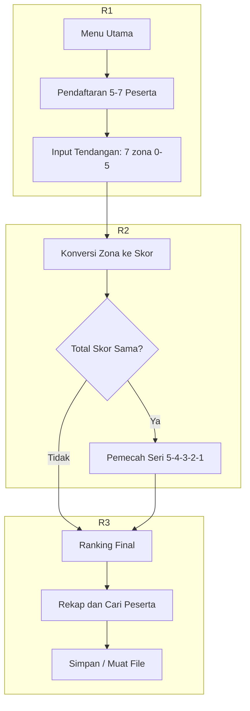
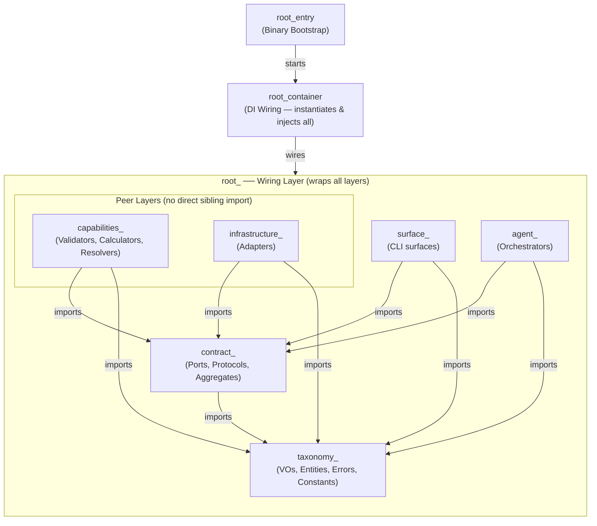

# LAPORAN PROJECT

**Aplikasi Perhitungan Hasil Lomba Tendangan Penalti**

| Nama        | Raka Arwaky      |
| Nim         | 22342030         |
| Mata Kuliah | Pengantar Coding |
| Sesi        | 863              |

---

## 1. Analisis Permasalahan

Berdasarkan kerangka epistemologis filsafat masalah, suatu kondisi hanya dapat disebut "masalah" apabila memenuhi tiga prasyarat sekaligus:

(a) terdapat subjek yang memiliki tujuan;

(b) terdapat kesenjangan  antara keadaan aktual dan keadaan yang dikehendaki;

(c) terdapat hambatan yang tidak dapat diatasi secara langsung.

### 1.1 Tujuan

Membangun program bahasa C untuk mengelola hasil lomba tendangan penalti.

Jumlah peserta 5-7 orang; setiap peserta 7 tendangan; zona bernilai 0 sampai 5.

Mengubah zona menjadi skor; total skor = jumlah seluruh skor tendangan.

Menentukan juara dari total skor tertinggi, dengan aturan seri 5 -> 4 -> 3 -> 2 -> 1.

Menyimpan data peserta, mencatat hasil tendangan, mencari peserta, menampilkan rekap, dan mengurutkan ranking.

### 1.2 Keadaan Saat Ini dan Keadaan Diinginkan

Keadaan saat ini: belum tersedia program yang memenuhi seluruh ketentuan di atas. Keadaan diinginkan  program yang secara utuh memenuhi batas peserta (5-7), batas tendangan (7), rentang zona (0-5), aturan konversi dan akumulasi skor, aturan seri bertingkat, serta kelima kemampuan kelola data. Kesenjangan antara kedua keadaan inilah yang menjadikan tugas ini sebagai masalah.

### 1.3 Hambatan

- **Masalah 1** - Pembatasan input zona 0-5 (Ketentuan 2 & 4). Tanpa pembatasan, pengguna dapat memasukkan nilai di luar rentang yang merusak perhitungan
- **Masalah 2** - Batas jumlah peserta 5-7 (aturan lomba). Data peserta harus dialokasikan menampung maksimal 7 tanpa meluap, namun tetap menerima minimal 5.
- **Masalah 3** - Konversi zona ke skor dan akumulasi (Ketentuan 3 & 4). Setiap zona harus dipetakan ke poin, lalu dijumlahkan menjadi total skor tiap peserta.
- **Masalah 4** - Penentuan juara dan aturan seri bertingkat (Ketentuan 5 & 6). Pengurutan tidak cukup hanya by total skor; diperlukan pemecah seri 5 -> 4 -> 3 -> 2 -> 1, dan peringkat sama bila seluruh komponen identik.
- **Masalah 5** - Kelola data antar-fitur (simpan, catat, cari, rekap, ranking). Seluruh fitur harus beroperasi pada satu kesatuan data peserta yang konsisten.

---

## 2. Skenario Program

Alur penggunaan aplikasi dalam satu sesi:

- Menu utama menampilkan 6 fitur + 1 fitur simpan/muat, dengan status tiap fitur (Aktif / Terkunci / Selesai) sesuai tahap lomba.
- Tahap 1 — Pendaftaran: pengguna memasukkan nama peserta (5–7). Tombol peserta ke-8 ditolak; nama kosong mengakhiri pendaftaran.
- Tahap 2 — Input Tendangan & Skor: untuk tiap peserta, masukkan 7 zona (0–5). Zona divalidasi; total skor diakumulasi otomatis.
- Tahap 3 — Ranking & Rekap: setelah semua peserta selesai, pengguna dapat melihat peringkat (dengan aturan seri) dan rekapitulasi lengkap.
- Fitur Cari Peserta: mencari peserta berdasarkan nama (cocok persis).
- Fitur Simpan / Muat Data: menyimpan seluruh lomba ke file `data_lomba.bin`, memuatnya kembali saat startup, menghapus file, atau me-reset lomba dari memori.

Verifikasi alur penuh (daftar → tendang → ranking → cari → rekap) telah ditutupi oleh test otomatis `test_full_game_via_surfaces`.



---

## 3. Konstruksi Program

Arsitektur yang digunakan adalah **AES (Agentic Engineering System)** — pola berlapis ketat (strict layered) dengan dependency inversion dilakukan lewat struct of function pointers sebagai pengganti interface. Arah dependensi downward-only: `taxonomy -> contract -> capabilities/infrastructure -> agent -> surfaces -> root (wiring only)`. Capabilities dan Infrastructure adalah layer setara (peer) yang sama-sama bergantung ke bawah pada Contract, dan tidak saling mengimpor.

### 3.1 Hierarki Layer



---

## 4. Struktur (struct)

**Struct** (structure) adalah tipe data yang membungkus beberapa variabel menjadi satu kesatuan. Di program ini, seluruh data dibungkus dalam *Value Object* (VO) di `src/shared/` supaya tipe tidak tertukar saat kompilasi. Daftar di bawah adalah **TIPE (cetakan)**, bukan variabel — variabel yang dibuat dari tipe-tipe ini dicantumkan di Section 6. Tipe aggregate (`RegistrationAggregate`, `ScoringAggregate`, dll.) didefinisikan di `contract_*_aggregate.h` / `module.*.h` dan menjadi tipe bagi variabel aggregate di Section 6. Berikut struct yang ada di source:

| Struct | Keterangan |
|---|---|
| `CompetitionState` | Wadah status lomba utama; menampung array peserta, jumlah peserta, dan tahap lomba; di-pass via pointer dari `main()` (tanpa variabel global). |
| `CompetitionStateKind` | Enum tahap lomba: `STATE_INIT` (belum ada peserta), `STATE_REGISTERED` (boleh tendang & cari), `STATE_COMPLETED` (boleh ranking & recap). |
| `ParticipantEntity` | Satu peserta lengkap: id, nama, 7 hasil tendangan (`kicks`), total skor, frekuensi zona, dan jumlah tendangan dilakukan. |
| `ParticipantIdVO` | Pembungkus nomor urut peserta (indeks dalam array data). |
| `ParticipantNameVO` | Pembungkus nama peserta (`char[MAX_NAME_LENGTH+1]`) agar batas panjang terjaga. |
| `KickVO` | Satu tendangan: `zone` (0–5) dan `points` (sama dengan zone). |
| `ZoneVO` | Pembungkus nilai zona (0..5, 0 = miss) agar tidak tertukar dengan id/poin. |
| `TotalScoreVO` | Pembungkus total skor peserta (0..35 = 7 × 5). |
| `ZoneFreqVO` | Frekuensi tiap zona (0..5), dipakai pemecah seri peringkat. |
| `KickCountVO` | Pembungkus jumlah tendangan yang sudah dilakukan (0..TOTAL_KICKS). |
| `RankingEntryVO` | Satu baris hasil peringkat (ranking & recap): id, total skor, frekuensi zona, dan posisi rank. |
| `SearchResultVO` | Balikan pencarian peserta: status ketemu, id, nama, skor, riwayat tendangan, dan frekuensi zona. |

---

## 5. Konstanta

Konstanta terpusat di `taxonomy_game_constant.h`:

| Konstanta | Nilai | Keterangan |
|---|---|---|
| `MIN_PARTICIPANTS` | 5 | Jumlah peserta minimal yang harus didaftarkan. |
| `MAX_PARTICIPANTS` | 7 | Batas maksimal peserta (ukuran array data lomba). |
| `TOTAL_KICKS` | 7 | Jumlah tendangan per peserta. |
| `MIN_ZONE` | 0 | Zona terendah (tendangan meleset / miss). |
| `MAX_ZONE` | 5 | Zona tertinggi (poin maksimal per tendangan). |
| `MAX_NAME_LENGTH` | 30 | Panjang maksimal nama peserta (karakter, tanpa null-terminator). |
| `DEFAULT_STORAGE_FILENAME` | `"data_lomba.bin"` | Nama file penyimpanan lomba default. |
| `MENU_EXIT` | 0 | Kode pilihan menu: keluar dari program. |
| `MENU_REGISTRATION` | 1 | Kode pilihan menu: layar pendaftaran peserta. |
| `MENU_SCORING` | 2 | Kode pilihan menu: layar input tendangan & skor. |
| `MENU_RANKING` | 3 | Kode pilihan menu: layar tampilkan peringkat. |
| `MENU_SEARCH` | 4 | Kode pilihan menu: layar cari peserta. |
| `MENU_RECAP` | 5 | Kode pilihan menu: layar rekapitulasi lengkap. |

---

## 6. Variabel

**Variabel** adalah wadah nyata di memori yang menyimpan nilai. Ia bisa bertipe dasar (mis. `int`) maupun bertipe **struct** — artinya sebuah variabel yang tipenya adalah struct akan membungkus variabel-variabel lain di dalamnya. Aplikasi sengaja TIDAK menggunakan variabel global untuk data lomba. Di bawah ini, setiap baris adalah **VARIABEL (instance)** yang dibuat di `main()`; kolom *Jenis* menunjukkan apakah variabel itu bertipe dasar atau bertipe struct. Seluruh state lomba disimpan di `main()` lalu di-pass via pointer ke tiap fitur. Variabel yang ada di `root_cli_main_entry.c`:

| Variabel | Jenis | Keterangan |
|---|---|---|
| `CompetitionState state` | Struct (`CompetitionState`, Sect. 4) | Satu-satunya wadah data lomba; diinisialisasi `participant_count = 0` dan `state = STATE_INIT`, lalu di-pass ke seluruh fitur via pointer. |
| `RankingEntryVO entries[MAX_PARTICIPANTS]` | Array of struct (`RankingEntryVO`, Sect. 4) | Array hasil peringkat sementara, diisi `agent_ranking_compute()` sebelum menampilkan juara. |
| `char line[64]` | Dasar (`char`) | Buffer baris untuk menampilkan juara di layar penutup. |
| `const char *winner`, `*second`, `*third` | Dasar (pointer `char`) | Pointer nama juara 1–3 di layar penutup. |

Catatan: tipe-tipe contract (`RegistrationAggregate`, `ScoringAggregate`, `RankingAggregate`, `SearchAggregate`, `RecapAggregate`, `SanitizeAggregate`, `StorageAggregate`, `ExportAggregate`, `DisplayPort`) **bukan variabel** — mereka adalah struct/contract yang didefinisikan di `contract_*_aggregate.h` / `module.*.h` (lihat Section 4 & ARCHITECTURE.md). Di `main()`, yang diinstansiasi menjadi variabel bertipe contract tersebut adalah `reg, sc, rk, sr, rc, sn, st, ex` (aggregate) dan `dp` (DisplayPort); surfaces memanggil domain **lewat** variabel-variabel contract itu sebagai pintu masuk (AES: aggregate = satu-satunya pintu masuk surfaces ke domain).


Fungsi domain & infrastruktur utama (semua ada di `src/`):

| Fungsi | Keterangan |
|---|---|
| `root_registration_build` | Merakit aggregate pendaftaran (di `main()`). |
| `agent_registration_append` | Menambah peserta ke `CompetitionState` saat pendaftaran. |
| `capabilities_scoring_validate_zone` | Memvalidasi zona (0–5) sebelum dicatat. |
| `capabilities_scoring_record_kick` | Mencatat satu tendangan & mengakumulasi skor ke peserta. |
| `capabilities_ranking_compute` | Mengurutkan peserta + menerapkan aturan seri zona 5→4→3→2→1. |
| `capabilities_search_resolver` | Mencari peserta berdasarkan nama (cocok persis). |
| `agent_recap_orchestrator` | Mengoordinasikan penyusunan rekapitulasi lengkap. |
| `capabilities_recap_formatter` | Memformat data rekap menjadi tampilan. |
| `agent_storage_save` | Menyimpan seluruh lomba ke file `data_lomba.bin`. |
| `agent_storage_load` | Memuat lomba dari file saat startup. |
| `agent_storage_delete` | Menghapus file penyimpanan lomba. |
| `sanitizer_validate_int` | Memvalidasi input bilangan bulat (termasuk rentang). |
| `sanitizer_validate_string` | Memvalidasi input teks (nama peserta). |
| `cli_surfaces_menu_run` | Menjalankan menu utama & merutekan pilihan ke layar fitur. |
| `cli_surfaces_*_execute` | Fungsi layar tiap fitur (pendaftaran, scoring, ranking, cari, recap, storage). |
| `root_display_build` | Merakit `DisplayPort` (antarmuka render ncurses). |
| `cli_surfaces_storage_execute` | Layar fitur Simpan / Muat / Reset data. |

---

## 8. Kode Sumber (Script Program)

Kode sumber lengkap terdapat di folder `src/` (41 file .c/.h) dengan struktur:

- `src/shared/`        — konstanta, struct (VO), enum, kontrak antarmuka
- `src/registration/`  — pendaftaran peserta
- `src/scoring/`       — validasi & pencatatan zona → skor
- `src/ranking/`       — peringkat + aturan seri
- `src/search/`        — pencarian peserta
- `src/recap/`         — rekapitulasi
- `src/storage/`       — simpan/muat/hapus file
- `src/sanitizer/`     — validasi input
- `src/cli/`           — layar menu & tiap fitur (command + page)
- `src/tui/`           — adaptor ncurses (DisplayPort)
- `root_cli_main_entry.c` — titik masuk program

Cuplikan fungsi inti — aturan seri (ranking):

```c
static int compare_entries(const void *a, const void *b) {
    const RankingEntryVO *x = a, *y = b;
    if (x->total_score != y->total_score)
        return y->total_score - x->total_score;
    for (int z = MAX_ZONE; z >= 1; z--)        /* 5,4,3,2,1 */
        if (x->zone_freq[z] != y->zone_freq[z])
            return y->zone_freq[z] - x->zone_freq[z];
    return 0;                                  /* seri sempurna */
}
```

Kompilasi & pengujian: `make` (build) dan `make test` (semua test lolos).
