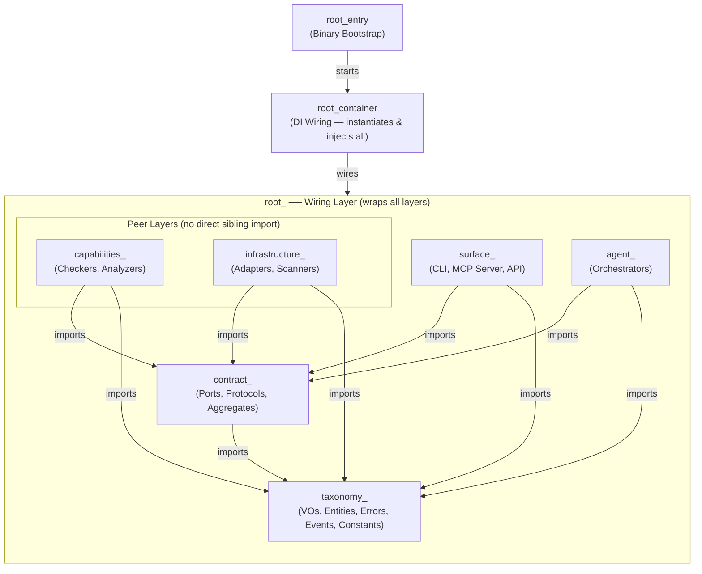
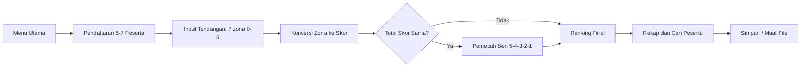

# LAPORAN PROJECT

**Aplikasi Perhitungan Hasil Lomba Tendangan Penalti**

| Nama        | Raka Arwaky      |
| Nim         | 22342030         |
| Mata Kuliah | Pengantar Coding |
| Sesi        | 863              |

---

## 1. Analisis Permasalahan

Berdasarkan kerangka epistemologis filsafat masalah, suatu kondisi hanya dapat disebut "masalah" apabila memenuhi tiga prasyarat sekaligus:

(a) terdapat subjek yang memiliki tujuan;

(b) terdapat kesenjangan  antara keadaan aktual dan keadaan yang dikehendaki;

(c) terdapat hambatan yang tidak dapat diatasi secara langsung.

### 1.1 Tujuan

Membangun program bahasa C untuk mengelola hasil lomba tendangan penalti.

Jumlah peserta 5-7 orang; setiap peserta 7 tendangan; zona bernilai 0 sampai 5.

Mengubah zona menjadi skor; total skor = jumlah seluruh skor tendangan.

Menentukan juara dari total skor tertinggi, dengan aturan seri 5 -> 4 -> 3 -> 2 -> 1.

Menyimpan data peserta, mencatat hasil tendangan, mencari peserta, menampilkan rekap, dan mengurutkan ranking.

### 1.2 Keadaan Saat Ini dan Keadaan Diinginkan

Keadaan saat ini: belum tersedia program yang memenuhi seluruh ketentuan di atas. Keadaan diinginkan  program yang secara utuh memenuhi batas peserta (5-7), batas tendangan (7), rentang zona (0-5), aturan konversi dan akumulasi skor, aturan seri bertingkat, serta kelima kemampuan kelola data. Kesenjangan antara kedua keadaan inilah yang menjadikan tugas ini sebagai masalah.

### 1.3 Hambatan

- **Masalah 1** - Pembatasan input zona 0-5 (Ketentuan 2 & 4). Tanpa pembatasan, pengguna dapat memasukkan nilai di luar rentang yang merusak perhitungan
- **Masalah 2** - Batas jumlah peserta 5-7 (aturan lomba). Data peserta harus dialokasikan menampung maksimal 7 tanpa meluap, namun tetap menerima minimal 5.
- **Masalah 3** - Konversi zona ke skor dan akumulasi (Ketentuan 3 & 4). Setiap zona harus dipetakan ke poin, lalu dijumlahkan menjadi total skor tiap peserta.
- **Masalah 4** - Penentuan juara dan aturan seri bertingkat (Ketentuan 5 & 6). Pengurutan tidak cukup hanya by total skor; diperlukan pemecah seri 5 -> 4 -> 3 -> 2 -> 1, dan peringkat sama bila seluruh komponen identik.
- **Masalah 5** - Kelola data antar-fitur (simpan, catat, cari, rekap, ranking). Seluruh fitur harus beroperasi pada satu kesatuan data peserta yang konsisten.

---

## 2. Skenario Program

Alur penggunaan aplikasi dalam satu sesi:

- Menu utama menampilkan 6 fitur + 1 fitur simpan/muat, dengan status tiap fitur (Aktif / Terkunci / Selesai) sesuai tahap lomba.
- Tahap 1 — Pendaftaran: pengguna memasukkan nama peserta (5–7). Tombol peserta ke-8 ditolak; nama kosong mengakhiri pendaftaran.
- Tahap 2 — Input Tendangan & Skor: untuk tiap peserta, masukkan 7 zona (0–5). Zona divalidasi; total skor diakumulasi otomatis.
- Tahap 3 — Ranking & Rekap: setelah semua peserta selesai, pengguna dapat melihat peringkat (dengan aturan seri) dan rekapitulasi lengkap.
- Fitur Cari Peserta: mencari peserta berdasarkan nama (cocok persis).
- Fitur Simpan / Muat Data: menyimpan seluruh lomba ke file `data_lomba.bin`, memuatnya kembali saat startup, menghapus file, atau me-reset lomba dari memori.

Verifikasi alur penuh (daftar → tendang → ranking → cari → rekap) telah ditutupi oleh test otomatis `test_full_game_via_surfaces`.

---

## 3. Konstruksi Program

Arsitektur yang digunakan adalah **AES (Agentic Engineering System)** — pola berlapis ketat (strict layered) dengan dependency inversion dilakukan lewat struct of function pointers sebagai pengganti interface. Arah dependensi downward-only: `taxonomy -> contract -> capabilities/infrastructure -> agent -> surfaces -> root (wiring only)`. Capabilities dan Infrastructure adalah layer setara (peer) yang sama-sama bergantung ke bawah pada Contract, dan tidak saling mengimpor.

### 3.1 Hierarki Layer



### 3.2 Alur Data Utama



---

## 4. Struktur (struct)

Struct utama (diekstrak dari source):

### CompetitionState (wadah status lomba)

```c
typedef struct {
    ParticipantEntity     participants[MAX_PARTICIPANTS];
    int                   participant_count;
    CompetitionStateKind  state;   /* INIT | REGISTERED | COMPLETED */
} CompetitionState;
```

### ParticipantEntity (satu peserta)

```c
typedef struct {
    ParticipantIdVO   id;          /* nomor urut */
    ParticipantNameVO name;        /* nama (dibungkus VO) */
    KickVO            kicks[TOTAL_KICKS]; /* 7 hasil tendangan */
    TotalScoreVO      total_score; /* akumulasi poin */
    ZoneFreqVO        zone_freq;   /* hitungan tiap zona (pemecah seri) */
    KickCountVO       kick_count;  /* 0..7 tendangan dilakukan */
} ParticipantEntity;
```

### CompetitionStateKind (enum tahap)

```c
typedef enum {
    STATE_INIT = 0,       /* belum ada peserta */
    STATE_REGISTERED = 1, /* boleh tendang & cari */
    STATE_COMPLETED = 2   /* boleh ranking & recap */
} CompetitionStateKind;
```

---

## 5. Konstanta

Konstanta terpusat di `taxonomy_game_constant.h`:

```c
MIN_PARTICIPANTS 5     /* peserta minimal */
MAX_PARTICIPANTS 7     /* peserta maksimal (batas array) */
TOTAL_KICKS      7     /* tendangan per peserta */
MIN_ZONE         0     /* zona terendah (miss) */
MAX_ZONE         5     /* zona tertinggi (top) */
MAX_NAME_LENGTH  30    /* panjang nama maksimal */
DEFAULT_STORAGE_FILENAME "data_lomba.bin"
```

---

## 6. Variabel

Aplikasi sengaja TIDAK menggunakan variabel global untuk data lomba. Variabel utama:

- `CompetitionState state` — dideklarasikan di `main()`, di-pass ke seluruh fitur via pointer (satu sumber data).
- Aggregate lokal di main(): `reg, sc, rk, sr, rc, st, sn` — masing-masing berisi function pointer ke implementasi domain.
- `DisplayPort dp` — antarmuka render, dirakit oleh `root_display_build()`.
- Variabel lokal di tiap fungsi: loop index (`i, z`), buffer (`buf[128]`), state sementara (`RankingEntryVO entries[]`).

---

## 7. Fungsi

Fungsi domain & infrastruktur utama:

- `root_registration_build` / `agent_registration_append` (pendaftaran peserta)
- `capabilities_scoring_validate_zone` / `capabilities_scoring_record_kick` (input tendangan & skor)
- `capabilities_ranking_compute` (urutkan + aturan seri zona 5→4→3→2→1)
- `capabilities_search_resolver` (cari peserta)
- `agent_recap_orchestrator` / `capabilities_recap_formatter` (rekapitulasi)
- `agent_storage_save` / `agent_storage_load` / `agent_storage_delete` (simpan/muat/hapus file)
- `sanitizer_validate_int` / `sanitizer_validate_string` (validasi input)
- `cli_surfaces_menu_run` + `cli_surfaces_*_execute` (navigasi & layar tiap fitur)
- `root_display_build` (rakit DisplayPort / antarmuka ncurses)
- `cli_surfaces_storage_execute` (fitur Simpan/Muat/Reset)

---

## 8. Kode Sumber (Script Program)

Kode sumber lengkap terdapat di folder `src/` (41 file .c/.h) dengan struktur:

- `src/shared/`        — konstanta, struct (VO), enum, kontrak antarmuka
- `src/registration/`  — pendaftaran peserta
- `src/scoring/`       — validasi & pencatatan zona → skor
- `src/ranking/`       — peringkat + aturan seri
- `src/search/`        — pencarian peserta
- `src/recap/`         — rekapitulasi
- `src/storage/`       — simpan/muat/hapus file
- `src/sanitizer/`     — validasi input
- `src/cli/`           — layar menu & tiap fitur (command + page)
- `src/tui/`           — adaptor ncurses (DisplayPort)
- `root_cli_main_entry.c` — titik masuk program

Cuplikan fungsi inti — aturan seri (ranking):

```c
static int compare_entries(const void *a, const void *b) {
    const RankingEntryVO *x = a, *y = b;
    if (x->total_score != y->total_score)
        return y->total_score - x->total_score;
    for (int z = MAX_ZONE; z >= 1; z--)        /* 5,4,3,2,1 */
        if (x->zone_freq[z] != y->zone_freq[z])
            return y->zone_freq[z] - x->zone_freq[z];
    return 0;                                  /* seri sempurna */
}
```

Kompilasi & pengujian: `make` (build) dan `make test` (semua test lolos).
